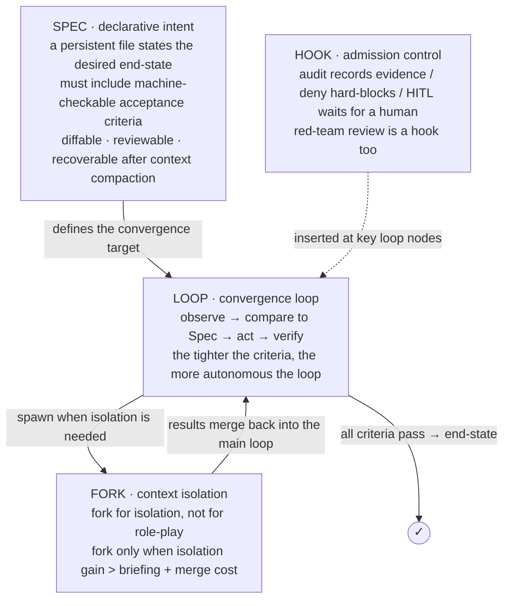
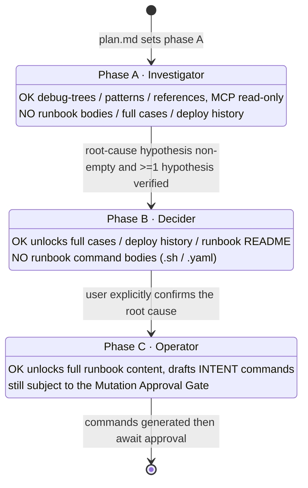
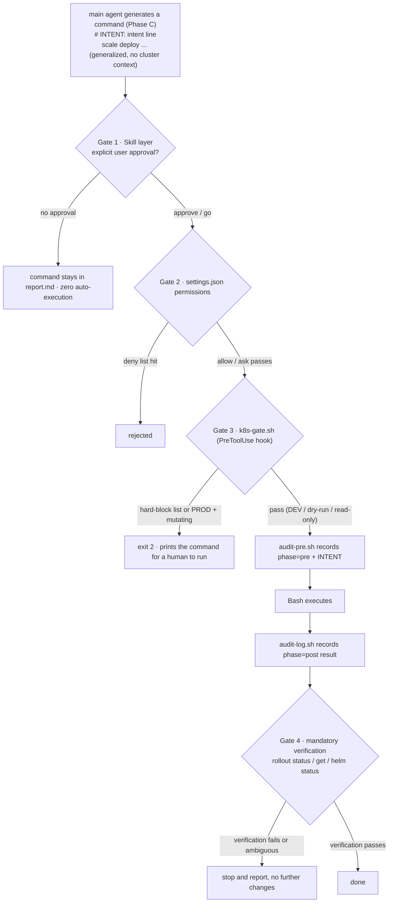
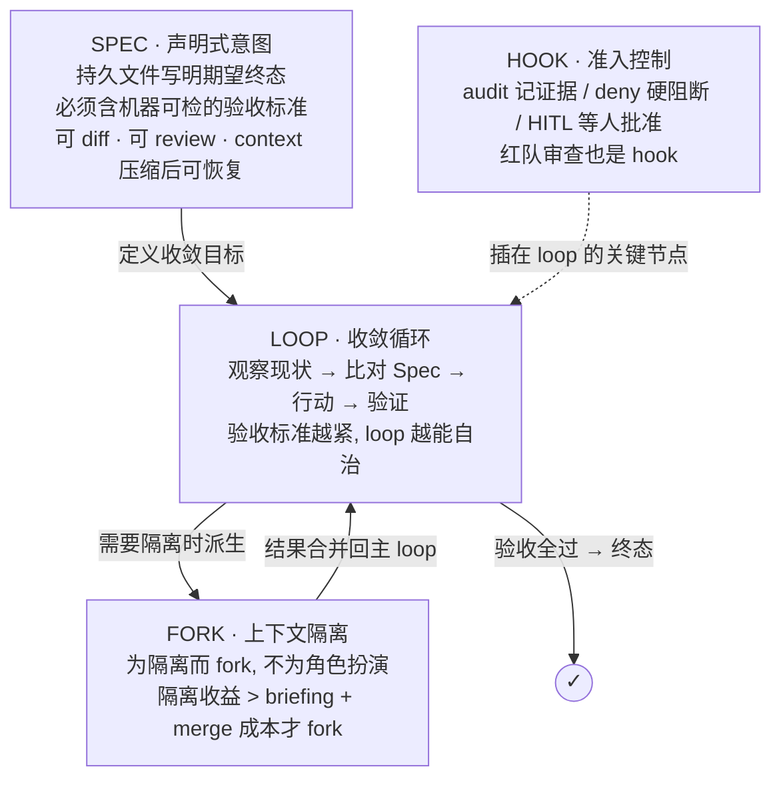
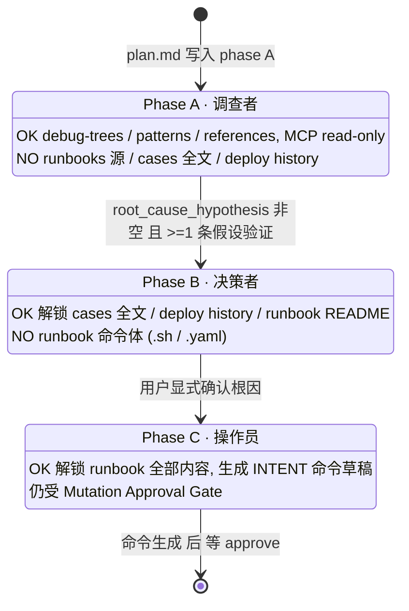
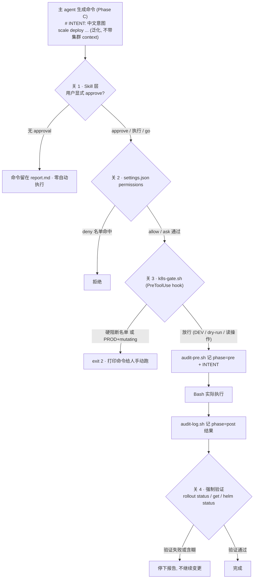

# META
id: w-p-agentops
kicker_en: PROJECT
kicker_cn: 项目
title_en: An SRE Oncall Triage Harness — Autonomous Investigation, Human-Owned Mutation
title_cn: 一个 SRE Oncall Triage Harness：agent 自主调查，mutation 主权归人
sub_en: A working harness that refactors SRE oncall triage from a human-executed procedure into an agent that investigates on its own while every irreversible action stays behind a deterministic gate. Built on four control primitives — Spec / Loop / Hook / Fork — with the reliability discipline of a Kubernetes control plane wrapped around a non-deterministic reasoning core.
sub_cn: 一个把 SRE oncall triage 从人肉执行重构为「agent 自主调查 + 人保留 mutation 主权」的 harness：所有不可逆操作都挡在确定性门禁之后。它建立在 Spec / Loop / Hook / Fork 四个控制原语之上，用 Kubernetes 控制平面的可靠性范式去约束一个不确定的推理内核。

domains: [platform, incident, security]

# EN

## Why

In an oncall investigation the main agent's real job is judgment: is this a false alarm, where is the root cause, what to query next, do we escalate. Judgment needs a clear context window. But a single raw range query can come back at 30K tokens, and a slice of logs is worse. If the main agent pulls that data itself, then by the time it reaches the phase where the hard calls happen, its context is drowned in raw numbers and its judgment is spent.

That is the first-principles constraint the whole system is built on: context is scarce RAM, not an infinite disk. Whoever occupies it should pay for the occupancy. One iron rule follows directly — the main agent keeps only navigation, judgment, and command generation; all raw-data fetching is pushed down to a subagent that returns a structured summary of no more than 500 tokens. This is not an optimization. It is an architectural constraint.

I built this harness to hold that line under real oncall load, and the design below is a chain of consequences from that one constraint.

## The design: four control primitives, not role-play

Most "multi-agent" frameworks do role-play: a PM agent, an engineer agent, a QA agent. That is skeuomorphism — copying a human org chart onto agents, intuitive but without engineering meaning. What actually carries weight is four control primitives:

Three design decisions do most of the work.

**Subagent isolation.** The main agent inherits the strongest model and only judges; raw VictoriaMetrics/Loki queries and Slack reads are dispatched to a subagent that returns at most 500 tokens — a max value with its timestamp, a step-jump flag, a baseline ratio. This is the capacity-bound and attention-bound case for Fork made concrete: a 30K-token query is isolated into a fresh window so the main context never sees it. The anti-pattern is the main agent running the query itself, pulling back 200 data points, and arriving at the decisive phase already token-exhausted.

**Phase lock.** Karpathy described a classic agent failure: see a deploy record, hallucinate a root cause — swept off by "what changed recently" before the symptom is even understood. I designed that failure mode out with a state machine. A `phase:` field at the top of the plan file physically restricts what the main agent can read: in Phase A it cannot read deploy history at all, so it cannot confabulate one. The gate to the next phase is an explicit precondition, not a suggestion.

**The red line.** Models hallucinate. That is a premise, not a defect, so system safety can never rest on "the model will comply." Judgment — false alarm or not, where the root cause is — goes to the model. Every irreversible operation (delete, scale, drain, IAM change) goes to a deterministic shell hook that hard-blocks. No amount of hallucination gets past an `exit 2`. This turns safety from "hope the model behaves" into "it's fine if the model misbehaves."

## One transferable intuition: this is a Kubernetes control plane

For an SRE none of this is new — it is the Kubernetes control-plane pattern moved inside the agent. Spec is the desired-state manifest; Loop is the controller's reconcile loop; Hook is the admission webhook; Fork is pod-level isolation plus an independent auditor. The proposition underneath: we are not replacing SREs with AI. We are using decades of reliability engineering to constrain and operate a non-deterministic reasoning core.

## Safety that actually lands

A single mutating command has to clear four gates before it reaches production; any one of them stops it:

Gate 1 is the skill layer: absent approval, the command just sits in the report. Gate 2 is a static allow/deny list — fastest, coarsest. Gate 3 is the deterministic executor: six shell hooks that understand cluster-alias-to-environment grading and fail closed — an unclassified alias is treated as production. This is the layer the model cannot route around, and it is where the red line is actually enforced. Gate 4 is mandatory post-verification. Two of the hooks even nest a second model call (`claude -p`) to review the current model's plan at the moment of approval — AI reviewing AI, the red-team hook mounted exactly at Spec-freeze time.

## Why it gets better with use

The compounding is not "save the report." It is a delta judgment: against 130+ existing knowledge files, what did this investigation actually learn that is *new*? Matches update an existing file; a new root-cause path creates a new case; a new signal updates the routing table. Three anti-rot rules keep it clean: record only the delta, promote AI-written knowledge from `draft` to `stable` only after human review, and keep every entry traceable via `derived_from` back to the triage report. The knowledge base today spans 34+ cases, 21+ runbooks, and 15+ cards, and the next alert's fast path retrieves straight into it.

And every real oncall is an eval run. `verify.py` gates single-investigation quality with an exit code — required sections present, evidence chain per conclusion, no over-assertion in the Slack response — while `slo.py` tracks pass-rate trends across investigations and exposes decay in the skill itself. The system is therefore not a static tool but a closed loop that improves as it is used.

## Takeaways

- The binding constraint of an agent system is the context window, not the model. Treat context as RAM and the isolation architecture designs itself: judgment on the main agent, raw data on subagents behind a 500-token contract.
- Safety belongs in deterministic code, not in the prompt. Let the model judge; let a shell hook that returns `exit 2` own every irreversible action. Then hallucination stops being a safety risk.
- This is the concrete evidence for a larger thesis I hold elsewhere on this site: in the agent era, the SRE's job is to be the reliable outer shell around a non-deterministic core.

# CN

## Why

一次 oncall 调查里，主 agent 真正要做的是**判断**：这是不是假警报、根因在哪、下一步查什么、要不要升级。判断需要一个清醒的 context 窗口。可是一次 raw range query 回来可能就是 30K token，一段日志更多。如果主 agent 自己去拉这些数据，等它走到需要下关键判断的阶段，context 已经被原始数字淹没，判断力也被榨干了。

这就是全系统建立其上的第一性约束：context 是稀缺的 RAM，不是无限的硬盘。谁占用它，谁就该为占用付出代价。由此直接推出一条铁律，主 agent 只保留导航、判断、命令生成，一切原始数据获取下沉给 subagent，只回收 ≤500 token 的结构化摘要。这不是优化，是架构约束。

我构建这个 harness，就是要在真实 oncall 负载下守住这条线。下面的设计，全是这一条约束的推论链。

## 设计：四个控制原语，不是角色拟物

多数「多 agent」框架在做角色扮演：PM agent、工程师 agent、QA agent。这是拟物，把人类组织架构照搬给 agent，看着直观，实则没有工程意义。真正有意义的是四个控制原语：

三条设计决策承担了大部分工作。

**Subagent Isolation。** 主 agent 继承最强的模型，只做判断；VictoriaMetrics/Loki 的 raw query 和 Slack 读取分派给 subagent，只回收 ≤500 token，一个带时间戳的极值、一个 step jump 标记、一个 baseline 比值。这是 Fork 的 capacity-bound 与 attention-bound 理由的具体形态：把一次 30K token 的查询隔离进一个干净窗口，主 context 永远看不到它。反模式是主 agent 自己跑查询，拿回 200 个数据点，走到决策阶段时已经 token-exhausted。

**Phase Lock。** Karpathy 观察过一种典型 agent 失败：看到 deploy 记录就脑补根因，症状还没看清就被「最近改过什么」带跑。我用一个状态机把这个失败模式设计掉。plan 文件顶部的 `phase:` 字段物理限制主 agent 当前能读什么：Phase A 时它根本读不到 deploy history，也就无从脑补。进入下一阶段的门是显式前置条件，不是提醒。

**红线。** 模型会幻觉。这是前提，不是缺陷，所以系统安全性绝不能建立在「模型会自觉遵守约束」之上。判断（是不是假警报、根因在哪）交给模型。一切不可逆操作（删除、scale、drain、IAM 变更）交给确定性的 shell hook 硬阻断，agent 再怎么幻觉也绕不过一个 `exit 2`。这条红线把「安全」从「希望模型别犯错」变成「模型犯错也没关系」。

## 一条可迁移的直觉：这就是 Kubernetes 控制平面

对 SRE 来说这套东西并不新，它就是把 Kubernetes 控制平面思想搬进 agent。Spec 是期望状态 manifest；Loop 是 controller 的 reconcile loop；Hook 是 admission webhook；Fork 是 pod 级隔离加一个独立审计者。底下的命题是：我们不是用 AI 取代 SRE，而是用几十年沉淀的可靠性工程，去约束和运营一个不确定的推理内核。

## 真正落地的安全

一条 mutating 命令要真正落地，必须闯过四关，任何一关拦下都到不了生产：

关 1 是 skill 层：没有 approval，命令就留在 report 里。关 2 是静态 allow/deny 名单，最快但最粗。关 3 是确定性执行者：6 个 shell hook，理解「集群 alias → 环境分级」并 fail-closed，未分类的 alias 一律按生产处理。这是模型绕不过的那一层，也是红线真正的执行者。关 4 是强制的事后验证。其中两个 hook 甚至嵌套第二次模型调用（`claude -p`），在批准那一刻审查当前模型的计划，AI 审 AI，恰好把红队 hook 挂在 Spec 冻结的时刻。

## 为什么越用越好

复利不是「把报告存起来」，而是一个 **delta 判断**：和已有 130+ 篇 knowledge 文件比，这次到底学到了什么*新*东西。完全匹配就更新旧文件；新根因路径就新建 case；新信号就更新路由表。三条防腐原则保证它不腐化：只记 delta；AI 写的知识要人工 review 后才从 `draft` 提升到 `stable`；每条都用 `derived_from` 可溯源回本次 triage report。今天这个知识库覆盖 34+ cases、21+ runbooks、15+ cards，下一次告警的 fast path 直接检索进去。

而且每一次真实 oncall 就是一次 eval run。`verify.py` 用退出码守单次质量（required sections 齐全、每个结论有 evidence chain、Slack response 不过度断言），`slo.py` 跨调查跟踪通过率趋势、暴露 skill 本身的退化。所以这个系统不是静态工具，而是一个随使用自我改进的闭环。

## Takeaways

- 一个 agent 系统的约束是 context 窗口，不是模型。把 context 当 RAM，隔离架构就自己长出来了：判断留在主 agent，raw data 下沉给 subagent，用 500 token 契约收口。
- 安全属于确定性代码，不属于 prompt。让模型判断，让一个返回 `exit 2` 的 shell hook 掌管一切不可逆操作，幻觉就不再是安全风险。
- 这是本站另一处论点的实物证据：在 agent 时代，SRE 的工作是成为一个不确定内核外面那层可靠的 outer shell。

# SOURCES

- 全文骨架与四段结构（哲学→设计→实现→结果）、四控制原语、Harness 三件套、K8s 控制平面对照、红线、Phase Lock、四关 mutation gate、知识复利闭环、eval loop：contexts/builder_brainstorm/oncall_triage_theory_to_practice.md（477 行完整档案）
- 「我构建了」口径的代码背书：agents/sre_oncall_triage_skill/（SKILL.md MAP 入口、6 个 hook、9 个 skill、setup.sh symlink 安装、verify.py / slo.py、knowledge/ 库）
- 四控制原语 mermaid：源文件 §1.2（EN 节点标签翻译，无 alias，无需脱敏）
- Phase Lock 状态机 mermaid：源文件 §2.4（stateDiagram，替换 emoji 勾叉为 OK/NO 以稳妥渲染；无内部服务名）
- 四关 mutation gate mermaid：源文件 §3.5（脱敏：`kwestproda scale deploy ...` → `scale deploy ...`，去除具体集群 context）
- 数字来源（均在源文件）：context ≤500 token（§1.1 §2.3）、130+ knowledge 文件（§4.1）、6 hook（§3.5）、34+ cases / 21+ runbooks / 15+ cards（§4.1 KB 节点）、exit 2 硬阻断（§1.5 §3.5）
- 呼应页：站点 V4 视角页 w-v-agents（AI agent 时代的 SRE），本篇 Takeaways 末句一句话呼应「SRE = outer shell」论点，不重复其内容

脱敏与边界说明：
- 集群 alias（kwestproda/kwestdeva 等）、内部服务名（fp/dv-*/dapp）、客户名、内网 URL 一律未写入正文与图；四关 mutation 图的命令泛化为不带 context 的 `scale deploy ...`。
- 可出现的名词：DataVisor、VictoriaMetrics、Loki、Slack、Claude Code、Kubernetes、IAM，均为通用工具/平台名或本人雇主。
- 「我构建/我设计」口径基于 agents/sre_oncall_triage_skill/ 真实代码；数字均取自源档案，未新增或夸大。
- Phase Lock 图中原 emoji（✅/❌/⚠️）替换为 OK/NO/纯文字，避免 mermaid stateDiagram 在部分渲染器下的兼容问题；语义不变。
