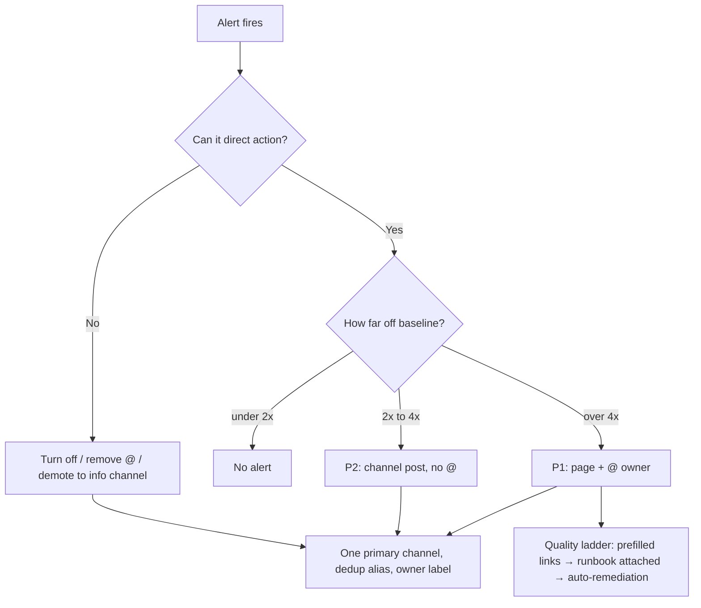
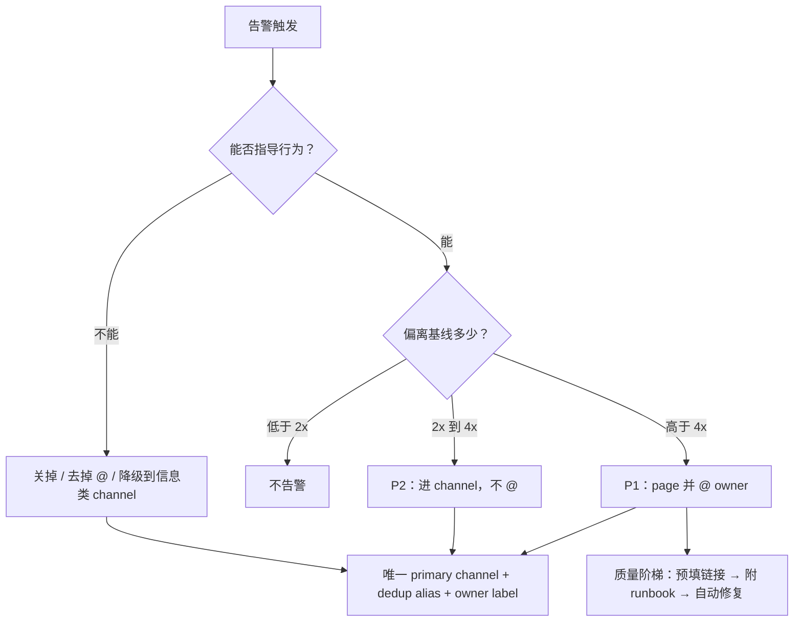

# META
id: w-p-alertgov
kicker_en: PROJECT
kicker_cn: 项目
title_en: Alert Governance: Turning the Pager from Noise Back into Decision Signal
title_cn: 告警治理：把 pager 从噪声源治回决策信号
sub_en: Audited a pager emitting ~960 OpsGenie alerts a day, ~85% of them default-P3, from 367 paging rules — traced four structural root causes, and rebuilt admission, dedup, and ownership so decay has to fight back against the system.
sub_cn: 审计了一个每天产出约 960 条 OpsGenie 告警、约 85% 是默认 P3、背后有 367 条 paging 规则的 pager：定位四个结构性根因，重建准入、去重和 ownership，让腐化从默认结局变成需要对抗系统的例外。
domains: [obs, influence]

# EN

## Why

By the time this became a project, the pager had stopped being evidence of anything. The baseline: 367 alert rules carried the label that routes to OpsGenie, spread across 30 rule files, and OpsGenie was absorbing roughly 960 alerts a day — about 85% of them P3, because P3 was simply the default when no priority was set. The infra-team channel alone ran at ~12 alerts an hour, around 290 a day.

The texture was worse than the volume. One OOM-kill rule with `for: 0m` produced 80 alerts in three days from 18 crash-looping pods; the top three rules together accounted for 145 pages in that window. A single ALB QPS-zero alert fanned out to six Slack channels at once, then fired again two minutes later. One channel took 8 OpsGenie alerts in six minutes. The batch pipeline's timeout alert paged the same stuck job hourly — three pages, three hours, one problem — and rated a job 28% over its average the same P1 as one 300% over; on the sampled day it produced 10+ P1 pages, all @-mentioning the subteam, none carrying a diagnostic link. Twelve infra alert channels existed; two had gone silent and nobody had noticed.

The cost was plain: alert fatigue from low-signal pages slows triage exactly when response quality matters most. The governing principle came first and stayed one sentence: **an alert that cannot direct action gets turned off or demoted.**

## How

The method was a decision tree, applied per alert, backed by evidence — every judgment traced to a captured alert sample or a rule definition, not to opinion.

The audit surfaced four structural root causes: the OpsGenie label was a free one-line switch with no admission threshold; overlapping Alertmanager routes with `continue: true` fanned one alert into multiple receivers; no receiver set a dedup alias, so the same problem re-created itself as a new alert on every re-fire; and a bypass script posted straight to OpsGenie with hardcoded P3, invisible to all routing and inhibition.

Execution was phased so that measurement preceded change. Phase 0 built the baseline dashboard — the numbers above. Phase 1 was config stop-the-bleed, packaged as two reviewable PRs with pre-flight lint and a rollback path: debounce windows on the noisiest rules (`for: 0m` → 10m), a hard admission gate so only P1/P2 reaches OpsGenie, severity tiering for the batch alerts, and a dedup alias with `update_alerts` on every receiver so repeats increment a counter instead of paging. Phase 2 split the shared OpsGenie API key into per-team integrations, added causal inhibition chains, and set auto-close policies. Phase 3 made the fixes structural: the bypass sender rerouted through Alertmanager, and a `team` ownership label required on every rule. Each phase carried acceptance gates against the baseline: OpsGenie volume 960/day → under 400, then under 200; the top-3 noise sources 145 per 3 days → under 40, then under 15; P3 share 85% → under 50%, then under 30%; on-call watching three channels instead of twelve. The same pass delegated deploy-approval toil — 11 approval requests @-ing infra on-call in two days, all for preprod — to team-lead approval, since an existing auto-approve path already proved infra review added nothing there.

## Why alerting systems decay

The analysis chapter of this project, and the part I consider its actual core, is a mechanism, not a list of bad rules. An alerting system increases in entropy unless external work is applied — and the audit shows exactly why.

The incentives are asymmetric. Adding an alert is cheap and visible: after an incident, one label line routes a new rule to the pager, there is no admission threshold, and the author looks diligent. That is how 367 paging rules accumulate. Deleting an alert is risky and invisible: delete wrong and you own the missed outage; delete right and nothing observable happens. So the flow runs one way.

Meanwhile every rule's semantics silently expire as the system evolves under it, and expiry emits no signal. The audit is a catalog of this: a node-memory alert at 90%, a threshold that predates 90% being a normal operating level for a Kubernetes node; a 300Mbps traffic page, though high traffic alone is not a failure and gave on-call nothing to do; a QPS-zero alert built on the assumption that traffic is always present, firing on endpoints that legitimately have none. Priority decayed the same way: with P3 as the unexamined default, 85% of alerts shared one level and the field carried no information — trivial and severe deviations paged identically. Even the topology decayed: two of twelve channels had simply died, and the system grew a bypass path around its own governance. None of this was anyone's mistake. It is the default trajectory of any system where adding is free, deleting is punished, and failure is silent.

## Keeping it clean: anti-entropy mechanisms

A one-time cleanup only resets the entropy to a low point; preventing recurrence means structures that apply work continuously. Three came out of this project: admission control — the P1/P2 gate in front of OpsGenie, a required ownership label on every rule, and a planned CI lint rejecting any paging rule without a `runbook_url`; standing measurement — the baseline dashboard kept as a permanent alert SLO dashboard, plus an automated weekly toil report, making pager quality itself a monitored metric; and a review loop — a quarterly, owner-assigned alert review with explicit severity thresholds, proposed upward as a team-level process. The intent: decay now has to fight the system instead of riding its defaults.

## Takeaways

- An alerting system obeys a second law: without continuous external work it accumulates noise, because adding alerts is cheap and visible while removing them is risky and invisible. Governance is that work, institutionalized.
- Cleanup is a state change; admission control is a rate change. The gate in front of the pager (priority threshold, owner, runbook) is worth more than any single purge.
- Make the pager itself an SLO object: if alert volume, priority mix, and dedup ratio are not on a dashboard, their regression is invisible — which is how the entropy got in the first time.

# CN

## Why

立项的时候，这个 pager 已经不能作为任何事情的证据了。Phase 0 的量化 baseline 说明了问题：367 条 alert rule 打着进 OpsGenie 的路由 label，散落在 30 个规则文件里；全局 OpsGenie channel 每天吞下约 960 条告警，其中约 85% 是 P3，原因很简单，不写 priority 时 P3 就是默认值。仅 infra 团队的 OpsGenie channel 就以每小时约 12 条的速率运行，一天约 290 条。

细看比总量更糟。一条 `for: 0m` 的 OOM-kill 规则，因为 18 个 pod 连锁 crash，三天产出 80 条告警；Top 3 规则在同一窗口合计 145 条 page。一条 ALB QPS 归零告警单次触发同时 fan-out 到 6 个 Slack channel，两分钟后又来一轮。一个 channel 在 6 分钟内收到 8 条 OpsGenie 告警。批处理调度器的超时告警对同一个卡住的 job 每小时 page 一次，三小时三条，问题只有一个；超出平均 28% 的 job 和超出 300% 的 job 拿到同一个 P1。采样那一天，仅这一族告警就产出 10 条以上 P1，每条都 @ subteam，没有一条带诊断链接。基础设施相关的告警 channel 有 12 个，其中 2 个早已无消息，也没人察觉。

我在年度自评里把代价写得很直接：低信号 page 造成的 alert fatigue，恰恰在响应质量最重要的时刻拖慢 triage。治理的第一性原则先于一切动作确定，并且始终只有一句：**不能指导行为的 alert，关掉或降级。**

## How

方法是一棵决策树，逐条告警过判定，全部落在证据上：每个结论都能追溯到一条采集的真实告警样本或一段规则定义，而不是感觉。

审计定位了四个结构性根因：进 OpsGenie 的 label 是一行代码的免费开关，没有任何准入门槛；Alertmanager 里多条 `continue: true` 的重叠路由，把一条告警扇出到多个 receiver 和 channel；所有 receiver 都没配 dedup alias，同一问题每次重新 firing 都生成一条新告警；还有一条旁路脚本直接向 OpsGenie 写入，priority 硬编码 P3，对所有路由和 inhibition 完全不可见。

执行按阶段推进，测量先于改动。Phase 0 建 baseline dashboard，也就是上面那组数字。Phase 1 是 config 止血，打包成两个可 review 的 PR，带 lint 预检、分步 apply 和回滚路径：给最吵的规则加去抖窗口（`for: 0m` 改 10m）；加一道硬准入门槛，只有 P1/P2 才允许进 OpsGenie；给批处理告警按偏离倍数分级；所有 receiver 加 dedup alias 并开 `update_alerts`，重复触发变成计数递增而不是再 page 一次。Phase 2 把共享同一个 OpsGenie API key 的 4 个 receiver 拆成按团队独立的 integration，合并冗余路由，补齐因果明确的 inhibition 链，配置 auto-close 策略。Phase 3 把修复固化为结构：旁路脚本改道走 Alertmanager，每条规则强制携带 `team` ownership label。每个阶段都对照 baseline 设验收门禁：OpsGenie 日总量 960 先降到 400 以下再到 200 以下；Top 3 噪声源从 3 天 145 条降到 40 以下再到 15 以下；P3 占比从 85% 降到 50% 以下再到 30% 以下；oncall 从盯 12 个 channel 收敛到 3 个。同一轮治理还把部署审批这类 toil 委托了出去：两天 11 条 @ infra oncall 的审批请求全部来自 preprod 环境，而系统里已存在的自动通过路径证明 infra 审批在这里不产生任何价值，于是下放给 team lead。

## 为什么告警会腐化

这个项目的分析章，也是我认为真正的核心，给出的是机制而不是坏规则清单。告警系统是一个没有外部做功就必然熵增的系统，审计材料恰好完整展示了为什么。

激励是不对称的。加告警便宜且可见：出过一次事故，加一行 label 就把新规则路由进 pager，没有任何准入门槛，作者还显得尽责。367 条 paging 规则就是这样积累出来的。删告警有风险且不可见：删错了要为漏掉的故障负责，删对了则什么可观测的事情都不会发生。于是流量只朝一个方向走。

与此同时，每条规则的语义随着脚下系统的演化静默失效，而失效不产生任何信号。审计就是这种现象的目录：一条 90% 阈值的节点内存告警，这个阈值诞生于 90% 还不是 Kubernetes 节点正常水位的年代；一条 300Mbps 的流量 page，但流量高本身不是故障，oncall 看了也无事可做；一条 QPS 归零告警，建立在"流量永远存在"的假设上，对本来就没有请求的端点持续误报。priority 以同样的方式腐化：P3 是无人审视的默认值，85% 的告警挤在同一档，这个字段不再携带任何信息，轻微偏差和严重故障以完全相同的方式 page。连拓扑本身也在腐化：12 个 channel 里 2 个已经死掉，系统还长出了绕开自身治理的旁路。这一切不是任何人的失误。在一个加告警免费、删告警受罚、失效无声的系统里，这就是默认轨迹。

## 治理完如何预防：反熵机制

一次性清理只是把熵拉回低点，防止复发需要持续做功的结构。从这个项目的素材里建立或明确了三类：其一是准入控制，OpsGenie 前面的 P1/P2 门槛、每条规则强制的 ownership label，以及规划中的 CI lint，拒绝任何不带 `runbook_url` 的 paging 规则；其二是常设测量，Phase 0 的 baseline dashboard 保留为长期的 alert SLO dashboard，外加自动化的 weekly toil report 定期发到工程 channel，让 pager 质量本身成为被监控的指标；其三是 review 回路，按 owner 分配、带明确 severity 阈值的季度告警评审，这一条我作为团队级流程向上提了出去。设计意图是让腐化必须对抗系统，而不是搭系统默认值的便车。

## Takeaways

- 告警系统服从热力学第二定律：没有持续的外部做功就必然积累噪声，因为加告警便宜且可见，删告警有风险且不可见。治理就是把这份功制度化。
- 清理改变的是状态，准入控制改变的是速率。pager 前面那道门（priority 门槛、owner、runbook）比任何一次大扫除都值钱。
- 把 pager 本身变成 SLO 对象。告警总量、priority 分布、dedup 比例不上 dashboard，它们的退化就不可见，而这正是熵第一次溜进来的方式。

# SOURCES

- 核心原则「不能指导行为的 alert → 关掉或降级」 → alert_governance_decision_tree.md:3
- 367 条 `oncall: 1` 规则分布在 30 个 YAML 文件 → opsgenie_optimization.md:68
- OpsGenie ~960 条/天（~40/h）；#opsgenie-infra 12/h ≈ ~290/天；FP channel 26/h（观察窗口 2026-04-20 约 6.5h） → opsgenie_optimization.md:59-65
- P3 占比 ~85%（priority 默认 P3） → opsgenie_optimization.md:40, 321
- OomKiller `for: 0m`，18 pod 连锁 OOM，3 天 80 条；PodRestart x47；NodeMem 90% 阈值 x18 → opsgenie_optimization.md:84-94
- Top-3 三天合计 145 条，Phase 1 目标 <40，Phase 2 目标 <15 → opsgenie_optimization.md:318
- 四个结构性根因 R1-R4（oncall:1 无门槛 / continue:true 重叠路由 / 无 alert_alias / pi_sender 旁路硬编码 P3） → opsgenie_optimization.md:108-114
- ALB QPS Zero 单次触发 fan-out 6 个 channel，2 分钟后又一轮；「QPS 归零不代表故障（可能本来就没流量）」 → alert_governance_decision_tree.md:261-288
- 6 分钟 8 条 OpsGenie 风暴 → alert_governance_decision_tree.md:394-409
- Luigi 类批处理告警：4/15 一天 10+ 条 P1 全部 @subteam、无诊断链接；同一 stuck job 每小时重复（120/180/240min 三连）；32min vs avg 25min（超 28%）也 P1，240min vs 60min（超 300%）同级 → alert_governance_decision_tree.md:191-196, 641-652
- 严重度分级方案：<2x 不告警 / 2-4x P2 不 @ / >4x P1 附 runbook → alert_governance_decision_tree.md:648-652
- 质量阶梯 Level 0（纯症状）→ Level 1（预填链接）→ Level 2（附 runbook）→ Level 3（自动修复） → alert_governance_decision_tree.md:488-513
- 12 个 infra 相关 channel，#infra-monitor / #monitor-pager 近期无消息；目标 oncall 只看 3 个 channel → alert_governance_decision_tree.md:680-708
- NodeTraffic 300Mbps「流量高本身不是故障，oncall 看了也做不了什么」 → alert_governance_decision_tree.md:215-257, 471-476
- K8sNodeMemoryUsageHigh 90% 阈值「对 K8s node 太敏感 / 正常水位」 → opsgenie_optimization.md:90, 129
- 4 个 receiver 共享同一 OpsGenie api_key；全部无 alert_alias；default P3 → opsgenie_optimization.md:36-53
- pi_sender 旁路直通 OpsGenie，对 Alertmanager 抑制/dedup 完全不可见；Phase 3 改走 Alertmanager → opsgenie_optimization.md:44-50, 113, 305
- Phase 0 baseline / Phase 1 config 止血 / alert SLO dashboard + weekly toil report + alert ownership registry（CEO review 决定） → alert_governance_execution.md:5-11, 35, 61, 79
- Phase 1 两个 PR（rule + alertmanager）+ promtool/amtool lint 预检 + 回滚手册 → opsgenie_apply_runbook.md:36-52, 226-352
- B1 准入门槛：oncall receiver 加 `priority: P1|P2`，P3 以下不进 OpsGenie → opsgenie_optimization.md:143-149, 157-175
- B4 dedup：alert_alias + update_alerts:true，重复 firing 变 count 递增 → opsgenie_optimization.md:196-210
- 验收门禁表：960 → <400 → <200；P3 85% → <50% → <30% → opsgenie_optimization.md:313-323
- CI lint：禁止 `oncall:1` 不带 runbook_url；每条 rule 带 team label → opsgenie_optimization.md:306-307
- Deploy 审批：4/14-15 两天 11 条 @oncall-infra 请求，全部 preprod；Approver: null 自动路径已存在；下放 team lead → alert_governance_decision_tree.md:366-378, 1024-1044
- Alert fatigue「slows triage and degrades response quality when it matters most」；季度告警 review（owner-assigned + severity thresholds）作为建议向上提出 → fy2026_self_assessment.md:25-27

脱敏与省略说明：
- 素材中所有客户名、内部服务名、集群名、IP、api_key、人名与 permalink 一律未写入正文；直通 OpsGenie 的内部 sender 泛化为「旁路脚本/bypass sender」，内部部署审批系统泛化为「审批系统的自动通过路径」，内部批处理调度组件泛化为「批处理调度器/batch pipeline」。
- 素材只有 baseline 实测值与各 Phase 的目标/验收门禁，没有治理落地后的实测对比数据，因此正文所有下降数字均以「验收门禁/目标」口径书写，未声称已达成的降幅。
- Part 2 的数据操作自助化（S3/CH export 等 MGT 服务）属于同一治理工作的另一条线，与本篇 pager 主题弱相关，仅保留 deploy 审批下放一句，其余未写入。
