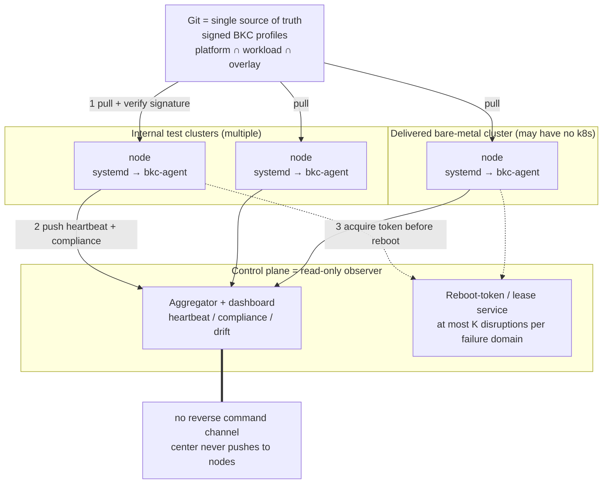
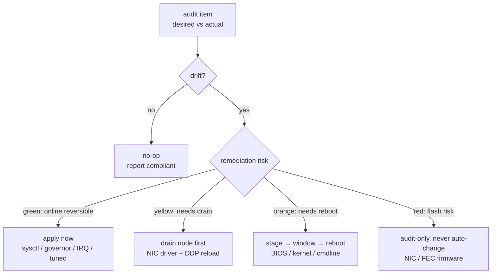
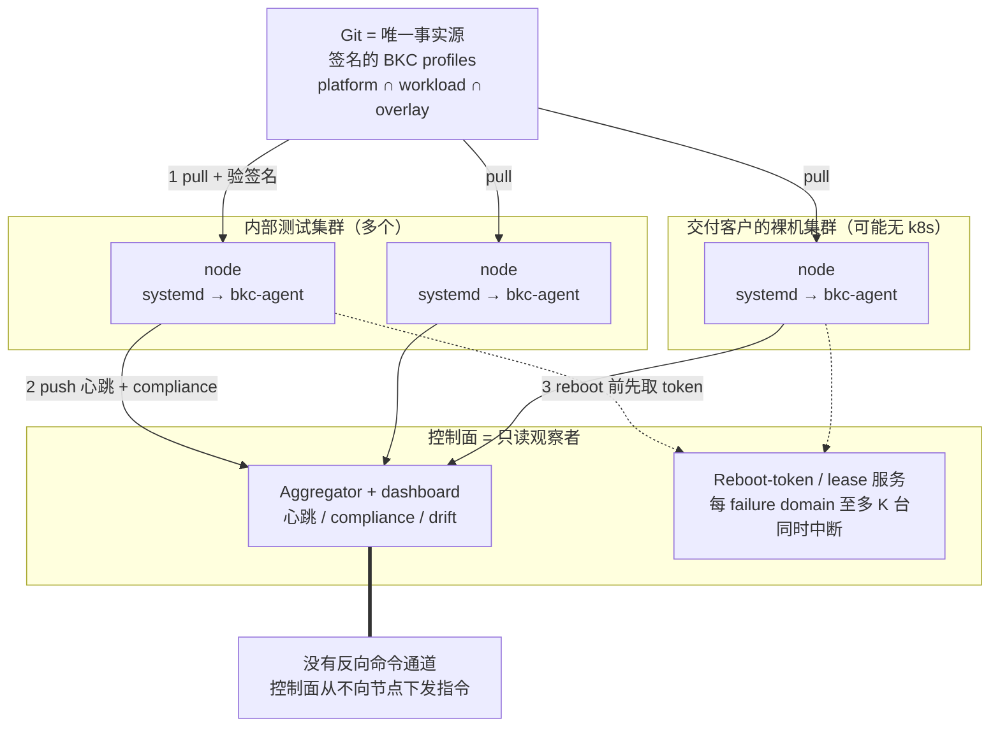
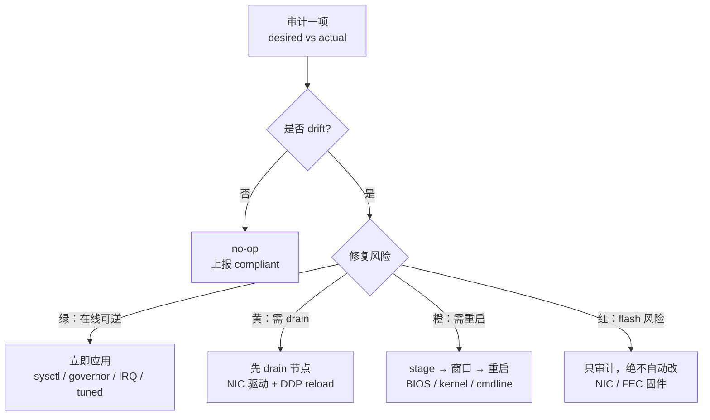

# META
id: w-p-bkc
kicker_en: PROJECT
kicker_cn: 项目
title_en: Compiling a Document into a Control Loop: A Machine-Level Configuration Reconciler for 5G vRAN Bare Metal
title_cn: 把一份文档编译成 control loop：面向 5G vRAN 裸金属的 machine-level 配置收敛控制器
sub_en: A self-authored, continuously running systemd-level daemon that turned Intel's Best Known Configuration from prose-and-shell documentation into a git-declared, continuously audited desired state across ~30 bare-metal servers spanning multiple clusters.
sub_cn: 一个自研、持续运行的 systemd 层 daemon，把 Intel 的 Best Known Configuration 从一份 prose 加 shell 的文档，变成 git 里声明式、被持续审计的 desired state，覆盖分布在多个 cluster 的约 30 台裸金属服务器。
domains: [infra, platform]

# EN

## What it was, and why

Kubernetes runs a reconcile loop over containers: declare a desired state, observe the actual state, converge the difference, repeat. This project pushed that philosophy one layer down, onto the bare-metal hardware that carries real-time radio traffic in a 5G vRAN stack.

Intel's cloud-ification of 5G moves the radio access network's L1/L2 off purpose-built silicon and onto general-purpose Xeon servers with standard NICs and software (the FlexRAN reference architecture). Whether that software hits certified performance depends entirely on the hardware, firmware, and kernel being tuned to exactly the values Intel has validated — the Best Known Configuration, or BKC.

My work sat in the IaC layer: hardware-level configuration management for this fleet. The concrete deliverable was a self-authored, continuously running machine-level controller — one daemon per node, at the systemd layer.

The starting point is the whole point. Before this system, the BKC was not compiled into anything executable. It lived as prose and copy-paste shell snippets in a doc, as tribal knowledge in engineers' heads, and as an assumption that "it was probably right when we installed it." Provisioning a node meant opening that doc and pasting commands by hand — no enforcement, no audit, no drift detection. This was more primitive than Ansible: not "Ansible was not good enough," but that there was no Ansible-tier layer at all. In one sentence, the project compiled a document into a control loop: desired state moved from scattered prose and human memory into a git-declared, machine-executable, continuously enforced form.

## Why BKC is a desired state by nature

BKC is a validated recipe for a full stack that delivers certified performance: BIOS (C-state / P-state policy, Turbo, SR-IOV, VT-d/IOMMU, NUMA, power profile), kernel (an RT / low-latency build, boot parameters such as isolcpus, nohz_full, hugepages), NIC (the ice driver plus a DDP profile version), firmware, and OS tuning. It is, structurally, already a desired state — it just lacks a controller that continuously enforces it. That controller is what this project built. It also grounds an abstract claim in a concrete, commercially meaningful anchor: reconcile is a general idea, not a Kubernetes feature.

## The constraints that drove it (the 5G side)

Three hard properties shaped every design decision:

- Deterministic latency budgets are microsecond-scale. Fronthaul timing (O-RAN 7.2x), C-state wake latency, cross-NUMA access — a single unclosed C-state or one drifted tuning value can eat the budget and violate a timing SLA. Determinism at the bottom layer is a physical requirement, not an optimization.
- Drift does not crash; it silently degrades. A node off-BKC usually does not error — it jitters, drops packets, breaks the fronthaul timing budget. The hardest failure to diagnose is the one where every health check is green and performance is simply worse.
- Provisioning complete does not equal certified performance in place. A node that installs, boots K8s, and runs pods says nothing about whether C-states are off, the NIC firmware is right, the DDP profile is correct, or hugepages and isolcpus actually landed. The question the system answers: how do we define and continuously enforce "5G-grade hardware readiness"?

## Architecture

The design is pull-based, and the control plane is an observer rather than a commander. There are three data flows and none point from the center to a node: each node pulls its BKC profile from git and verifies the signature before applying; each pushes a heartbeat and compliance summary to a read-only aggregator; and before any disruptive action a node must acquire a token. The center degrades into a dashboard that can die without stopping a single node from enforcing.

Two facts force this shape. Convergence has to live at the systemd layer, not the K8s layer: you cannot assume K8s is even up (bare-metal delivery, testbed re-imaging, a node that just powered on), the drift lives in a layer K8s cannot see (BIOS, kernel cmdline, NIC firmware, sysctl), and a solution delivered to a customer must be self-contained — one systemd unit plus one agent binary, not a dependency on the customer already running an orchestrator. And two reconcile loops nest: systemd keeps the agent process alive, the agent keeps the node's configuration from drifting — the same structure as kube-controller-manager over pods, with the target swapped for Linux plus hardware.

## The engineering core: reconcile graded by risk

This is the line between running a script and designing a controller. A one-shot config push is not enough when the machines are live and constantly changed, so such a controller must classify every configuration item along two axes — can it be audited, and what is the cost and risk of remediating it — and act accordingly:

- 🟢 online and reversible (sysctl, CPU governor, IRQ affinity, tuned profile): reconcile immediately.
- 🟡 requires draining the node first (NIC ice driver and DDP reload, which needs the interface down).
- 🟠 requires a maintenance window and reboot (BIOS values, kernel version, kernel cmdline — none take effect until reboot).
- 🔴 audit-only, never auto-changed (NIC NVM firmware, FEC accelerator firmware — a flash is high-risk).

Three principles fall out. Audit always precedes and is independent of update: even for items the controller never changes, continuously producing per-node compliance plus a drift timestamp lights up the silent-degradation blind spot and becomes a delivery-compliance artifact. Remediation must be traffic-aware, because the target is a live node carrying real-time radio traffic. And every action is idempotent and forward-only: current equal to desired is always a no-op.

The audit-and-monitor half is the confirmed core of what I built and ran: the daemon continuously inspects each node — BIOS via Redfish/BMC and in-band vendor tools, kernel via /proc/cmdline, tuning via sysctl and tuned, NIC via ethtool and devlink — and reports compliance. The full risk-tiered model above, with drain, maintenance windows, and reboot coordination, is stated here as how such a controller must be built to act safely on live nodes.

## Problems a controller like this must solve

Framed as design, not war stories — these are the problems any honest version of this system has to answer:

- The monitor must not perturb the monitored. On a node with isolcpus, the isolated cores run the RT RAN workload. An audit agent scheduled onto those cores, or one whose child processes escape onto them, becomes a noisy neighbor and manufactures the very jitter it exists to protect against. It must be pinned to housekeeping cores and refuse to run on isolated ones, its children constrained by the same cpuset.
- A cross-reboot state machine. Changes that only take effect after reboot (BIOS, kernel) mean the agent has to survive the reboot it triggers: a persisted state machine plus an intent marker read on boot, bounded retries to break boot loops, and a bootloader last-known-good fallback so a bad cmdline cannot brick a customer node.
- Reboot tokens rate-limited by failure domain. Under a pull model a single BKC bump in git is seen by every node on the next poll — without a distributed lease capping how many nodes in a domain may be disrupted at once, they would all reboot together, a self-inflicted correlated failure. Fail-safe default: token service unreachable means do not reboot.
- Signed profiles. The agent runs as root on every machine and can flash firmware, and desired state comes from git. The trust boundary has to be locked with signature verification (fail-closed), an INTENT audit log per mutation, reviewed protected branches, and human approval for the highest-risk class (firmware flash) — especially because this ships to customers running the agent as root on their own bare metal.

This is the same blast-radius discipline as the Kubernetes upgrade project's serial:1, quorum math, and PodDisruptionBudget — one mind, two layers.

## Scope

The system deliberately stops at the systemd layer and does not become a K8s Node Operator. The scenario is precisely "below K8s, on customer bare metal, possibly with no K8s at all," so moving up into an Operator would contradict the reason the project exists. Exposing compliance as a Node label for the scheduler (the NFD-style neighbor) is an imaginable adjacent direction, explicitly out of scope.

## Takeaways

- Reconcile is target-agnostic. A document becomes a control loop once desired state is declarative, machine-executable, and continuously enforced — the target can be a container or a NIC firmware version. This project is the argument that the idea belongs below K8s as much as above it.
- Audit is worth more than auto-remediation on day one. Making a hardware-layer blind spot visible, as per-node compliance and drift timestamps, is the value; safe remediation is the second step, gated by risk and traffic.

# CN

## 这是什么，以及为什么做

Kubernetes 在容器上跑一个 reconcile loop：声明 desired state，观察 actual state，收敛差异，循环往复。这个项目把同一套哲学向下推了一层，落到承载 5G vRAN 实时无线流量的裸金属硬件上。

Intel 的 5G 云化（cloud-ification）把无线接入网的 L1/L2 从专用芯片搬到通用 Xeon 服务器加标准 NIC 加软件（FlexRAN 参考架构）上。这套软件能不能跑出认证性能，完全取决于底层硬件、固件、内核是否被精确调到 Intel 验证过的那组值，也就是 Best Known Configuration，简称 BKC。

我做的是 IaC 这一层：这批 fleet 的硬件层配置管理。落地产物是一个自研、持续运行的 machine-level controller，每台节点一个 daemon，跑在 systemd 层。

起点本身就是全部要点。在这个系统之前，BKC 从没被编译成任何可执行的东西。它以三种形式存在：一份 doc 里的 prose 描述加几段复制粘贴的 shell 片段，工程师脑子里的部落知识，以及每台机器上「当初装的时候大概是对的」这个假设。排一台机器，就是打开那份 doc，一段段复制命令、肉眼看输出，没有 enforcement，没有审计，没有 drift 检测。这比 Ansible 更原始：不是「Ansible 不够好」，而是当时连 Ansible 这一级都没有。用一句话概括，这个项目把一份文档编译成了一个 control loop。desired state 从散落在 prose 和人脑里，变成 git 里声明式、机器可执行、被持续 enforce。

## 为什么 BKC 天生就是 desired state

BKC 是一份被验证过、能交付认证性能的完整栈配方：BIOS（C-state / P-state 策略、Turbo、SR-IOV、VT-d/IOMMU、NUMA、电源 profile）、kernel（RT / low-latency 版本，isolcpus、nohz_full、hugepages 等启动参数）、NIC（ice 驱动加一个 DDP profile 版本）、firmware，以及 OS tuning。它在结构上天生就是一个 desired state，只差一个持续 enforce 它的控制器。这个项目做的就是那个控制器，它也让「reconcile 是通用思想、不属于 Kubernetes」这个抽象论断，落到了一个具体、真实、有商业价值的锚点上。

## 驱动它的硬约束（5G 技术侧）

三个硬性质塑造了每一个设计决策：

- 确定性时延预算是微秒级的。fronthaul 时序（O-RAN 7.2x）、C-state 唤醒延迟、跨 NUMA 访问，一个没关的 C-state 或一处漂移的 tuning 值，就可能吃掉预算、违反时序 SLA。底层的确定性是物理要求，不是 nice-to-have 的优化。
- 漂移不 crash，只静默降级。偏离 BKC 的节点通常不报错，而是抖动、丢包、突破 fronthaul 时序预算。最难查的失效，恰恰是所有健康检查全绿、性能就是差的那一种。
- provisioning 完成不等于认证性能就位。一台机器装好、能起 K8s、能跑 pod，完全不代表 C-state 关了、NIC 固件对了、DDP profile 是对的版本、hugepages 和 isolcpus 真的落地了。系统回答的核心问题是：如何定义并持续 enforce「5G 级硬件就绪」。

## 架构

架构是 pull-based 的，控制面是观察者而不是指挥官。三条数据流，没有一条方向是控制面到节点：每个节点主动从 git 拉自己的 BKC profile，验签后再应用；每个节点主动向一个只读 aggregator 推心跳加 compliance 摘要；任何破坏性动作之前，节点必须先取一个 token。中心退化成一个 dashboard，它挂掉也不会让任何一台节点停止 enforce。

两个事实逼出这个形态。第一，收敛必须做在 systemd 层，不能只做在 K8s 层：不能假设 K8s 起得来（裸机交付、测试床重装、节点刚开机），漂移发生在 K8s 看不到的层（BIOS、kernel cmdline、NIC 固件、sysctl），而交付给客户的方案必须自包含，装一个 systemd unit 加一个 agent 二进制，不依赖客户先跑一套编排。第二，两层嵌套 reconcile：systemd 保证 agent 进程活着，agent 保证节点配置不漂移，这和 kube-controller-manager 管 pod 是同构的，只是 target 换成了 Linux 加硬件。

## 工程核心：按风险分级的 reconcile

这里是「跑脚本」和「设计一个 controller」的分界线。机器是活的、被反复改动，一次性下发配置远远不够，所以这类 controller 必须把每条配置沿两个维度打标，即能否审计、以及修复的代价和风险，然后分档行动：

- 🟢 在线可逆（sysctl、CPU governor、IRQ 亲和、tuned profile）：立即 reconcile。
- 🟡 需先 drain 该节点（NIC ice 驱动加 DDP reload，要接口 down）。
- 🟠 需维护窗口加重启（BIOS 值、kernel 版本、kernel cmdline，都要重启才生效）。
- 🔴 只审计、绝不自动改（NIC NVM 固件、FEC 加速卡固件，flash 是高风险动作）。

三条原则从里面长出来。audit 永远先于、且独立于 update：即便某项 controller 从不改，持续产出每节点 compliance 加 drift 时间戳本身就有价值，它正好点亮了静默降级这个盲区，也成了交付合规的凭证。修复必须 traffic-aware，因为 target 是承载实时无线流量的活体节点。每个动作都幂等且只前进：current 等于 desired 一律 no-op。

审计与监控这一半，是我构建并跑起来的、已确认的核心：daemon 持续巡检每台节点，BIOS 走 Redfish/BMC 与带内厂商工具，kernel 读 /proc/cmdline，tuning 读 sysctl 和 tuned，NIC 用 ethtool 和 devlink，并上报 compliance。上面那套完整的风险分级模型，即带 drain、维护窗口、重启协调的完整 🟢/🟡/🟠/🔴 分档，在这里是作为「这类 controller 必须如何构建才能安全作用于活体节点」的设计口径陈述的。

## 这类 controller 必须解决的问题

这一节是设计口径，不是战绩故事。以下是这个系统任何一个诚实的版本都必须回答的问题，以及这类 controller 必须如何构建来回答它们：

- 监控者不能扰动被监控对象。开了 isolcpus 的节点，隔离核跑的是 RT 的 RAN 负载。审计 agent 如果被调度到这些核上，或它派生的子进程逃逸上去，就变成噪声邻居，亲手制造出它本该保护的那种 jitter。agent 必须钉死在 housekeeping 核、拒绝在隔离核上运行，其子进程受同一个 cpuset 约束。
- 跨重启状态机。只有重启才生效的改动（BIOS、kernel）意味着 agent 得活过它自己触发的那次重启：一个落盘的状态机加一个开机读取的 intent marker，有上限的重试来打破 boot loop，以及 bootloader 的 last-known-good 兜底，让一个坏 cmdline 不至于把客户节点变砖。
- 按 failure domain 限流的 reboot token。pull 模型下，git 里一次 BKC bump 会被每台节点在下一个 poll 周期同时看到，如果没有一个分布式 lease 限制同一域内同时中断的节点数，它们会一起重启，造成自己制造的 correlated failure。fail-safe 默认：token 服务不可达就不重启。
- 签名 profile。agent 在每台机器上以 root 运行、能刷固件，而 desired state 来自 git。信任边界必须用验签（fail-closed）锁死，配套每次 mutation 的 INTENT 审计日志、带 review 的 protected branch、以及最高危类别（固件 flash）的人工审批，尤其因为这套要交付给客户，让客户在自己的裸机上以 root 跑这个 agent。

这和 resume 里 Kubernetes 升级项目的 serial:1、quorum math、PodDisruptionBudget 是同一套 blast-radius 纪律，同一个脑子、两个层。

## 范围边界

系统刻意停在 systemd 层，不做成 K8s Node Operator。场景恰恰是「K8s 之下、客户裸机、可能根本没有 K8s」，往 K8s Operator 走反而背离了这个项目存在的理由。把 compliance 暴露成 Node label 给调度器用（NFD 那类邻居方向）是一个可想象的相邻方向，但明确不在本项目范围内。

## Takeaways

- reconcile 与 target 无关。一份文档一旦让 desired state 变得声明式、机器可执行、被持续 enforce，就成了一个 control loop，target 可以是容器，也可以是一个 NIC 固件版本。这个项目就是「这个思想在 K8s 之下和之上同等成立」的论证。
- 第一天里，audit 比 auto-remediation 更值钱。把硬件层的盲区点亮成每节点 compliance 加 drift 时间戳，这是价值所在；安全的修复是第二步，被风险和流量状态所 gate。

# SOURCES

## 真实性边界（confirmed-real vs design-framing）

本页严格遵守源设计文档文末的「真实性边界」。以下两栏是给主 agent 和用户核对用的：正文里凡是「我做了 / 我构建了」的声明，只对应第一栏；其余全部用设计口径（「这类 controller 必须…」「the system was designed to…」）写。

### 写成「我做了 / confirmed-real」的（严格限于已确认部分）

| 声明 | 依据 |
|---|---|
| Intel 5G 云化（cloud-ification）背景；IaC / 硬件层配置管理是作者做的 | 源文档「真实背景」+「真实性边界·已确认」 |
| 构建并运行了一个持续运行的自研 machine-level controller（daemon，systemd 层）| 源文档「真实性边界·已确认」；正文 sub 与「工程核心」段 |
| 审计 / 监控能力（L1）：持续巡检每节点、产出 compliance + drift；采集面（Redfish/BMC、/proc/cmdline、sysctl/tuned、ethtool/devlink）| 源文档 L1 已确认 + 采集面小节。**注意：正文只把「审计与监控」认领为已运行；修复的具体风险分档未认领** |
| before 现状 = doc 里 prose + 复制粘贴 shell + 人肉执行（比 Ansible 更原始，当时连 Ansible 这级都没有）| 源文档「Before」小节 + 真实性边界 |
| 场景 = 多个内部测试集群 + 交付客户的裸机集群 | 源文档「场景与规模」+ 真实性边界 |
| 规模约 30 台服务器、分布在多个 cluster | 源文档「规模（已确认）」 |
| NIC = Intel E810 100GbE | 源文档「网络（已确认）」 |
| 范围不含 K8s Operator，刻意停在 systemd 层 | 源文档「系统能力分层·范围边界」+ 真实性边界 |

### 只用设计口径写、未认领为战绩的（design-framing，待用户确认或降级）

| 内容 | 正文处理方式 | 待用户裁决 |
|---|---|---|
| 具体 SKU（Coyote Pass/M50CYP、Dell R750、ACC100、N3000）| 全程用代际说法「Ice Lake 代服务器 / 100G NIC / FEC 加速卡」，未出现具体型号 | 若确认真实平台型号，可回填；不确定就保持代际 |
| 能力分层 L2 / L3 / L4（在线 tuning 收敛、traffic-aware 破坏性收敛、GitOps 闭环）| 「工程核心」段把完整风险分档明确标为「how such a controller must be built」；只把 L1 审计/监控认领为已运行 | 逐条确认真做到哪一层，做到的可从设计口径升格为「我做了」 |
| 深挖问题①隔离核 / CPUAffinity jitter | 写成「监控者不能扰动被监控对象」的设计原则，未写「我踩过这个坑」| 若确为真实战故事，可升格 |
| 深挖问题②跨重启状态机 | 写成「这类系统必须解决的问题」，未认领 | 同上 |
| 深挖问题③reboot token 按 failure domain 限流 | 架构图保留 token 流（作为设计），正文写成「must be built to answer」| 同上 |
| 深挖问题④签名 profile / 信任边界 | 写成设计口径 + 呼应 workspace 的 INTENT 约定 | 同上 |
| pull-based 架构 / aggregator / 无反向命令通道 | 以「The design is pull-based」描述性/设计口径陈述，未声称「我压测过其抗分区」| 架构确为作者设计的可确认；协调层（token/lease）实现程度待定 |

## 脱敏

- 未出现运营商 / 客户名、超出公开范围的 Intel 内部代号、真实 BKC 数值。
- 使用的公开名称：E810、FlexRAN、O-RAN 7.2x、Ice Lake 代、DDP、ice driver、SR-IOV、VT-d、isolcpus 等均为公开术语。
- 具体服务器 / 加速卡 SKU 一律用代际说法，未落到型号。

## 呼应点

- 结尾 blast-radius 呼应站点已有的 Kubernetes 升级项目（p_k8s_upgrade，serial:1 / quorum math / PodDisruptionBudget）：同一套纪律下沉到硬件层。
- 签名 profile 段呼应 workspace CLAUDE.md 里 K8s 变更前写 `# INTENT` 的审计约定。

## 渲染说明（给维护者）

- build_content.py 的 md 解析器不渲染 markdown 表格，故正文（EN/CN body）内不使用表格；风险分级用列表 + mermaid 流程图表达。本 SOURCES 节不被渲染（parser 只取 EN/CN），表格仅供核对。
- mermaid 节点标签内用 HTML 实体 `&cap;`（∩）和 `&rarr;`（→），避免裸 unicode 或箭头符号干扰解析；风险分档颜色以中英文文字（绿/黄/橙/红、green/yellow/orange/red）表达，未依赖 emoji 在图内渲染。
