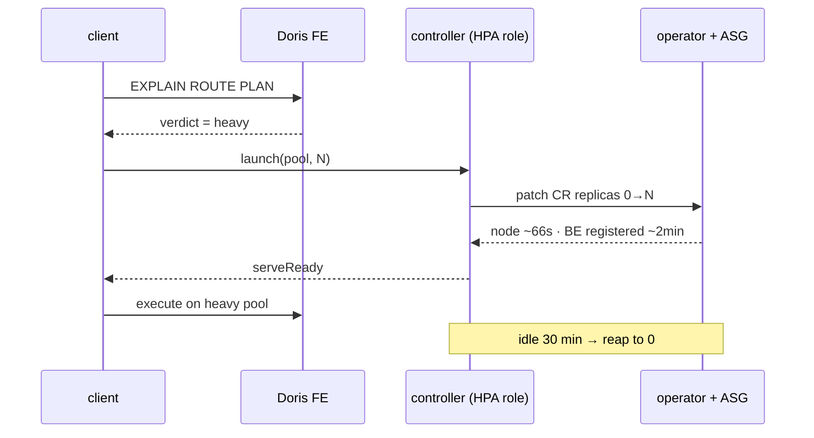
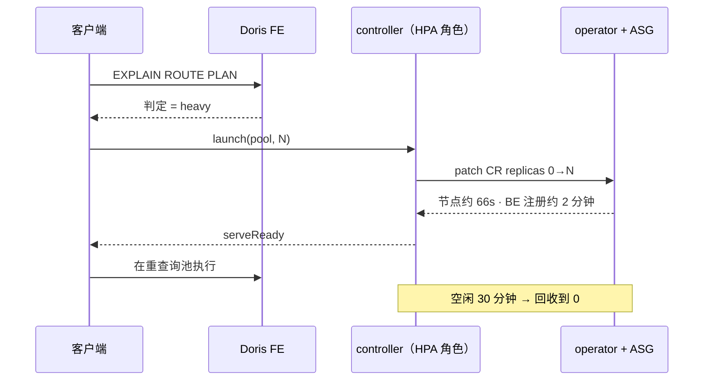

# META
id: w-p-elastic
kicker_en: PROJECT
kicker_cn: 项目
title_en: Designing the Elastic Compute Tier: Discrete Capacity, One Write Primitive, Readiness That Cannot Lie
title_cn: 弹性计算层是怎么设计的：离散容量、一个写原语、不会骗人的 readiness
sub_en: Five design decisions behind a heavy-query compute pool that rests at zero: physical isolation instead of a workload class, discrete capacity instead of per-query autoscaling, sizing by bottleneck instead of by size, a controller reduced to patching one field, and a readiness path built on the assumption that every health signal eventually lies. Spot pricing is a per-pool consequence, not the point.
sub_cn: 一个平时 0 副本的重查询计算池背后的五个设计决策：用物理隔离而不是负载分级、用离散容量而不是逐查询伸缩、按瓶颈类型而不是按数据量定容、把 controller 收敛成对一个字段的 patch，以及一条假设「每个健康信号最终都会骗人」而设计的 readiness 路径。spot 只是分池决策的结果，不是重点。
domains: [platform, infra, dist]

# EN

## The architecture, as five decisions

The pool itself is unremarkable; the design is in what it refuses to do. Five decisions carry the whole thing.

**1 — Physical isolation, not a workload class.** The heavy tail does not get a priority label inside the serving pool; it gets its own compute group. In shared-data mode that is affordable in a way it would not be in shared-nothing: tablets live in S3, so a pool is a metadata construct. Scaling the pool live from 2 to 4 backends moved **zero data** — ownership rebalanced to 131/128/128/125 as a metadata operation. Isolation is therefore the cheap primitive here, and memory isolation is the property the serving pool actually needs.

**2 — Discrete capacity, not per-query autoscaling.** The pool scales in fixed increments between a floor of zero and a small maximum, and deliberately does not compute a precise per-query target. Scale-up is minutes-scale (~66 s for the node, ~2 min for backend registration) while heavy queries run 60–500 s: many finish before a new backend is ready, so per-query elasticity is mostly theater. What elasticity buys is a *floor of zero*, not a fitted curve.

**3 — Sizing by bottleneck, not by data volume.** The heavy tail splits in two. Scan-bound shapes want scale-out — more backends, more S3 fetch parallelism. Memory-bound shapes — high-cardinality distinct aggregation, windows, join blow-ups — want scale-up plus spill, because their state has to fit inside one backend's RAM. Adding backends to a memory-bound query buys nothing; that is a capacity decision that has to be made per shape, not per gigabyte.

**4 — One write primitive.** The scaler is an internal controller I rebuilt into a pure HPA role. Its first design deployed backends itself, via a Helm install plus `ALTER SYSTEM ADD BACKEND`; I killed that before implementation, because it applied a shared-nothing mental model to shared-data mode, where backends register with the MetaService and any compute group not declared in the operator's custom resource is erased on the next reconcile. Bespoke deployment logic was not merely redundant — it built state the platform would actively destroy. The rewrite does exactly one thing: read the CR, locate the target compute group's index, JSON-patch `spec.computeGroups[i].replicas`.

**5 — Readiness that assumes every signal lies.** Scale-from-zero fails silently by construction, so the readiness path is layered and adversarial: controller `RUNNING` is only a pod-count check, the real gate parses `SHOW BACKENDS` for the target group's `Alive` column, and then a canary query touches storage. A `SELECT 1` probe is constant-folded by the frontend and never dispatched — it reports an empty compute group as healthy.

The trigger comes from the layer above: a routing verdict at plan time says *heavy*, and that verdict is what launches capacity. Evaluate, route, then run — elasticity is the third step, not the first.

## Why a floor of zero: cost points the opposite way from frequency

Production query-log mining settled the shape of the problem. Point-serving traffic is ~97% of captured executions on the event table; the heavy classes — cross-date aggregations, big GROUP BYs, window queries — are ≤3% of executions but carry a concentrated, outsized share of compute. The per-query cost ratio is ~1,240×: the monthly cumulative-window query averaged 196,354 ms while the highest-frequency point lookup averaged 158 ms. Starker still, 18 executions of that one window query roughly equal the total compute of 21,755 point queries. A pool sized for the light majority optimizes for throughput and concurrency; the heavy tail fits none of it, and cannot share the serving pool's machines.

The economics then argue against a resident heavy pool. A static 2-node heavy pool costs ~$772/month on-demand. The measured burst pattern — averaging 2 heavy nodes for ~2 hours a day — costs ~$63/month on-demand, ~$24 on spot: a ~92% saving on-demand, ~97% on spot. The price of elasticity is a cold start of ~66 s for the node plus ~2 min for backend registration, plus a cold-S3 first scan — acceptable for a latency-tolerant <3% tail. That arithmetic is the entire justification for the pattern.

## How: a controller reduced to one patched field

The scaler is an internal controller I rebuilt into a pure HPA role. Its first design deployed backends itself, via a Helm install plus `ALTER SYSTEM ADD BACKEND`. I killed it before implementation: that is a shared-nothing mental model applied to shared-data mode, where backends register with the MetaService and any compute group not declared in the operator's custom resource is erased on the next reconcile. Bespoke deployment logic was not just redundant; it built state the platform would actively destroy. The rewrite does exactly one thing: read the CR, locate the target compute group's index, and JSON-patch `spec.computeGroups[i].replicas` — a single write primitive, merged with 34/34 tests passing.

The full loop runs live on a preprod cluster at production scale: a routing verdict says heavy → the controller patches replicas 0→N → the ASG boots a node in ~66 s → the backend registers with the frontend in ~2 min → layered readiness checks pass → the query executes in the heavy pool → an idle reaper returns the pool to zero. Readiness is layered: controller RUNNING is only a pod-count check; the real gate parses `SHOW BACKENDS` for the target group's Alive column, then runs a canary scan. Scaling the pool live from 2 to 4 backends moved zero data — tablets live in S3, and ownership rebalanced to 131/128/128/125 as a metadata operation.

Capacity is discrete, not continuous. The pool scales in fixed increments between a floor of zero and a small max, rather than computing a precise per-query target — scale-up is minutes-scale and many queries finish before a new backend is ready; per-query elasticity is mostly theater. Sizing splits the heavy tail by bottleneck: scan-bound shapes want scale-out (more backends, more S3 fetch parallelism), memory-bound shapes — high-cardinality distinct aggregations, windows, join blow-ups — want scale-up plus spill, because their state must fit one backend's RAM.

## The hard parts

**Two ways cluster-autoscaler silently refuses to scale from zero.** First, the backend requested cpu=8 on an 8-vCPU node whose allocatable was ~7.9 after kube-reserved — the scheduler simulation reports Insufficient cpu forever, with no event pointing at the 0.1-core gap; requesting cpu=7 scaled immediately; "requests strictly below node vCPU" became a P0 checklist item. Second, at literal zero nodes the autoscaler has no real node to inspect; it builds a virtual node purely from the ASG's node-template label and taint tags. With those missing, it concludes the group can never host the pod and skips it — the pod stays Pending with no error mentioning the tags. Both failures are silent by construction — what makes scale-from-zero its own discipline.

**Probes that lie.** A `SELECT 1` readiness probe is constant-folded by the frontend and never dispatched to any backend — it happily reports an empty compute group as healthy. The real data-plane probe is `SHOW BACKENDS` Alive plus a canary query that touches storage.

**Red that means healthy.** A compute group parked at zero replicas makes the operator's aggregate cluster-health field read red. That is a monitoring quirk, not a fault: scale-to-zero is the design working. Sharper still: a group scaled to zero can leave an orphaned lease in the metadata service, blocking other groups' compaction until it expires — learned the hard way; idle states need their own operational review.

**Spot versus on-demand, per pool.** The serving pool is never spot: a reclaim is a query outage plus a cache dump. The heavy pool tolerates interruption by construction — the frontend detects a dead backend via ~2 s heartbeats, locks release in ~7 s, and a failed query retries once, all inside spot's 2-minute reclaim window — and spot pricing runs ~62% below on-demand for the node class. But floor-zero already makes the absolute on-demand cost small, and a mid-query reclaim on a 60–500 s query wastes the work plus a ~3–4 min re-scale. The decision: on-demand until a node-termination handler is installed, then a spot-first mixed ASG with on-demand fallback — tied to measured node-hours, not dogma.

## Productionization: pull the decisions out of the client

The first working integration left too much intelligence in the query-execution client, which probed the frontend, chose replica counts, and judged queue pressure itself. The production evolution converges four capabilities into the controller. Launch is formalized as a declarative, raise-only, idempotent target — repeated launches with the same N are no-ops, and concurrent launches coalesce onto a single handle at the max requested target. Scale-up becomes a fixed increment rather than precise scale-to-N. The status endpoint exposes alive-backend counts and a serve-ready bit, so clients stop probing the frontend directly. And the controller's monitor reads `waiting_query_num` from `SHOW WORKLOAD GROUPS`, scaling up on sustained queueing, capped at the pool max. The client's only conversation is with the controller.

## Takeaways

- Elasticity is an economics argument before it is an infrastructure pattern: measure the compute concentration and the burst shape first; ~92–97% of a static pool's cost was simply idle time.
- When a platform operator owns the state, bespoke tooling should shrink — the correct size for this scaler was one patched field on one custom resource.
- The characteristic failure mode of scale-from-zero is silence: schedulers, probes, and health gauges that report nothing wrong while nothing happens. Design the readiness path assuming every signal will eventually lie, because each one did.

# CN

## 这个架构，就是五个决策

池子本身平平无奇，设计全在它**拒绝做什么**上。五个决策撑起整件事。

**1 — 用物理隔离，不用负载分级。** 重查询尾部拿到的不是 serving 池里的一个优先级标签，而是自己的 compute group。存算分离让这件事变得便宜（shared-nothing 下不会）：tablet 在 S3 上，所以一个池就是一个元数据构造。在线把池从 2 个 BE 扩到 4 个，**零数据移动** —— 归属重平衡成 131/128/128/125，纯元数据操作。于是隔离在这里是最便宜的原语，而**内存隔离**恰好是 serving 池真正需要的那个性质。

**2 — 用离散容量，不做逐查询伸缩。** 池子在「底 0」和一个小上限之间按固定增量伸缩，**刻意不去算精确的每查询目标**。扩容是分钟级（节点约 66 秒、BE 注册约 2 分钟），而重查询本身跑 60–500 秒：很多查询在新 BE 就绪之前就结束了，所以逐查询弹性基本是表演。弹性买到的是**一个为零的地板**，不是一条拟合曲线。

**3 — 按瓶颈类型定容，不按数据量。** 重尾分成两类。扫描瓶颈型要横向扩（更多 BE、更多 S3 拉取并发）；内存瓶颈型（高基数 distinct 聚合、窗口、join 膨胀）要纵向扩加 spill，因为它的状态必须装进**单个 BE 的内存**。给内存瓶颈的查询加 BE 一点用都没有 —— 这是一个必须按查询形态而不是按 GB 数来做的容量决策。

**4 — 一个写原语。** scaler 是我重写成纯 HPA 角色的内部 controller。它的第一版设计自己部署 BE（Helm install 加 `ALTER SYSTEM ADD BACKEND`），我在实现之前就把那版杀掉了：它把 shared-nothing 的心智模型套在了存算分离上 —— 这里 BE 是向 MetaService 注册的，任何没在 operator CR 里声明的 compute group 都会在下一次 reconcile 时被抹掉。自研部署逻辑不只是冗余，它**建造的是平台会主动销毁的状态**。重写后它只做一件事：读 CR、定位目标 compute group 的下标、JSON-patch `spec.computeGroups[i].replicas`。

**5 — 假设每个信号都会骗人的 readiness。** 从零扩容天生静默失败，所以 readiness 路径是分层且对抗式的：controller 的 `RUNNING` 只是 pod 数检查，真正的门是解析 `SHOW BACKENDS` 里目标 group 的 `Alive` 列，然后再跑一条碰存储的 canary。`SELECT 1` 探针会被 FE 常量折叠、根本不下发到任何 BE —— 它会把一个空的 compute group 报成健康。

触发信号来自上一层：plan 期的路由 verdict 判定 *heavy*，是这个 verdict 拉起算力。**先评估、再路由、后执行** —— 弹性是第三步，不是第一步。

## 为什么地板是零：成本与频率指向相反的方向

生产 query log 挖掘定下了问题的形状。事件表上点查类 serving 流量约占捕获执行数的 97%；重查询类（跨日期聚合、大 GROUP BY、窗口查询）只占执行数的 3% 以下，却集中承载了不成比例的算力。单查询成本比约 1,240 倍：月度累计窗口查询平均 196,354ms，而频率最高的点查形状平均 158ms。更直观的对照是：那条窗口查询执行 18 次，总算力约等于 21,755 条点查。为轻查询多数派设计的池子，优化目标是吞吐和并发，与重尾完全不匹配，而重尾也绝不能与 serving 池共享机器。

经济账进一步否定了常驻重查询池。静态 2 节点重池按 on-demand 计价约 $772/月；实测的 burst 模式（平均每天 2 台重节点跑约 2 小时）on-demand 约 $63/月，spot 约 $24/月，即 on-demand 省约 92%，spot 省约 97%。弹性的代价是冷启动：节点拉起约 66 秒，backend 注册约 2 分钟，外加第一次冷读 S3 的扫描税。对一个延迟容忍的 3% 以下长尾，这是可接受的。这笔算术就是整个模式的全部理由。

## 怎么做：controller 收敛成对一个字段的 patch

scaler 是一个我重构过的内部 controller，最终角色是纯 HPA。它的第一版设计自己部署 backend：Helm 装一个 BE，再用 `ALTER SYSTEM ADD BACKEND` 注册。这个设计在实现之前就被我否掉了，因为它是把 shared-nothing 的心智模型套在了 shared-data 模式上：cloud mode 下 backend 通过 MetaService 注册，而任何没有在 operator 的 custom resource 里声明的 compute group，下一次 reconcile 会被直接抹掉。自建部署逻辑不只是多余，它建立的状态会被平台主动摧毁。重写后的 controller 只做一件事：读 CR，定位目标 compute group 的数组下标，JSON-patch `spec.computeGroups[i].replicas`，全系统唯一的写原语，以 34/34 测试通过合入。

完整链路在生产规模的 preprod 集群上跑通：路由 verdict 判 heavy，controller 把副本数 0→N patch 上去，ASG 约 66 秒拉起节点，backend 约 2 分钟完成注册，分层就绪检查通过，查询在重池执行，idle reaper 把池子缩回 0。就绪检查刻意做成分层，因为每个单独的信号都会说谎：controller 的 RUNNING 只是 pod 计数；真正的门槛是解析 `SHOW BACKENDS` 里目标组的 Alive 列，再加一条 canary 查询。线上把池子从 2 台扩到 4 台 backend，零数据搬迁：tablet 在 S3 上，归属以元数据操作 rebalance 成 131/128/128/125。

容量是离散分层的，不是连续伸缩的。池子在 floor 0 和一个不大的上限之间按固定增量伸缩，而不是为每条查询计算精确目标：扩容是分钟级的，很多查询在新 backend 就绪之前就已经跑完，per-query 弹性大多是表演。sizing 按瓶颈把重尾切成两类：scan-bound 形状适合 scale-out（更多 backend，更多 S3 拉取并行度）；memory-bound 形状（高基数 distinct 聚合、窗口、join 膨胀）适合 scale-up 加 spill，因为它们的状态必须装进单台 backend 的内存。

## 难点

**cluster-autoscaler 从 0 扩容的两类静默拒绝。** 第一类：BE 请求 cpu=8，而 8 vCPU 节点扣除 kube-reserved 后 allocatable 只有约 7.9，调度模拟永远报 Insufficient cpu，没有任何事件指向那 0.1 核的差距；改成 cpu=7 立即扩出，"request 必须严格小于节点 vCPU"进了部署 checklist 的 P0。第二类：ASG 处于字面意义的 0 节点时，autoscaler 没有真实节点可查看，只能靠 ASG 的 node-template label 和 taint tag 在内存里构造一个 virtual node 做匹配；缺 tag 时 autoscaler 直接判定这个组永远装不下该 pod 并跳过，pod 永远 Pending，且没有任何报错提到缺失的 tag。两类失败在构造上就是静默的，这是 scale-from-zero 区别于普通 autoscaling 的地方。

**会说谎的探针。** `SELECT 1` 就绪探针会被 FE 常量折叠，从不下发到任何 backend，空的 compute group 也会被它报告为健康。数据面探针必须是 `SHOW BACKENDS` 的 Alive 状态，加一条真正触达存储的 canary 查询。

**显红的其实是健康。** compute group 停在 0 副本会让 operator 的聚合集群健康字段读成红色。这是监控层的 quirk，不是故障：scale-to-zero 正是设计在生效。相关但更尖锐的一课：缩到 0 的 group 可能在元数据服务里留下一个 orphan lease，在过期之前阻塞其他 group 的 compaction。这是踩过的坑，也是"idle 状态需要专门的运维审视，不能默认免费"的原因。

**spot 与 on-demand 按池分治。** serving 池永远不上 spot：一次回收等于查询中断加缓存清空。重池在构造上容忍中断：FE 心跳约 2 秒检测到 backend 失联，锁约 7 秒释放，失败查询重试一次，全部落在 spot 2 分钟回收窗口之内；该节点档位的 spot 价格比 on-demand 低约 62%。但 floor 0 已经让 on-demand 的绝对成本很小，而一条 60 到 500 秒的重查询中途被回收，浪费的是已完成的工作加约 3 到 4 分钟的重新扩容。决策是：装好 node-termination handler 之前用 on-demand，之后切 spot 优先的混合 ASG 加 on-demand 兜底。决策锚定实测 node-hours，不锚定"spot 便宜"的教条。

## 生产化：把决策从客户端收进 controller

第一版跑通的集成把太多智能留在了查询执行客户端：它自己探活 FE、自己决定副本数、自己判断排队压力。生产化演进把四项能力收敛进 controller：launch 形式化为声明式、只升不降、幂等的目标（同 N 重复调用是 no-op，并发调用合并到同一个 handle，按最大目标生效）；扩容改为固定增量，不做精确 scale-to-N；status 端点暴露 alive backend 计数和 serve-ready 标志，客户端不再直连 FE 探活；controller 的 monitor 读 `SHOW WORKLOAD GROUPS` 的 `waiting_query_num`，持续排队时自动加固定增量，封顶池上限。客户端从此只和 controller 一个面板对话。

## Takeaways

- 弹性首先是一笔经济账，其次才是基础设施模式：先测算力集中度和 burst 形状，静态池约 92% 到 97% 的成本纯粹是空转时间。
- 平台 operator 拥有状态时，自建工具应当收缩。这个 scaler 的正确尺寸，是对一个 custom resource 的一个字段做 patch。
- scale-from-zero 的典型失败模式是静默：调度器、探针、健康度都报告一切正常，而什么都没有发生。就绪链路要按"每个信号都会在某个时刻说谎"来设计，因为它们各自都真的谎报过。

# SOURCES

- /Users/rshao/work/work-harness/code_repos/infra/cre6630-infra/cre-6630/interview/INTERVIEW-PROJECT.md
- /Users/rshao/work/work-harness/code_repos/infra/cre6630-infra/cre-6630/interview/dimensions/doris-arch.md
- /Users/rshao/work/work-harness/code_repos/infra/cre6630-infra/cre-6630/interview/dimensions/opensource.md
- /Users/rshao/work/work-harness/code_repos/infra/cre6630-infra/cre-6630/scaling/explain/plan/71-cg-design.md
- /Users/rshao/work/work-harness/code_repos/infra/cre6630-infra/cre-6630/scaling/explain/plan/72-dcluster-scaling-dynamics-spec.md
