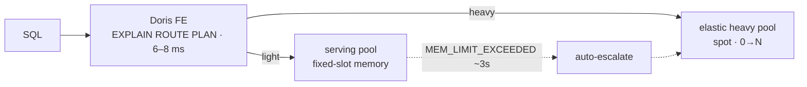
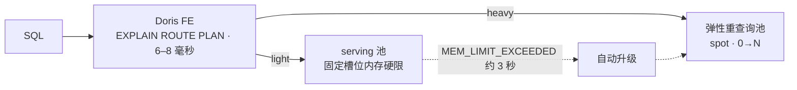

# META
id: w-p-routing
kicker_en: PROJECT
kicker_cn: 项目
title_en: Engine-Level Query Routing: EXPLAIN ROUTE PLAN
title_cn: 引擎级查询路由：EXPLAIN ROUTE PLAN
sub_en: A new SQL statement inside the Apache Doris frontend that classifies every query heavy or light in 6–8 ms before execution — built on a fork, mechanism prepared for upstream, policy deliberately kept internal.
sub_cn: 在 Apache Doris FE 内新增一条 SQL 语句，每条查询执行前 6-8ms 判定 heavy/light。工作在 fork 上完成，mechanism 准备 upstream，policy 刻意留在内部。
domains: [dist, platform, influence]

# EN

## Why the decision has to happen before execution

After the migration consolidated serving and analytics onto one Apache Doris deployment, fewer than 1% of queries were heavy — but a single misplaced heavy query could starve the shared light pool. Reactive elasticity cannot be the safety mechanism here: scaling a compute pool is a minutes-scale operation, while a memory blow-up is a seconds-scale event. The only place the routing decision can safely happen is at plan time, before any backend touches data.

The first question was whether stock Doris already exposed enough signal. I built a closed-loop feasibility pipeline (SQL in, EXPLAIN parsed and classified, real execution as ground truth) over a 52-query suite triangulated three ways: a real ~1,900-column schema, the platform's actual production SQL templates, and the business query taxonomy. Stock EXPLAIN routed the suite at 45% accuracy with a 27% heavy-miss rate; the worst miss ran 188 s and consumed 800 MB, roughly 10% of one backend's memory, in a single query.

Two measurements settled the design direction. Identical query templates with different parameters (a time-window sweep from 1 hour to 36 days) produced byte-identical EXPLAIN text while real memory differed 23× and wall time 6×. And a point lookup aimed at the highest-cardinality key ran in 32 ms while EXPLAIN predicted a full table scan. The workload is fixed templates with parameter-driven cost swings of 50×–2,000×, which makes static hints structurally unable to solve the problem: any labeling scheme keyed on query text sees the same bytes for wildly different costs.

## How: expose what the optimizer already computes

The gap was a signal problem, not a rule problem. Doris's cost-based optimizer already computes per-operator cardinality, selectivity, average row width, scan bytes, and sort/aggregate state sizes while building the physical plan; it folds them into one opaque cost number and discards them. The first change, on an Apache Doris fork, was `EXPLAIN ESTIMATE PLAN`: a read-only visitor (`PlanEstimateCollector`) that walks the finalized physical plan and emits those per-operator estimates as structured JSON. The diff is purely additive — zero deletions, no changes to the cost model or statistics calculator (15 files, +1,310 lines in PR form). The first unit test returned `estimated_filter_selectivity = 0.9867`, exactly 4933/5000 — evidence this is exposing existing math, not building new estimation logic.

`EXPLAIN ROUTE PLAN` is that estimate plus one step: a 15-rule classifier ported from a Python reference into Java, returning a verdict JSON — label, confidence, target compute group, target workload group, transport — in 6–8 ms, independent of data volume (13M and 102M rows both plan in ~8 ms, because the estimate reads cached CBO statistics with zero I/O). The integration followed the seams of the prior feature exactly: a `ROUTE` token in the ANTLR lexer, a `planType` alternative in the parser grammar, one new `ExplainCommand` enum case, one token-to-enum mapping, one new branch in the planner's explain path, and two new classes. All ~21 routing thresholds are declared `@ConfField(mutable=true)` and hot-reloadable via `ADMIN SET FRONTEND CONFIG`, with defaults equal to the Python constants — threshold tuning never requires a rebuild.

On a preprod cluster at production scale, heavy recall on the canonical suite went 7% → 100% (15/15) and light precision reached 86%; six of the heaviest real production queries (up to 76 GiB / ~3 B rows scanned) routed 6/6 with zero heavy misses. The classifier is permitted to be imperfect — a misrouted heavy query is contained by a runtime memory hard limit and escalated, a separate layer covered in the main case study.

## Two blind spots in the cost model, found by re-benchmarking

Both misclassifications found in the second benchmark round were the same species of bug: the estimate was not slightly off, it was structurally blind.

**A bounded window query that looked like a full-table scan.** A point query carrying a window function — `WHERE user_id = X ... ROW_NUMBER() OVER (PARTITION BY user_id) LIMIT 1000` — routed heavy. The CPU-blocking rule keyed on the raw largest leaf-scan cardinality, so one user's ~840K rows read as a full-table window, even though the filter bounded the window's input and the query actually cost 0.8 s of CPU and 12–28 MB peak memory. The fix emits `input_cardinality` on WINDOW and PARTITIONTOPN operators and gates the CPU rule on that signal, falling back to the raw cardinality when it is absent. Genuine full-table windows still route heavy.

**A wide `SELECT *` the byte model called cheap.** Output volume, modeled as rows × average row bytes, badly under-prices a wide read, because the cost of a wide read is not bytes — it is cold-opening thousands of column files from object storage. Measured at production scale: a 3,727-column `SELECT *` took **253 s cold**. The fix adds `output_column_count` — taken straight from `plan.getOutput().size()`, a structural fact rather than an estimate — plus one hot-reloadable bar (default 200 columns) that routes a wide result heavy with an `output_materialization` reason and switches its transport to Arrow Flight. Both fixes are backward-compatible: when the new estimate field is absent, the rule falls back to prior behavior.

**"Why not just fix the SQL?"** — the fair objection, and answering it is the thesis of this project. `SELECT *` on a 3,700-column table is bad practice, and callers are told so. But a platform cannot make its safety contingent on every caller being disciplined, least of all now, when a growing share of queries is generated by product features and AI agents rather than written by hand and reviewed. And independent of anyone's SQL style, an estimator that labels a 253-second query *light* is wrong on its own terms: that is a defect in the cost model, and it will mis-price the next unfamiliar shape too. Fixing the SQL removes one bad query. Fixing the classifier removes the failure class where any bad query lands in the pool sized for 20 ms point lookups. One is a remedy, the other is a property.

The same reasoning later drove a v3 simplification: rules resting on CBO byte estimates were dropped in favour of structural signals — operator shape, output column count, bounded input — because a signal you can trust to be a fact beats a better-looking number you cannot.

## The hard parts

**Cross-language parity.** The 15 rules existed as a Python implementation; the port had to run in the FE's hot path in Java. Two independent implementations of routing policy will silently drift, and one off-by-one threshold sends a heavy query into the light pool. The fix was to treat the Python implementation as an executable specification, not documentation: a 197-case golden corpus of real estimate JSON is fed to both sides, asserting label-for-label agreement — 197/197 passed before any cluster or image existed. The most fragile surface was tolerant-accessor semantics: null, -1, and "unknown" must map to the same tri-state in both languages, and "field absent" must never be conflated with "value is zero" — that distinction is exactly where a cross-language port fails silently.

**Build economics forcing verification design.** A full FE build under QEMU-emulated amd64 took 43:55 min per successful run. That constraint forced a layered strategy: cheap, high-signal verification first (the parity harness runs with standalone javac against built jars, at zero build cost), expensive, low-signal verification last (full build, image, cluster smoke test). Native arm64 compilation later cut builds to ~3 min, and an overlay Dockerfile cut image pushes from 747 MB to 43 MB / 3.8 s. Combined with hot-reloadable thresholds, "change a tuning value" went from a 44-minute rebuild to one SQL statement.

**Bugs the parity net cannot catch.** Parity proves Java equals Python; it does not prove the specification itself is correct. After rollout, a LIMIT blindspot surfaced: a LIMIT anywhere in the plan suppressed the "scan too large" heavy signal, but LIMIT only bounds the output of blocking operators such as hash aggregation — it does not bound the underlying scan. The bug was caught by cross-validating classifier verdicts against real production behavior, fixed structurally (blocking operators no longer exempt a query; pure scan-plus-limit still does), and fed back into the golden corpus as a new fixture. Spec-level bugs need production cross-validation; the corpus then keeps them fixed.

**Deciding what not to upstream.** Leadership initially wanted the classifier contributed upstream along with the estimate mechanism. A line-by-line read of the classifier produced seven concrete business couplings: workload-group-anchored memory thresholds, calibration constants such as a 50M-row heavy cutoff, a recall-first risk posture, company-specific query shapes, and private fork fields. The counter-argument used the first PR's own principle — the engine should emit data; callers decide policy — so upstreaming policy would contradict the mechanism's own pitch. The outcome: `EXPLAIN ESTIMATE PLAN` was prepared as a clean 8-commit PR against a synthetic base branch so the diff is exactly the feature; the classifier was archived internally and never proposed for merge. That argument changed the decision.

## Takeaways

- Quantify the gap before touching an engine. The load-bearing number was the 27% heavy-miss rate — a safety problem — not the 45% accuracy headline.
- Prefer exposing existing internal math to building new estimation. A zero-deletion diff is itself the risk argument.
- Judging what not to contribute is part of the contribution. Mechanism belongs upstream; calibrated policy does not.

# CN

## 为什么判定必须发生在执行之前

迁移把 serving 和分析收敛到同一套 Apache Doris 平台之后，重查询占比不到 1%，但一条被误放进共享轻查询池的重查询足以拖垮整个池子。事后弹性救不了这个场景：计算池扩容是分钟级操作，内存打爆是秒级事件。路由判定唯一安全的位置是 plan time，即任何 backend 碰到数据之前。

第一个问题是：原生 Doris 暴露的信号够不够。我搭了一条闭环可行性流水线（SQL 输入，解析 EXPLAIN 输出并分类，再真实执行作为 ground truth），套件 52 条 SQL，代表性做了三角验证：真实的约 1,900 列 schema、平台真实生产 SQL 模板、业务查询 taxonomy。结果：原生 EXPLAIN 路由准确率 45%，heavy-miss 率 27%，最坏一条漏判查询跑了 188 秒、吃掉 800 MB，约等于单台 backend 内存的 10%。

两个测量结果决定了设计方向。同一条 SQL 模板换参数（时间窗从 1 小时到 36 天扫过一遍），EXPLAIN 输出逐字节相同，而真实内存差 23 倍、真实耗时差 6 倍。另一条刻意打在最高基数键上的点查真实执行 32ms，EXPLAIN 却预测全表扫描。这个负载的本质是固定模板加参数摆动，成本随参数摆动 50 到 2,000 倍，静态 hint 在结构上无解：任何基于查询文本打标签的方案，看到的是同样的字节，对应的却是天差地别的成本。

## 怎么做：把优化器已经算出的数吐出来

这是 signal problem，不是 rule problem。Doris 的 CBO 在生成物理计划时本来就算出了每个算子的 cardinality、selectivity、平均行宽、scan bytes、sort/agg 状态大小，只是把它们折进一个不透明的 cost 数字后丢弃了。第一个改动在 Apache Doris fork 上完成：`EXPLAIN ESTIMATE PLAN`，一个只读 visitor（`PlanEstimateCollector`）遍历已定稿的物理计划，把这些算子级估算以结构化 JSON 输出。diff 是纯加法：零删除，不改 cost model 和统计模块（PR 形态 15 个文件，+1,310 行）。首个单测返回 `estimated_filter_selectivity = 0.9867`，恰好等于 4933/5000，证明这是暴露既有数学，不是新建估算逻辑。

`EXPLAIN ROUTE PLAN` 等于这份估算再加一步：把 15 条规则的 Python 参考实现 port 成 Java 分类器，返回 verdict JSON（label、confidence、目标 compute group、目标 workload group、transport），耗时 6-8ms，与数据量无关（13M 行和 102M 行都是约 8ms，因为估算读的是 CBO 缓存统计，零 I/O）。接入点严格沿前一个 feature 的缝走：ANTLR lexer 加一个 `ROUTE` token，parser grammar 的 `planType` 加一个 alternative，`ExplainCommand` 加一个 enum case，一处 token 到 enum 的映射，planner 的 explain 路径加一个分支，外加两个新类。全部约 21 个路由阈值声明为 `@ConfField(mutable=true)`，通过 `ADMIN SET FRONTEND CONFIG` 热调，默认值等于 Python 常量，调阈值永远不需要 rebuild。

在生产规模的 preprod 集群上，canonical 套件的 heavy recall 从 7% 到 100%（15/15），light precision 到 86%；六条最重的真实生产查询（最大 76 GiB、约 30 亿行扫描）6/6 路由正确，零漏判。分类器被允许不完美：漏判的重查询会被运行时内存硬限拦住并升级重跑，那是另一层机制，见总篇 case study。

## 重新 benchmark 时发现的两个成本模型盲区

第二轮 benchmark 抓到的两处误判，本质是同一种 bug：估算不是「偏了一点」，而是结构性看不见。

**被过滤器夹住的 window 查询被当成全表扫。** 一条带窗口函数的点查——`WHERE user_id = X ... ROW_NUMBER() OVER (PARTITION BY user_id) LIMIT 1000`——被判成 heavy。CPU 阻塞规则读的是原始的最大叶子扫描基数，于是某个用户的约 84 万行看起来像一个全表窗口，而实际上过滤器已经把窗口的输入夹住了，这条查询真实成本是 0.8 秒 CPU、峰值内存 12-28MB。修复是在 WINDOW 与 PARTITIONTOPN 算子上吐出 `input_cardinality`，CPU 规则改用这个信号，字段缺失时退回原来的基数。真正的全表窗口仍然路由 heavy。

**宽表 `SELECT *` 被字节模型算成便宜。** 输出体量按「行数 × 平均行宽」建模，会严重低估宽读的成本，因为宽读的代价不是字节数，而是从对象存储冷启动打开上千个列文件。生产规模实测：3,727 列的 `SELECT *` 冷跑 **253 秒**。修复是加一个 `output_column_count`——直接取 `plan.getOutput().size()`，这是结构事实而不是估算——再加一条可热更的阈值线（默认 200 列），把宽结果集判为 heavy，理由标 `output_materialization`，并把传输切到 Arrow Flight。两处修复都向后兼容：新字段不存在时规则退回原行为。

**「为什么不直接改 SQL？」** 这是个公道的质疑，而回答它正好就是这个项目的论点。3,700 列的表上写 `SELECT *` 当然是坏实践，我们也确实这么告知调用方。但一个平台不能把自己的安全性押在「每个调用方都守纪律」上，尤其是现在——越来越多的查询由产品功能和 AI agent 生成，而不是人手写、再经过 review。而且抛开任何人的 SQL 风格：一个把 253 秒的查询标成 *light* 的估算器，本身就是错的，这是成本模型的缺陷，它同样会给下一个陌生形态定错价。改 SQL 消灭一条坏查询，改分类器消灭的是「任何坏查询都可能落进那个按 20 毫秒点查规格建的池子」这一整类失效。前者是补救，后者是性质。

同一条推理后来推动了 v3 的简化：依赖 CBO 字节估算的规则被砍掉，换成结构信号——算子形态、输出列数、被夹住的输入——因为一个可信为事实的信号，胜过一个更好看但不可信的数字。

## 难点

**跨语言 parity。** 15 条规则原本是 Python 实现，port 后要跑在 FE 热路径的 Java 里。两份独立的策略实现一定会静默 drift，一个阈值 off-by-one 就会把重查询送进轻查询池。解法是把 Python 当可执行规范而不是文档：用 197 条真实估算 JSON 组成 golden corpus，同时喂两边，断言 label 逐条一致，在任何集群和镜像存在之前 197/197 全过。最脆弱的表面是容错 accessor 语义：null、-1、"unknown" 在两种语言里必须映射到同一个三态，"字段缺失"绝不能和"值为零"混为一谈，跨语言 port 最容易静默出错的正是这里。

**build 成本倒逼验证分层。** QEMU 模拟 amd64 的 FE 全量 build，成功一次要 43 分 55 秒。这个约束逼出了分层验证策略：便宜且高信号的验证放最前（parity harness 用 standalone javac 对着编译产物 jar 跑，零 build 成本），昂贵且低信号的验证放最后（全量 build、镜像、集群冒烟）。之后原生 arm64 编译把 build 压到约 3 分钟，overlay Dockerfile 把镜像推送从 747 MB 压到 43 MB、3.8 秒。加上阈值热调，"改一个调参值"从 44 分钟 rebuild 变成一条 SQL。

**parity 网兜不住的 bug。** parity 证明的是 Java 等于 Python，不证明规范本身正确。上线后暴露了一个 LIMIT 盲区：计划里任何位置出现 LIMIT 都会压制"扫描过大"的 heavy 信号，但 LIMIT 只约束 hash aggregation 这类 blocking 算子的输出，不约束底层扫描量。这个 bug 靠把分类器 verdict 与真实生产行为交叉验证抓到，修法是结构性的（blocking 算子不再豁免，纯 scan 加 limit 仍豁免），并作为新 fixture 反哺进 golden corpus。规范级 bug 需要生产行为交叉验证，corpus 负责让它不再复发。

**判断什么不该 upstream。** Leadership 最初希望把分类器和估算机制一起贡献给上游。逐行读完分类器源码后，列出七个具体的业务耦合点：workload group 锚定的内存阈值、5,000 万行 heavy 判定线这类校准常量、recall 优先的风险姿态、公司特有的查询形状、私有 fork 字段。反驳用的是第一个 PR 自己的设计原则：engine emits data, caller decides policy，把 policy 塞进上游会自相矛盾。最终结果：`EXPLAIN ESTIMATE PLAN` 以干净的 8-commit PR 形态对着 synthetic base branch 准备 upstream，diff 恰好就是 feature 本身；分类器留在内部归档，不提议 merge。这个论证改变了决策。

## Takeaways

- 动引擎之前先量化缺口。真正承重的数字是 27% 的 heavy-miss 率（安全问题），不是 45% 准确率这个头条数字。
- 优先暴露既有内部数学，而不是新建估算。零删除的 diff 本身就是风险论证。
- 判断什么不该贡献也是贡献的一部分。mechanism 属于上游，校准过的 policy 不属于。

# SOURCES

- /Users/rshao/work/work-harness/code_repos/infra/cre6630-infra/cre-6630/interview/INTERVIEW-PROJECT.md
- /Users/rshao/work/work-harness/code_repos/infra/cre6630-infra/cre-6630/interview/dimensions/opensource.md
- /Users/rshao/work/work-harness/code_repos/infra/cre6630-infra/cre-6630/interview/dimensions/perf-routing.md
