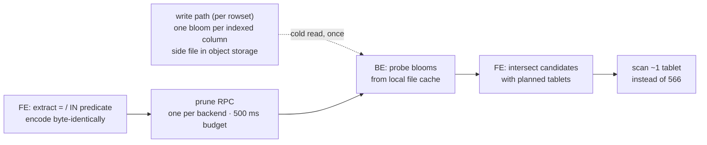
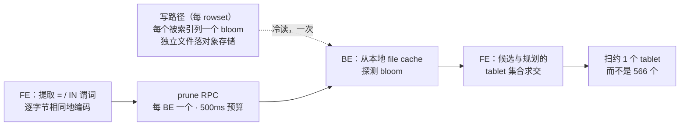

# META
id: w-p-fanout
kicker_en: PROJECT
kicker_cn: 项目
title_en: Fan-Out Is the Floor: Two Targeted Optimizations for Query Shapes Nobody Controls
title_cn: 扇出是地板：两个针对「没人能控制的查询形态」的定向优化
sub_en: A cross-tablet point-query index that prunes 566 tablets to about one before any tablet is opened, and a wide-read prefetch that removes serialization rather than IO — chosen because the cost of each was mostly avoidable fan-out, and shipped fail-open because neither may ever change a result. Includes the tradeoff that actually cost us, and the silent incident it caused.
sub_cn: 一个在打开任何 tablet 之前把 566 个 tablet 剪到约 1 个的跨 tablet 点查索引，以及一个消掉串行化而不是消掉 IO 的宽读预取 —— 选这两个是因为它们的成本里大部分是可避免的扇出，做成 fail-open 是因为它们永远不许改变结果。包含我们真正付出的那个代价，以及它造成的一次静默事故。
domains: [data, dist, platform]

# EN

## Where this sits

The analytics platform was rebuilt in three layers, and they solve different kinds of problem.

**Migration** replaced the substrate: off ClickHouse onto Apache Doris with compute-storage separation. Not because Doris was faster — ClickHouse still was — but because the *precondition* for ClickHouse's speed had expired. Its performance depends on sorting keys and modelling the query shapes in advance, and once a growing share of queries arrives from AI agents, nobody knows the shapes in advance.

**The elastic compute tier** built a control plane on top: evaluate every query's cost before execution, route it heavy or light at plan time, give the heavy tail a physically isolated compute group, and provision that group on demand from a floor of zero. That layer makes no query faster. It decides *where* each query lands and makes that place exist when needed.

**This article is the third layer**, and it is the only one that makes a query genuinely cheaper.

## Why the optimization has to be targeted rather than general

Query text, workload mix, and query shape are all inputs we do not control, and a growing share of them is generated by product features and AI agents rather than written by hand and reviewed. "Tell the callers to write better SQL" is not a weak remedy here — it is architecturally unavailable.

So the only remaining lever is to make the shapes a caller might plausibly write structurally cheaper. But that cannot mean optimizing everything, so the selection rule matters:

> A query shape is worth attacking when its cost is mostly **avoidable fan-out**. Attack waste, never necessary cost.

Two shapes qualified, and they are worth stating side by side, because they fail differently:

| Shape | What is waste | What is not |
|---|---|---|
| Point lookup on a non-bucketed column | opening 566 tablets when one holds the row | the one tablet that holds it |
| Wide read of hundreds of columns | reading its column files **serially** | the column files themselves |

This is why the second one is not "optimizing `SELECT *`". A wide read does not read fewer columns afterwards. It stops reading them one at a time.

## The measurement that reset the cost model

The first instinct was to reduce rows scanned, so bloom filters went in. Rows scanned fell **73%** and wall-clock time did not move — because one user's rows lived in **2,044 files**. That result did not optimize anything; it invalidated the cost model. The currency is not rows scanned, it is how many independent IO units must be opened and whether they can overlap.

The mirror image arrived from the other direction: a **3,727-column** `SELECT *` measured **253 s cold**, while the planner's byte-volume estimate (rows × average row bytes) classified it *light*. One overestimate and one underestimate, one root cause — the estimator was structurally blind to fan-out.

Fan-out also has two independent axes, which is why there are two optimizations and not one: the **tablet axis** can be pruned, the **column axis** cannot, but it can be overlapped.

## Axis one: prune the tablet fan-out

Every index Doris ships — zonemap, bloom filter, inverted, short-key, primary-key — is **local to a tablet**. Each can only answer "is this value inside the tablet you already opened". When a table is not bucketed by the column being filtered, a point query has no choice but to open every tablet. The missing structure is a *global* one that answers a different question, earlier: **which tablets could contain X, before any tablet is opened.**

The shape it took, on the fork: one bloom filter per rowset per indexed column, written as a self-validating side file next to the rowset's segments in object storage. At plan time the frontend extracts `=`/`IN` predicates, encodes probe values **byte-identically to the write path**, and asks each involved backend — one RPC per backend, not one per tablet — to test its tablets' blooms. Tablets whose blooms all miss are dropped, and the candidate set is always intersected with the planner's own tablet set. A 64-tablet demo table prunes to 1 tablet (`probes=1, degraded=0`); a non-existent value prunes to 0.

### What it costs, stated honestly

| Cost | Size |
|---|---|
| Write path | one extra hash and insert per value, consuming the column-value stream the writer already produces — **no extra IO** |
| Storage | planning target **10–20 GB** for the table, not the 6–8 GB first estimated, because the bloom's bit count rounds up to a power of two; measured **3–4 GiB per backend** at four backends |
| Plan-time latency | one extra network round trip inside a point-query budget, capped at **500 ms**; a cold backend can pay a real object-storage stall before degrading |
| Cache budget | the index blocks live in the file cache's INDEX queue, which is carved out of the queue that holds column data — see the next section |
| Compaction coupling | normal compaction rebuilds blooms for free through the shared writer path, but the **ordered-rowset fast path** links segments without invoking the column writer, so its output silently has no index at all until that is handled explicitly |
| Lifecycle | the new side files are not in the garbage collector's enumeration path, so without a fix they leak in object storage forever |

### Why a false positive is acceptable and a miss never is

A false positive costs one extra scanned tablet: **bounded, and budgeted by a knob**. A false negative drops a tablet that actually holds data: **unbounded, and it returns wrong results.** Those two costs are not the same shape, so the design only ever leans one way — *over-scan, never skip*. Every failure path degrades to "this tablet must be scanned": descriptor missing, bloom unreadable, not yet backfilled, RPC timeout, or a backend whose local view lags the query's pinned snapshot version. The response field is deliberately named *candidate* rather than *pruned*, so any omission on the backend side naturally shows up as "returned too many candidates" (safe) instead of "pruned too many" (wrong).

Exactly one semantic path can break that guarantee: **byte-encoding mismatch**. If a predicate literal, after the planner's type coercion, encodes differently from the stored value, the probe misses a value that is really there. So any encoding uncertainty means *do not prune*: implicit casts, `CHAR(n)` padding, datetime scale, narrowing conversions, and `DECIMAL` outright, whose scale differences would break byte-identity. The cost is real — those columns never benefit, and affected queries lose pruning **silently, without an error**. It is the correct trade: losing a benefit is recoverable, encoding wrong once is not.

### The structural cost nobody notices at demo time

The false-positive budget must be defined **per tablet**, not per bloom, because a tablet accumulates one bloom per rowset: with `B` blooms of per-bloom rate `p`, the tablet's union false-positive rate is `B·p`. And **`B` is not a configuration knob** — it is a function of how well compaction is keeping up.

| B (blooms per tablet) | tablet-level false positive | expected mis-scanned tablets |
|---|---|---|
| 1 | 1% | ~6 / 566 |
| 5 | 5% | ~28 / 566 |
| 50 | ~40% (union bound saturated) | ~226 / 566 — pruning has effectively stopped working |

So this index couples query performance to compaction health. That is the long-term liability it introduces, and it is worth saying out loud, because it is invisible in a demo and obvious in a quarter.

## The tradeoff that actually cost us: one cache, two working sets

The index blocks and the column data compete for the same local file cache, and the competition is zero-sum by construction: the INDEX queue is sized as a percentage of capacity, and the queue holding column data is the *remainder*. Every point given to one is taken from the other — and the other is exactly what the 43-second wide read needs.

| | index side | column-data side |
|---|---|---|
| Working set | 3–4 GiB per backend; worst case ~14 GiB when one backend owns everything | 441 one-mebibyte blocks per wide read |
| Value when resident | probe costs 0.03 s, and pruning a tablet avoids **all** of that tablet's downstream IO | each block saves one ~97 ms round trip |
| Cost when missing | ~100 ms per file, spent inside a **hard 500 ms plan-time budget**; blow the budget and the entire prune is abandoned, back to full fan-out | linearly slower |
| Failure curve | **a cliff** | **a slope** |

The conclusion follows from the shapes, not from preference: **size the index queue for the worst-case single-backend working set, not the average** — leave headroom on the cliff and let the slope absorb the squeeze. Both sides have to be computed before that number is set. Undersize it and a one-time cold-read cost becomes a permanent, non-converging object-storage bill.

## The incident: "warmed once" is not "still resident"

A daemon warms each backend's index files into cache on startup, so cold probes hit local disk instead of object storage. It kept a map of backend id to last start time and skipped any backend whose start time had not changed. That invariant is the wrong one.

What happened, over three days on preprod: four backends were ingesting; the cluster was scaled down to a single backend for a single-node performance test, and the daemon warmed it **once — the only warm-up it ever received**; two days of ingest and compaction produced new index files that no past warm-up covered; the cluster was scaled back to four backends, and the three re-added ones registered with **fresh backend ids**. Then a manual check:

| Backend | cached | missing | wrong queue |
|---|---|---|---|
| the three re-added | 386–405 each | — | — |
| the one that never restarted | **0** | **313** | **73** |

The three new backends looked new to the daemon, so they were warmed normally. The original backend kept its id and never restarted, so it was skipped on every round from that single warm-up onward, and every probe against it became a cold object-storage read.

The amplifier was capacity. The cache-sizing step had been skipped, leaving the INDEX queue at its 5% default; during the single-backend window that one backend owned every tablet's blooms — roughly four times its normal footprint, which on its own exceeds any plausible 5% budget. **It evicted its own warm-up.**

Three things have to be said together about this:

1. **Correctness was never affected.** Every failure path degraded to over-scan. This was a performance and cost problem, exactly as designed.
2. **It was silent.** No alert, no error, no degraded flag — found by running a check script by hand. Residency was never an observable quantity.
3. **The fix order was itself the judgement.** Size the cache *first*, before shipping any repair mechanism. Otherwise a mechanism that re-reads whatever is missing will re-read it on every round for as long as the budget is smaller than the working set — turning a one-time cost into a permanent one.

The repair replaced "process warmed once" with a residency-driven loop, governed by one hard constraint: **a sweep over a fully resident backend must issue zero object-storage GETs.** That single requirement eliminates most of the obvious designs.

| Rejected repair | Why |
|---|---|
| Re-warm every backend every round | violates the zero-GET rule; permanent bandwidth waste |
| Let each backend sweep itself, no coordinator | a backend does not know its own consistent-hash ownership, so it would miss tablets moved onto it by a membership change — **the incident's own scenario** |
| Check residency over HTTP from the coordinator | hundreds of calls per sweep, and it duplicates cache-internal logic |
| Pin the index blocks so they can never be evicted | it removes them from budget accounting, which **makes sizing mistakes invisible** |
| Ship the queue resize only, treat it as a config incident | correct as phase one, insufficient alone |

And the counters — checked, resident, repaired, failed — shipped as metrics, because the first lesson of the incident is that residency has to be observable without a human remembering to look.

## The bug that made the whole feature a no-op

Before any of that, plan-time pruning **silently never fired** for ordinary queries. Two independent causes, both in the planner:

The predicate map it read was always empty at that point, because the only code path that populates it is a short-circuit point-query path that normal queries do not take. And "just populate it during node initialization" would not have worked either: the translator recurses into the child — creating and initializing the scan node — *before* attaching predicates to it. That is not an accident, it is the inherent order of a top-down visit that constructs fragments bottom-up. At initialization time the predicate list is empty by definition.

Worse, the naive fix would have been **unsafe**. Pruning during initialization pins its own snapshot version, taken earlier than the version the query actually reads, which is pinned later and uniformly. Versions are monotonic, so the pruned rowset set could be a strict *subset* of what the query reads — violating the superset invariant and **silently returning fewer rows**. A performance bug repaired into a correctness bug.

The fix moved pruning to the point where the query's real read version is computed, after the whole plan is translated. It incidentally collapsed per-partition metadata calls to zero extra and backend probe RPCs from one-per-partition-per-backend to one-per-backend.

The class matters more than the fix: a **silent, ordering-dependent no-op**. It compiled, ran, never threw, never logged, and never triggered. Its unit test passed because it bypassed the entire call chain and tested the encoding logic in isolation. Verification has to cover call *order*, not only function correctness.

## Axis two: overlap the column fan-out

For a wide read, the column files are not waste — they are the work. The waste is doing them one at a time.

The measured baseline for one such read: **43.45 s wall clock, 98.6% of it remote IO, 441 object-storage fetches**. The obvious story is "one serial read per column". Reading the code showed it is **up to three**, in a strict order:

| # | Read | Offset comes from |
|---|---|---|
| 1 | ordinal index page | footer-resident — **free** |
| 2 | data page | the ordinal index — **depends on read 1** |
| 3 | dictionary page (dictionary-encoded columns, 56% of this table) | footer-resident — **free** |

**Only read 2 has a data dependency.** Reads 1 and 3 have byte offsets that are already in memory once the segment footer is parsed, so both can be issued immediately, in parallel, with no prior IO. The entire design is a consequence of that one fact.

So: before the serial loop runs, warm every column's meta pages concurrently, and open each column's cache window ahead of the read that would have opened it later — deduplicated into cache-block-aligned ranges and submitted to the prefetch thread pool that already exists. The serial loop itself stays **byte-for-byte unchanged**; by the time it reaches column N, column N's block is local.

Correctness is argued structurally rather than by testing: the prefetch tasks are dry-run reads into a null destination, they decode nothing and mutate no reader state; they run on a pool that only ever performs that one operation; a full queue or any other failure degrades to "the loop reads it synchronously, as today"; and a block already being fetched is in a downloading state that a concurrent reader waits on, so no duplicate object-storage GET is ever issued. Remove the two warming steps and results must be bit-identical.

### What it costs, and where it stops working

The prefetch pool is backend-wide and its width is the throttle: with the default worker count and ~441 blocks per query, concurrent wide lookups **queue rather than multiply** object-storage concurrency. That is deliberate. The feature is off by default and gated on column count and row count so that scan-shaped queries are untouched. Two costs were accepted: a single master switch means the two warming steps cannot be rolled back independently, and the change touches code that compaction also runs through.

One clarification that matters more than it looks: **the warming step is not free of IO**. The index loads that follow it still block — they just block on a warm cache. What it removes is the serialization, not the reads.

And it stops working on array columns (2.5% of this table, deliberately skipped): an array's item pages cannot be prefetched at all, because *which* item pages are needed depends on offsets that have not been read yet. Coverage is 97.5% of columns, measured from the table's own schema, and the array pages are largely warmed incidentally anyway because they sit between scalar columns that are.

### Verification status, stated plainly

This layer's benefit is **projected, not measured**. The design and implementation are complete; the numbers are arithmetic over the measured baseline. Two things stand between it and a claim:

The baseline itself has to be rebuilt. It was measured on a build that predates the prefetch subsystem this design extends, so it must be re-measured on the target release with the switches off — and **that run may well be slower**, because it will expose thousands of serial index loads at iterator-init time, which is itself one of the things this change removes.

And the acceptance metric I originally wanted **cannot be computed under this design**. Prefetch reads are dry-run reads with the query id and cache statistics nulled out, so the profile's remote-IO counters fall toward zero while wall clock falls: the IO did not disappear, it stopped being attributed. I cannot prove "we parallelized rather than moved the work" by showing per-fetch latency unchanged. The substitute checks are counting submitted prefetch tasks, and comparing total bytes written into the cache before and after, which should stay flat.

## Killing my own first implementation

The first version of the prefetch was a self-contained path: its own stage enum, its own iterator method, its own block-folding arithmetic, its own configuration flags, sitting in front of the read loop. It was committed. Two days later I folded the whole thing into the prefetch subsystem that already existed and deleted it.

The reasons were mechanical, not aesthetic. The two overlapped on data pages, and each had derived the same block arithmetic separately — **two submitters against one cache, with two caps that did not know about each other and no shared deduplication**. And the genuinely new idea, warming meta pages, belonged somewhere the standalone version could not reach: ahead of the existing subsystem's own per-column index loads, which is also where it fixes that subsystem's worst behaviour on a wide table.

The part worth keeping is the condition that flips the answer, recorded at the time: had this needed to ship on the currently deployed release, where the subsystem does not exist and reuse would mean backporting more than a thousand lines across dozens of files, keeping both paths would have been correct. **The answer depends entirely on one fact about the target release** — which is the kind of thing that should be written down rather than remembered.

## Alternatives rejected

| Alternative | Why not |
|---|---|
| An exact inverted map from value to tablet, in the shared metadata store | hundreds of gigabytes and billions of writes against a store other systems depend on. Zero false positives is genuinely better; kept as a swappable backend if precision ever becomes a hard requirement |
| A routing table plus a tablet hint | the strongest pragmatic alternative, and worth measuring as a baseline. Not chosen because tablet ids are not stable across split, merge, schema change, or restore, and it needs dual writes with a freshness window |
| One mutable per-tablet aggregate bloom instead of one per rowset | reintroduces the only question in this design that can produce wrong answers: has the aggregate already absorbed the just-committed rowset? Per-rowset decomposition eliminates it by construction |
| A transposed or bit-sliced global structure | same freshness problem; flagged as the preferred evolution if tablet counts reach tens of thousands |
| An in-memory prune directory in the frontend | the exact structure does not fit the heap, so it forces a new stateful service to save one cache read |
| Re-bucketing the table by the filtered column | destroys the locality every existing per-user query depends on, and requires rewriting billions of rows. Not changing the physical layout was a stated constraint |
| Writing the bloom into the segment footer | reading it would require opening the segment file, which defeats the entire point of pruning before data files are opened |

## Takeaways

- **Rows scanned is a proxy. Fan-out is the floor.** A 73% reduction in rows with zero wall-clock change is the cheapest possible proof that you are optimizing the wrong quantity.
- **When you cannot constrain the input, the only lever left is making the shapes cheap** — but then the selection rule has to be explicit, or "optimization" becomes an infinite backlog. Attack avoidable fan-out; leave necessary cost alone.
- **Compare the shape of costs, not their size.** Bounded costs can be managed with a knob; unbounded ones have to be eliminated architecturally. That is why over-scan is acceptable and skipping is not, and why the cache budget goes to the failure curve that is a cliff rather than the one that is a slope.
- **An index that depends on background maintenance inherits that maintenance's health.** Pruning power decays as blooms accumulate per tablet, so this feature's value is a function of compaction keeping up.
- **The characteristic failure of a cache-residency design is silence.** "Warmed once" says nothing about "still resident", and nothing will page you. Make residency a counter before you make it a mechanism.

# CN

## 这篇在整体里的位置

分析平台的重建分三层，而三层解决的问题**性质不同**。

**迁移层**换掉了地基：从 ClickHouse 换到存算分离的 Apache Doris。不是因为 Doris 更快 —— ClickHouse 当时还更快 —— 而是因为 ClickHouse 快的那个**前提条件**失效了。它的性能依赖排序键和事先对查询形态建模，而当越来越大比例的查询由 AI agent 产生时，没有人能事先知道形态。

**弹性计算层**在上面建了控制面：执行前评估每条查询的成本、在 plan 期判定它 heavy 还是 light、给重尾一个物理隔离的 compute group、并让这个 group 从零地板按需供给。**这一层不让任何查询变快**，它决定每条查询**落在哪里**，并让那个地方在需要时存在。

**这篇文章是第三层**，也是三层里唯一真正让一条查询变便宜的那层。

## 为什么优化必须是「定向」的

SQL 文本、负载构成、查询形态，全部是我们控制不了的输入，而且其中越来越大的一部分由产品功能和 AI agent 生成，不是人手写、再经过 review 的。在这里「让调用方写更好的 SQL」不是一个偏弱的方案 —— 它在架构上根本不存在。

所以剩下的唯一杠杆，是让调用方**可能**写出的那些形态本身在结构上变便宜。但这不能等于什么都优化，于是选择判据才是关键：

> 一种查询形态值得下手，是因为它的成本里大部分是**可避免的扇出**。打浪费，不打必要成本。

两种形态符合判据，值得并排写出来，因为它们浪费的地方不同：

| 形态 | 什么是浪费 | 什么不是 |
|---|---|---|
| 非分桶列上的点查 | 为了拿一行打开 566 个 tablet | 真正含那行的那 1 个 tablet |
| 几百列的宽读 | **串行**读它的列文件 | 那些列文件本身 |

这就是为什么第二个不是「优化 `SELECT *`」。宽读之后并没有少读列，它只是不再一次一个地读。

## 那次重设成本模型的测量

第一反应是减少扫描行数，于是加了 bloom filter。扫描行数降了 **73%**，墙钟时间纹丝不动 —— 因为那个用户的行散在 **2,044 个文件**里。这个结果没有优化任何东西，它**否掉了成本模型**：货币不是扫过多少行，而是必须打开多少个独立 IO 单元、以及它们能不能重叠。

镜像的那一半从反方向撞过来：**3,727 列**的 `SELECT *` 实测冷跑 **253 秒**，而 planner 的字节体量估算（行数 × 平均行宽）判它 *light*。一个高估、一个低估，同一个病根 —— 估算器对扇出结构性失明。

而扇出有两个正交的轴，这也是为什么有两个优化而不是一个：**tablet 轴可以剪掉**，**列轴剪不掉、但可以重叠**。

## 轴一：剪掉 tablet 扇出

Doris 自带的每一种索引 —— zonemap、bloom filter、倒排、short-key、主键 —— 都是**tablet 局部**的。它们只能回答「这个值在不在你已经打开的这个 tablet 里」。当表不按被过滤的那列分桶时，点查除了打开每一个 tablet 别无选择。缺的是一个**全局**结构，它回答的是另一个问题，而且更早：**在打开任何 tablet 之前，哪些 tablet 可能含 X。**

它在 fork 上落成的形状：每个 rowset、每个被索引列一个 bloom filter，作为自校验的独立文件写在该 rowset 的 segment 旁边（对象存储上）。plan 期 FE 提取 `=`/`IN` 谓词，把探测值按**与写路径逐字节相同**的方式编码，然后请每个相关 BE —— **每 BE 一个 RPC，不是每 tablet 一个** —— 测它自己那些 tablet 的 bloom。全部 miss 的 tablet 被丢掉，而候选集合永远与 planner 自己的 tablet 集合**求交**。64 个 tablet 的 demo 表剪到 1 个（`probes=1, degraded=0`）；不存在的值剪到 0 个。

### 它的代价，如实写出来

| 代价 | 量级 |
|---|---|
| 写路径 | 每个值多一次 hash 加插入，消费的是 writer 本来就在产生的列值流 —— **零额外 IO** |
| 存储 | 全表规划量级 **10–20 GB**，而不是最初估的 6–8 GB，因为 bloom 的位数向上取到 2 的幂；4 BE 下实测**每 BE 3–4 GiB** |
| plan 期延迟 | 在点查预算里多一次网络往返，上限 **500ms**；冷 BE 上可能真付一次对象存储停顿才降级 |
| 缓存预算 | 索引块住在 file cache 的 INDEX 队列，而这个队列是从装列数据的那个队列里切出来的 —— 见下一节 |
| compaction 耦合 | 正常 compaction 通过共享 writer 路径免费重建 bloom，但**ordered-rowset 快路径**直接 link segment、不走 column writer，于是它的输出**静默地完全没有索引**，除非显式处理 |
| 生命周期 | 这些新的独立文件不在垃圾回收的枚举路径里，不修就会在对象存储上**永久泄漏** |

### 为什么假阳性可接受，漏判永远不可接受

假阳性的代价是多扫一个 tablet：**有界，而且由一个旋钮预算**。漏判的代价是丢掉一个真的含数据的 tablet：**无界，而且返回错误结果**。这两个代价形状不同，所以设计只朝一个方向倒 —— **只多扫，绝不漏**。每条失败路径都退化成「这个 tablet 必须扫」：描述符缺失、bloom 读不出、尚未 backfill、RPC 超时、或者 BE 的本地视图落后于查询钉住的快照版本。响应字段刻意叫 *candidate* 而不是 *pruned*，于是 BE 侧任何遗漏都自然表现为「多返回了候选」（安全），而不是「多剪了」（错误）。

只有一条语义路径能突破这个保证：**字节编码不一致**。如果谓词字面量在 planner 类型强制之后，编码方式与存储值不同，探测就会漏掉一个真实存在的值。所以任何编码不确定都意味着**不剪**：隐式 cast、`CHAR(n)` 补空格、datetime 精度、窄化转换，以及直接禁掉的 `DECIMAL`（scale 差异会破坏逐字节相同）。代价是真实的 —— 这些列永远吃不到收益，受影响的查询会**静默**失去剪枝、不报错。但这个取舍是对的：损失收益可以补救，编码错一次不能。

### demo 时看不见的那个结构性代价

假阳性预算必须定义成**每 tablet**的，而不是每 bloom 的，因为一个 tablet 会按 rowset 累积 bloom：`B` 个 bloom、每个单 bloom 率 `p`，tablet 级的并集假阳性率是 `B·p`。而 **`B` 不是一个配置旋钮** —— 它是 compaction 跟不跟得上的函数。

| B（每 tablet 的 bloom 数） | tablet 级假阳性 | 期望误扫 tablet |
|---|---|---|
| 1 | 1% | ~6 / 566 |
| 5 | 5% | ~28 / 566 |
| 50 | ~40%（并集界已饱和） | ~226 / 566 —— 剪枝实际上已经停止工作 |

所以这个索引**把查询性能耦合到了 compaction 的健康度上**。这是它引入的长期负担，值得主动讲出来，因为它在 demo 里看不见，在一个季度后很明显。

## 我们真正付出的那个代价：一块缓存，两个工作集

索引块和列数据争的是同一块本地 file cache，而这个竞争在构造上就是零和的：INDEX 队列按容量百分比配置，而装列数据的那个队列是**剩余量**。给一边的每一点都是从另一边拿的 —— 而另一边恰好是那个 43 秒宽读要吃的。

| | 索引侧 | 列数据侧 |
|---|---|---|
| 工作集 | 每 BE 3–4 GiB；单 BE 独占时最坏约 14 GiB | 单次宽读 441 个 1 MiB 块 |
| 常驻时的价值 | 探测 0.03 秒，而剪掉一个 tablet 省掉的是它**全部**的下游 IO | 每个块省一次约 97ms 往返 |
| 未命中的代价 | 每文件约 100ms，花在**硬性的 500ms plan 期预算**里；预算爆掉，整个剪枝被放弃、退回全扇出 | 线性变慢 |
| 失效曲线 | **悬崖** | **斜坡** |

结论来自曲线的形状，不来自偏好：**INDEX 队列要按「单 BE 最坏工作集」配，不是按平均值** —— 给悬崖留余量，让斜坡去承受挤压。而且两边都必须在设定这个数之前算清楚。配小了，一次性的冷读成本会变成**永久、不收敛的对象存储账单**。

## 那次事故：「预热过一次」不等于「现在还在缓存里」

有一个 daemon 在 BE 启动时把它的索引文件预热进缓存，好让冷探测打在本地磁盘而不是对象存储上。它维护一张「BE id → 上次启动时间」的表，启动时间没变就跳过。**它守住的是错的不变式。**

preprod 上三天里发生的事：4 个 BE 在灌数；为了做单机查询性能测试，集群缩到单 BE，daemon 给它预热了**一次 —— 这是它这辈子收到的唯一一次**；两天的灌数与 compaction 产生了过去任何预热都没覆盖的新索引文件；集群扩回 4 个 BE，而三台重新加入的 BE 拿到了**全新的 BE id**。然后手工查了一次：

| BE | 已缓存 | 缺失 | 队列放错 |
|---|---|---|---|
| 三台重新加入的 | 各 386–405 | — | — |
| 那台从未重启的 | **0** | **313** | **73** |

三台新 BE 在 daemon 眼里是新的，于是被正常预热。原来那台保留了 id 且从未重启，于是从那唯一一次预热之后**每一轮都被跳过**，针对它的每一次探测都变成了一次冷的对象存储读。

放大器是容量。缓存 sizing 那一步被跳过了，INDEX 队列停在 5% 默认值；而在单 BE 那段窗口里，那一台独自持有全部 tablet 的 bloom —— 约等于它平时足迹的四倍，**这个量本身就超出任何合理的 5% 预算**。它把自己的预热成果挤掉了。

关于这件事，有三句话必须一起说：

1. **正确性全程没受影响。** 每条失败路径都退化成过扫。这是纯粹的性能与成本问题，完全符合设计。
2. **它是静默的。** 没有告警、没有报错、没有降级标记 —— 是手工跑脚本查出来的。**常驻性从来不是一个可观测量。**
3. **修复顺序本身就是那个判断。** 先把缓存配够，**再**上任何修复机制。否则一个「发现缺失就重读」的机制，在预算小于工作集的前提下，会在每一轮都重读，把一次性成本变成永久成本。

修复用「常驻性驱动的回路」替换了「进程预热过一次」，并被一条硬约束统辖：**对一个完全常驻的 BE 做一次 sweep，必须发出零次对象存储 GET。** 这一条要求就淘汰掉了大部分显而易见的设计。

| 被否的修复方案 | 为什么 |
|---|---|
| 每轮无条件重预热所有 BE | 违反零 GET 规则；永久的带宽浪费 |
| 让每个 BE 自己 sweep，不要协调者 | **BE 不知道自己的一致性哈希归属**，会漏掉因成员变化被移到它身上的 tablet —— 正是这次事故的场景 |
| 协调者走 HTTP 检查常驻性 | 每次 sweep 上百次调用，而且要复制缓存内部逻辑 |
| 把索引块 pin 住，永不驱逐 | 它把这些块从预算核算里摘了出去，于是**配错容量这件事变得不可见** |
| 只做队列扩容，当成配置事故处理 | 作为第一阶段是对的，单独不够 |

而那几个计数器 —— 检查了多少、常驻多少、修复多少、失败多少 —— 是作为 metric 上线的，因为这次事故的第一条教训就是：**常驻性必须在不依赖人想起来去查的前提下可观测。**

## 那个让整个特性变成空转的 bug

在上面这一切之前，plan 期剪枝对普通查询**静默地从未触发**。两个独立成因，都在 planner 里：

它读的那张谓词表在那个时点上永远是空的，因为唯一填充它的代码路径是普通查询不会走的短路点查路径。而「那就在节点初始化时填一下」也修不了：翻译器会先递归进子节点 —— 在那里创建并初始化 scan node —— **之后**才把谓词挂上去。这不是偶然，是「自顶向下访问、自底向上构造 fragment」的固有顺序。初始化那一刻，谓词列表按定义就是空的。

更糟的是，那个天真修法**是不安全的**。在初始化期剪枝会钉住它自己的快照版本，而这个版本早于查询真正读的那个版本（后者是在更晚的地方统一钉的）。版本单调，于是被剪的 rowset 集合可能是查询实际读取集合的**真子集** —— 违反 superset 不变式，**静默地少返回行**。一个性能 bug 被修成了一个正确性 bug。

真正的修法是把剪枝移到「查询真实读版本被计算出来」的那个点，也就是整个 plan 翻译完之后。它顺带把每分区的元数据调用降到零次额外调用，把 BE 探测 RPC 从「每分区每 BE 一次」降到「每 BE 一次」。

**类别比修法更重要**：这是一个**静默的、依赖顺序的 no-op**。它编译通过、正常运行、不抛异常、不打日志、就是永远不触发。它的单测能过，是因为那个测试**绕开了整条调用链**，只在隔离环境里测编码逻辑。**验证必须覆盖调用顺序，不只覆盖函数正确性。**

## 轴二：把列扇出重叠掉

对宽读来说，那些列文件不是浪费 —— 它们就是工作本身。浪费的是**一次一个地做**。

一次这样的读，实测 baseline：**43.45 秒墙钟，其中 98.6% 是远程 IO，441 次对象存储 fetch**。显然的说法是「每列一次串行读」。读代码读出来是**最多三次**，而且有严格顺序：

| # | 读什么 | 偏移来自 |
|---|---|---|
| 1 | ordinal index page | segment footer —— **免费** |
| 2 | data page | ordinal index —— **依赖第 1 次** |
| 3 | dictionary page（字典编码列，本表占 56%） | segment footer —— **免费** |

**只有第 2 次有数据依赖。** 第 1 次和第 3 次的字节偏移在 segment footer 解析完之后就已经在内存里了，所以它们可以立刻发出、并行发出、不需要任何前置 IO。**整个设计都是这一个事实的推论。**

于是：在串行循环跑之前，先并发烘热每一列的 meta page，并提前打开每一列的缓存窗口 —— 按缓存块对齐去重，丢给**本来就存在**的预取线程池。串行循环本身**一个字节都不改**；等它走到第 N 列时，第 N 列的块已经是本地的了。

正确性是**结构性论证**而不是靠测试：预取任务是写进 null 目的地的 dry-run 读，它不解码、不改动任何 reader 状态；它们跑在一个只做这一个操作的池子上；队列满或任何失败都退化成「循环像今天一样同步读它」；而一个正在被拉取的块处于 downloading 状态，并发读者会等它而不是再发一次 GET。**把两个烘热步骤删掉，结果必须逐位相同。**

### 它的代价，以及它在哪里停止工作

预取池是 BE 级的，它的宽度就是节流阀：默认 worker 数下、单查询约 441 个块，并发的宽点查会**排队而不是把**对象存储并发**翻倍**。这是有意的。特性默认关闭，并且按列数和行数设了门槛，保证扫描型查询完全不受影响。两个被接受的代价：一个总开关意味着两个烘热步骤不能独立回滚；以及这个改动动了 compaction 也会走的代码。

一个看起来不重要但其实很重要的澄清：**烘热步骤本身不是零 IO**。它之后的那些 index load 照样阻塞 —— 只是阻塞在热缓存上。**它消掉的是串行化，不是那些读。**

而它在 array 列上停止工作（本表占 2.5%，刻意跳过）：array 的 item page **根本无法预取**，因为**需要哪些** item page 取决于还没读出来的 offset。覆盖率是 97.5% 的列（按表自己的 schema 实测），而且 array 的 page 大体上还是被顺带烘到了，因为它们夹在被预取的标量列中间。

### 验证状态，直说

**这一层的收益是推算的，不是实测的。** 设计与实现完成；数字是在实测 baseline 上做的算术。它和一个可声称的结论之间还隔着两件事：

**baseline 本身必须重建。** 它测在一个早于本设计所扩展的那套预取子系统的版本上，所以必须在目标版本上、把开关关掉重测一次 —— 而**那一次很可能更慢**，因为它会暴露 iterator 初始化时的数千次串行 index load，而那恰好是这个改动要消掉的东西之一。

**而我原本想要的验收指标在这个设计下不可计算。** 预取走的是 dry-run 读，query id 与缓存统计都被置空，所以 profile 里的远程 IO 计数会朝零掉，而墙钟同时在掉：**IO 没有消失，它只是不再被归因了**。我没法用「每次 fetch 的延迟没变」来证明「我并行化了而不是搬运了工作量」。替代验收是数提交出去的预取任务数，以及比对前后写进缓存的总字节数（应当持平）。

## 杀掉我自己的第一版实现

预取的第一版是一条自包含的路径：自己的 stage 枚举、自己的 iterator 方法、自己的块折叠算术、自己的配置开关，摆在读循环前面。它已经提交了。两天后，我把它整个折进了本来就存在的那套预取子系统，然后删掉。

理由是机械的，不是审美的。两者在 data page 上重叠，而且各自独立推导了同一套块算术 —— **两个提交者对着同一块缓存，两套互不知情的上限，没有共享去重**。而真正新的那个想法（烘热 meta page）该待的地方，独立版本到不了：它应该在既有子系统自己的逐列 index load **之前**，而那个位置也顺手治好了那个子系统在宽表上最糟的行为。

值得留下的部分是**当时记下来的那个反转条件**：如果这件事必须发在当前已部署的版本上（那里这套子系统不存在，复用意味着跨几十个文件 backport 上千行），那么保留两条路径才是对的。**这个答案完全取决于关于目标版本的一个事实** —— 而这种东西应该被写下来，不应该靠记。

## 被否决的方案

| 方案 | 为什么不 |
|---|---|
| 在共享元数据存储里放一份「值 → tablet」的精确倒排 | 几百 GB 加数十亿次写，压在别的系统也依赖的存储上。零假阳性确实更好；保留为可替换后端，如果哪天精确性成为硬需求 |
| 一张路由表加 tablet hint | 最强的务实替代，值得作为 baseline 去量。没选是因为 tablet id 在 split、merge、schema change、restore 之后都不稳定，而且需要双写与新鲜度窗口 |
| 每 tablet 一个可变的聚合 bloom，取代每 rowset 一个 | 会重新引入这个设计里唯一能产生错误答案的问题：那个聚合是否已经吸收了刚提交的 rowset？按 rowset 分解在构造上消灭了它 |
| 转置或 bit-sliced 的全局结构 | 同样的新鲜度问题；标为 tablet 数涨到几万时的首选演进方向 |
| FE 内存里的剪枝目录 | 精确结构塞不进堆，于是为了省一次缓存读要引入一个新的有状态服务 |
| 按被过滤列重新分桶 | 会摧毁现有每一条按用户查询所依赖的局部性，而且要重写数十亿行。不改物理布局是既定约束 |
| 把 bloom 写进 segment footer | 读它就得打开 segment 文件，这否掉了「在打开数据文件之前剪枝」的全部意义 |

## Takeaways

- **扫描行数是代理指标，扇出才是地板。** 行数降 73% 而墙钟零变化，是「你在优化错的量」这件事最便宜的证明。
- **当你不能约束输入时，剩下的唯一杠杆是让形态本身便宜** —— 但这时选择判据必须显式，否则「优化」会变成一个无限待办。打可避免的扇出，别碰必要成本。
- **比较代价的形状，不是它们的大小。** 有界的代价可以用旋钮管理，无界的必须用架构消灭。这就是为什么多扫可以接受、漏判不行，以及为什么缓存预算要给那条**悬崖**而不是那条**斜坡**。
- **一个依赖后台维护的索引，会继承那份维护的健康度。** 剪枝能力随每 tablet 累积的 bloom 数衰减，所以这个特性的价值是 compaction 跟不跟得上的函数。
- **缓存常驻性设计的典型失效方式是静默。** 「预热过一次」对「现在还在缓存里」什么都没说，而且不会有任何东西 page 你。**在把常驻性做成机制之前，先把它做成一个计数器。**

# SOURCES

**归属与真实性边界（对外必须守住）：**

- 方案设计与工程判断是本人的；实现代码由 AI 辅助生成，设计文档、不变式、验收方案与被否决方案的论证记录均为本人产出。
- **轴一（跨 tablet 点查索引）**：`64 → 1` 剪枝、`probes=1 degraded=0`、常驻探测 0.03s、冷读约 100ms/文件、preprod 缓存常驻事故的全部数字（0/313/73、386–405、3–4 GiB/BE）均为**实测**。
- **轴二（宽列预取）**：43.45s / 98.6% 远程 IO / 441 次 fetch / 444 MB 与列类型分布（3,727 列、97.5% 覆盖）为**实测 baseline**；改动后的收益为**推算**，且该 baseline 需在目标版本上重建后才可引用。**对外一律说「设计与实现完成，收益待实测」。**
- `73% 行数 / 墙钟不动 / 2,044 文件`、`3,727 列 SELECT * 冷跑 253s`、`566 tablet`、`~5.2B 行` 与全站口径一致。
- 容量表（B = 1 / 5 / 50）与存储量级（10–20 GB）来自设计文档的推导，非生产实测值，引用时按「规划量级」表述。
- 客户名、租户名、内部工单号、集群名、SKU 与内网地址全部不出现；事实源里的库表名一律以「事件宽表」指代。
