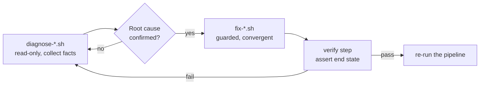
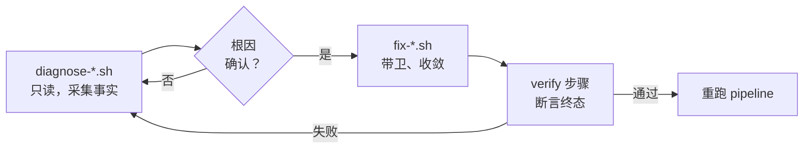

# META
id: w-p-jenkins
kicker_en: PROJECT
kicker_cn: 项目
title_en: "Knows Jenkins": What That Line Actually Tests in an SRE
title_cn: 「SRE 熟悉 Jenkins」到底是什么能力
sub_en: "Familiar with Jenkins" is in every SRE job description, but writing pipeline scripts is not the skill. The skill is treating the delivery pipeline as a production system: idempotent procedures, observable job state, configuration in code — and knowing when automation itself becomes the new source of entropy. Grounded in a real Jenkins migration and its diagnose/fix script pairs.
sub_cn: 「熟悉 Jenkins」写在无数 JD 里，但会写 pipeline 脚本不是那个能力。真正的能力是把交付流水线当生产系统对待：流程幂等、job 状态可观测、配置进代码，并且知道自动化本身什么时候会变成新的熵源。落地素材来自一次真实的 Jenkins 迁移，和其中 diagnose 与 fix 脚本的配对。

domains: [release, platform]

# EN

## Why

"Familiar with Jenkins" appears in countless SRE job descriptions, usually read as a tool claim: navigate the UI, write a Jenkinsfile, wire a webhook. That is table stakes, not what the line should test. The SRE reading starts elsewhere: the pipeline is the road every change takes to production — so what happens when it hangs at 2 a.m., fails halfway through a deploy, or, worst of all, silently does the wrong thing and reports green?

A Jenkins migration let me test my answer against reality: moving an installation between environments audits every assumption baked into it. Its failures supply the material below.

## The pipeline is a production system

The claim everything else follows from: most production incidents are change-induced, which makes the delivery pipeline the highest-leverage reliability surface an SRE owns, and the number-one incident source. I hold this as a conviction, not a neutral observation.

Three consequences fall out. The pipeline deserves SLIs — success rate, duration, queue time — because unmeasured degradation stays invisible until it blocks a release. It deserves failure-mode analysis: for every stage, what happens when it dies halfway, and can the operator tell? And it deserves a capacity view: agents, dependency caches, and artifact stores are production dependencies, not scenery.

One structural fact matters for Jenkins specifically: a declarative reconcile loop is idempotent by design; an imperative Jenkins pipeline is not — nothing guarantees that running a job twice converges to the same state. That is not a reason to avoid Jenkins; it is why "familiar with Jenkins" is a reliability skill: the idempotency the tool does not give you, you must construct.

## Three criteria that separate tool users from operators

### Idempotent and re-entrant procedures

During the migration, agent image builds failed on two fronts at once: the Debian Buster base image had gone EOL, its apt repositories moved to the archive, and upstream Maven mirrors serving several transitive dependencies had gone dark — dependency resolution failed, compilation failed, the Docker build failed downstream, a three-stage cascade.

The repair scripts I wrote follow one shape: guard, back up, converge, verify. The apt fix checks it is actually on a Buster system and no-ops otherwise, backs up the existing sources with a timestamp, then overwrites the configuration wholesale rather than patching lines. Overwrite-to-known-good is convergent: every run produces the same end state, so re-running is safe and dying in the middle costs nothing. The dependency-repair script ends with an explicit verify function asserting the artifacts now exist, instead of assuming success. The contrast case is the script that appends lines or assumes a clean start: run it twice and one incident becomes two.

### Observable and diagnosable state

The repo pairs each fix script with a read-only diagnose script that collects facts — OS release, source inventory, a dry-run update, warnings on known-EOL codenames — and changes nothing. Diagnosis existing as a separate artifact is the point: it encodes "confirm the failure mode before mutating anything" as structure, not discipline.

The second case is a side tool I built because Jenkins hides its own state: the UI shows one job, one build, one parameter set at a time. The tool pulls job status, recent builds, parameters, and commit IDs through the JSON API into one page spanning the old and new Jenkins environments, with one-click replay from the last successful parameters. Modest, but it embodies the criterion: job state should be extractable data, not an impression reconstructed by clicking. Full pipeline SLIs on a dashboard are the standard I would hold a mature setup to — stated here as a criterion, not as something this repo already had.

### Configuration as code

The delivery logic in this repo — some 275 pipeline definition files plus a shared library of reusable steps — lives in git: reviewable, diffable, and, decisively, migratable. The migration audited exactly this property. Everything in the repo moved cleanly; everything that lived only inside the running system — cached artifacts whose upstreams had since died, hand-tuned Maven settings inside agent pods — surfaced as a failure at migration time. That is the operational difference between pipeline-as-code and a snowflake Jenkins accreted through UI clicks: the snowflake is unrecoverable by definition. Extending the same criterion to the controller itself via JCasC is the standard I would apply to any Jenkins I own.

## When automation is the entropy

The counter-argument the thesis requires: automation is not the goal, and more of it is not monotonically better.

The migration produced a clean specimen. While the upstream repositories were dying, the build Jenkinsfile had grown workaround stages — metadata repair, dependency debugging, direct-download fallbacks. Once the artifacts were properly migrated, those stages were dead code: masking signal, adding runtime, confusing the next reader. Part of the documented fix was deleting them. Automation ages like alert rules: each piece encodes assumptions that silently expire, and an automated path nobody watches decays without anyone noticing — a manual gate at least has a human in it who notices.

Automation also opens new failure surface: credentials concentrated where the pipeline can reach them, a plugin supply chain, scripts that rot. That is why I read the manual review-and-approval stage in the production release flow as a design decision, not a gap: for low-frequency, high-blast-radius operations, a deliberate human gate is often the more reliable component. The ordering I defend: logically sound — provably runnable, observable, recoverable — beats maximally automated. Automate the frequent and reversible; gate the rare and irreversible.

## Takeaways

- "Familiar with Jenkins" should be read as "can own a delivery pipeline as a production system": its failure modes, its state, its recovery paths — not its syntax.
- Idempotency is the precondition for everything else. A procedure you cannot safely re-run cannot be automated, retried, or handed to the next on-call.
- Automation degree is not the metric; it is a trade with its own entropy. Runnable, observable, recoverable comes first — then automate what earns it.

# CN

## Why

「熟悉 Jenkins」写在无数 SRE 的 JD 里，通常被读成一个工具声明：会用 UI，会写 Jenkinsfile，会接 webhook。这个读法只是入场券，不是这行字真正想考察的东西。SRE 的读法从另一个问题出发：这条流水线是所有变更进入生产环境的必经之路，那么它凌晨两点卡死了怎么办，部署到一半挂了怎么办，最糟的情况，它静默地做错了事还报绿，怎么办？

我有机会用一次真实事件检验自己的答案：一次 Jenkins 迁移。把一套安装在环境之间搬家，等于对它体内每一条隐含假设做全量审计。迁移中浮出水面的故障，EOL 的基础系统、失联的上游制品仓库、只活在运行中 pod 里的状态，正是这篇文章判据的全部素材来源。

## CI/CD 是生产系统

先说方法论主张，因为其余一切由它推出：绝大多数线上事故由变更引起，所以交付流水线是 SRE 手里可靠性杠杆最高的一个面，也是头号事故源。这一条我持有的是立场，不是中立观察。

三个推论随之落地。流水线值得拥有自己的 SLI，成功率、时长、排队时间，和任何面向用户的服务一样；不测量，流水线的退化就不可见，直到它挡住一次发布。它值得做故障模式分析：每个 stage 挂在一半会发生什么，操作者能不能看出来。它还值得一个容量视角：build agent、依赖缓存、制品仓库都是有自己故障模式的生产依赖，不是背景板。

对 Jenkins 还有一个结构性事实。声明式的 reconcile 天生 idempotent，命令式的 Jenkins pipeline 天生不是：模型里没有任何东西保证一个 job 跑两遍收敛到同一状态。这不是回避 Jenkins 的理由，恰恰是「熟悉 Jenkins」成为一项可靠性工程能力的原因：工具不给你的幂等性，要靠你自己构造出来。

## 三个判据：工具使用者和系统运维者的分界

### 流程幂等、可重入

迁移期间，agent 镜像构建在两条独立战线上同时失败：Debian Buster 基础镜像 EOL，apt 仓库整体搬进了 archive；与此同时，若干传递依赖所在的上游 Maven 镜像仓库直接失联。Maven 解析失败，编译失败，Docker 构建跟着失败，一个烂根引发三级连锁。

我为此写的修复脚本遵循同一个形状：先设卫（guard），再备份，然后收敛，最后验证。apt 修复脚本先确认自己确实运行在 Buster 系统上，否则直接空操作退出；对现有配置做带时间戳的备份；然后整体覆写配置，而不是逐行打补丁。覆写到已知良好状态是收敛的：第二次运行产生和第一次相同的终态，跑两遍是安全的，断在中间也没有代价，从头重跑即可。依赖修复脚本的结尾是一个显式的 verify 函数，断言制品此刻确实存在，而不是假设成功。反例就是那种追加行、或假设初始状态干净的修复脚本：跑两遍，一个事故变成两个。

### 状态可观测、可诊断

同一个 repo 里，每个 fix 脚本配对一个 diagnose 脚本：只读，采集事实（系统版本、源清单、一次 dry-run 更新、对已知 EOL 代号的告警），不改变任何东西。诊断作为独立于修复的 artifact 存在，本身就是要点：它把「先确认故障模式，再动手改变系统」固化成了结构，而不是依赖纪律。

第二个案例是我做的一个小工具，起因是 Jenkins 藏起了自己的状态：UI 一次只给你看一个 job、一个 build、一组参数。工具通过 JSON API 把 job 状态、最近五次 build、参数和 commit ID 聚合到一页，同时覆盖迁移前后两套 Jenkins 环境，并支持用上一次成功 build 的参数一键 replay。它不大，但体现了判据本身：job 状态应该是可提取的数据，而不是靠翻页面拼出来的印象。至于完整的 pipeline SLI 上 dashboard，那是我衡量一套成熟设施的标准，在这里作为判据陈述，不声称这个 repo 已经做到。

### 配置即代码

这个 repo 里的交付逻辑，约 275 个 pipeline 定义文件加一套可复用步骤的 shared library，全部活在 git 里：可 review，可 diff，以及决定性的一点，可迁移。这次迁移本身就是对这个属性的审计。在 repo 里的东西全部干净地搬了过去；只活在运行中系统里的东西，上游早已死掉的缓存制品、agent pod 里手工调过的 Maven 配置，全部在迁移时刻以故障的形式浮出水面。这就是 pipeline-as-code 和「点 UI 攒出来的雪花 Jenkins」在运维意义上的差别：雪花在定义上不可恢复。把同一判据延伸到 Jenkins 本体，也就是用 JCasC 管理 controller 配置，是我对任何一套自己拥有的 Jenkins 会采用的标准。

## 自动化本身成为熵的时刻

论点自身要求的反面：自动化不是目的，程度更高也不是单调更好。

迁移留下了一个干净的标本。上游仓库陆续失联的那段时间，构建用的 Jenkinsfile 长出了一批 workaround stage：元数据修复、依赖调试、直接下载兜底。等制品被正式迁移到位之后，这些 stage 全部变成死代码：遮蔽信号，拖长构建，并且保证会迷惑下一个读 pipeline 的人。文档化的修复动作里有一条就是删掉它们。自动化的老化方式和告警规则一模一样：每一段都编码着会静默过期的假设，而一条没人看的自动化路径会在无人察觉中腐化；人工闸门里至少有一个会察觉异常的人。

自动化还会打开新的故障面：凭据集中在流水线够得着的地方，插件供应链，以及脚本本身的腐化。所以我把生产 release 流程里那个人工 review 与 approval 环节读作设计决策而非缺陷：对低频且爆炸半径大的操作，一道有意保留的人工闸门往往是更可靠的那个组件。我为之辩护的排序是：一个逻辑上站得住的流程，可证明能跑、可被观测、可以恢复，胜过一个自动化程度拉满的流程。高频且可逆的，自动化；低频且不可逆的，设闸。

## Takeaways

- 「熟悉 Jenkins」应该读作「能把一条交付流水线当生产系统来拥有」：它的故障模式、它的状态、它的恢复路径，而不是它的语法。
- 幂等是其余一切的前提。一个不能安全重跑的流程，就是一个不能自动化、不能重试、不能交接给下一个 oncall 的流程。
- 自动化程度不是指标，它是一笔带着自身熵的交易。可运行、可观测、可恢复在前，配得上的部分再自动化。

# SOURCES

- 方法论底座「流水线当生产系统、头号事故源」：interview-5-cicd_reliability.md:4-17（一句话总结 + reliability owner 开场）
- 幂等是自动重试/自动回滚的前提；声明式 reconcile 天生幂等 vs Jenkins 命令式天生不幂等：interview-5-cicd_reliability.md:33-35
- pipeline 当成有 SLO 的状态机、fail-fast vs fail-safe：interview-5-cicd_reliability.md:37-43
- Debian Buster EOL 故障链与修复：jenkins-config/fix-debian-buster-repos.sh:9-31（guard「非 Buster 则空操作」、时间戳备份、整体覆写 sources.list 到 archive.debian.org）
- 只读诊断脚本：jenkins-config/diagnose-debian-issues.sh:1-67（os-release、apt 源清单、apt-get update --dry-run、EOL 代号 buster/stretch/jessie 告警；全程无 mutation）
- Maven 依赖故障链「仓库失联 → 依赖下载失败 → 编译失败 → Docker 构建失败」：jenkins-config/docs/hibernate-validator-fix-guide.md:6-27
- 修复脚本的 收敛+验证 结构：jenkins-config/fix-hibernate-validator-deps.sh:63-283（覆写 settings.xml、清理 .lastUpdated 失败标记、mvn dependency:get 可重跑、结尾 verify_hibernate_validator_deps 断言制品存在）
- 上游仓库失联（maven.twttr.com 等）与包迁移方案：jenkins-config/docs/maven-dependency-fix.md:5-35
- 删除失效 workaround stage（"Fix Maven Repository Metadata" / "Debug Maven Dependencies" 等）：jenkins-config/docs/maven-dependency-fix.md:40-52
- pipeline-as-code 规模：jenkins-config/pipelines/ 下 275 个文件、28 个顶层 pipeline 目录；vars/ 下 16 个 shared library groovy 步骤
- release 流程含人工 review/approval 环节、rollback 与 hotfix 为一等公民目录：jenkins-config/docs/release-process-analysis.md:44-56 + pipelines/release/{request,process/{normal,hotfix,rollback},signoff,review,deploy}
- jenkins-mgt「job 状态变成可观测数据」：jenkins-mgt/README.md:11-27（动机：UI 单 job 视角、参数难追溯、多环境切换、replay 痛点）；jenkins_manager.py:17-45（JobInfo dataclass 聚合 status/builds/params/commit）；README「current vs legacy 双环境」与 last-success replay

脱敏与边界说明：
- 内部 registry 域名、pod 名、kubeconfig 路径、AWS 凭据（jenkins.yaml 中意外捕获的 agent pod spec 含明文密钥，未以任何形式引用）、内部制品名（ruleengine 等）与真实 job 名一律未写入正文；上游仓库泛化为「Twitter 托管的 Maven 镜像等上游」层面，DataVisor 未在正文点名，仅以「生产 release 流程」指代其发布体系。
- jenkins-config/jenkins.yaml 实为捕获的 agent pod YAML 而非 JCasC，因此正文不声称「controller 配置已进 JCasC」；JCasC 以「我会采用的标准/判据」口径书写。
- 「我做了」：diagnose/fix 脚本配对、guard→备份→收敛→verify 的脚本结构、依赖迁移与 workaround stage 清理（docs 记录）、jenkins-mgt 聚合工具。「我认为/判据」：pipeline SLI 上 dashboard、JCasC 管 controller、旁路使用率反向指标、低频高危操作保留人工闸门的排序论。repo 无 pipeline 监控接入，正文相应句子均以判据口径书写，未声称已实施。
