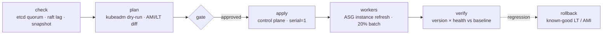
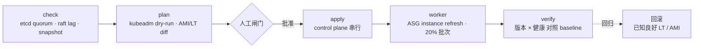

# META
id: w-p-upgrade
kicker_en: PROJECT
kicker_cn: 项目
title_en: Production Kubernetes Upgrade Engineering: 50 Clusters, 1.24 → 1.29, Zero Incidents
title_cn: 生产 Kubernetes 升级工程：50 集群，1.24 → 1.29，零事故
sub_en: An Upgrade Safety System (check → plan → apply + evidence) turned an 18–21 hour, two-person manual ritual into a 6–8 hour single-operator procedure, executed across two production fleets with zero customer-impacting downtime.
sub_cn: 用 Upgrade Safety System（check → plan → apply + evidence）把 18-21 小时、需要两人结对的手工升级压缩为 6-8 小时单人操作，并在两套生产集群上以零客户可感知停机完成执行。
domains: [release, infra]

# EN

## Why

Kubernetes 1.24 was aging out of support; every unsupported minor compounds CVE exposure and compliance risk. The fleet was 50 self-managed clusters on AWS — kubeadm control planes, ASG-backed workers — and the existing practice did not scale: a single cluster took 18–21 hours of hands-on work and required a two-person pairing, because the real risk model lived in senior engineers' heads. Multiply that by per-minor hops (kubeadm upgrades one minor at a time, so 1.24 → 1.29 means every intermediate step, each touching control plane, workers, and addons) and manual execution was not a viable plan.

The reframing that shaped the project: the root problem was not "manual vs. automated" but missing explainability. At any step, nobody could answer "what evidence tells me it is safe to proceed?" — knowledge was implicit, evidence scattered, postmortems impossible to reconstruct.

## How: the Upgrade Safety System

The system is a three-stage pipeline — `check → plan (dry-run) → apply + evidence` — implemented as a Python CLI orchestrating Ansible, boto3, and kubectl, with all stdout/stderr captured to an evidence store.

**check** makes the health baseline explicit. etcd quorum is verified three ways: member list (odd count, all online), raft index lag (a follower more than 1,000 entries behind the leader fails the gate — quorum can nominally exist while replication is unhealthy), and leader uniqueness. Node readiness, kube-system pod health, and active external alerts are gated the same way, with fail conditions written down rather than judged ad hoc. An etcd snapshot is mandatory before anything mutates.

**plan** is a real dry-run, not a document. Masters: `kubeadm upgrade plan` plus `ansible --check --diff`. Workers: an AMI diff (kubelet must equal the target version) and a Launch Template diff (only the AMI ID may change). Blast radius is quantified up front by quorum math: three masters tolerate exactly one unavailable, and `serial: 1` guarantees only one is ever touched, capping the worst case at a single node.

**apply** executes in strict order with per-layer gates. Control plane upgrades in place, one master at a time, each with human confirmation. Workers are replaced immutably — new AMI, Launch Template update, ASG Instance Refresh in 20% batches with pause-on-failure. Addons follow a dependency order: AWS cloud-controller-manager first (an unhealthy CCM strands new workers on the `uninitialized` taint), then the CNI (`maxUnavailable: 1`, verified by cross-node pod connectivity), then Cluster Autoscaler (verified by a drain-triggered scale-out). Post-verify re-runs the full check and diffs against the pre-upgrade baseline.

Every step drops evidence: JSON health snapshots, plan diffs, full execution logs, and a per-step state file (completed / in-progress / pending). Interrupted runs resume from state; idempotent steps re-run.

Fleet rollout order: dev → preprod → prod canary → remaining prod → management cluster last (highest blast radius). Any failure pauses the fleet until a human approves continuation.

The efficiency path: 18–21 hours with a two-person pair became 6–8 hours with one operator plus the system; the automation roadmap (external alert gating, synthetic health checks, auto-promotion after canary) targets 3–4 hours per cluster, a projected 60–80% reduction.

## Hard parts

**1. API deprecations as a separate workstream.** Removals ship per minor; the canonical case was PodSecurityPolicy, removed in 1.25. Logging and monitoring DaemonSets legitimately need privileged access, and a namespace carelessly set to `enforce: restricted` under Pod Security Admission blocks them outright. The fix was procedural: scan and migrate workloads before the hop, roll out PSA in warn/audit first, enforce only after zero violations, keep infra namespaces explicitly privileged. Version skew policy (kubelet may trail the apiserver by two minors) makes control-plane-first sequencing safe by construction.

**2. Stateful workloads and eviction order.** Draining nodes that host database pods (Kafka, MySQL, YugabyteDB, ClickHouse) is where upgrades break tenants. Database-hosting nodes were mapped ahead and sequenced first in each wave, one at a time with per-service verification. PDBs stay honest even on a dark cluster: violations there cannot hurt users, but they still block drain, so the procedure is wait-for-PDB or explicitly lower `minAvailable` — never force. Protection is layered — PDB for voluntary disruption, HPA for load, readiness probes for rollout — with the non-covered cases (hardware failure, application bugs) named and handled by multi-AZ placement.

**3. Fleet heterogeneity without heroics.** 50 clusters drift. Clusters were classified by `cluster_type` (workload / management / dev-staging), with per-cluster feature flags for residual exceptions — e.g. a drain timeout raised from the 300s default to 600s where eviction is known to be slow. Drift is not eliminated; it is made visible in the check baseline before every upgrade, and a growing flag count signals the classification itself is wrong.

**4. Making "zero incidents" a verifiable claim.** Zero incidents only means something against a pre-agreed standard. Every gate resolves a version × health four-quadrant (target version + healthy → proceed; old version + healthy → re-run; anything unhealthy → human), post-verify diffs against the recorded baseline rather than an engineer's memory, and the check itself is cross-validated against external monitoring to defend against a wrong baseline. Validation covered business-layer correctness, not just infra health.

**5. Rollback designed per layer, triggers pre-declared.** An etcd snapshot restores data, not binaries — so control plane rollback is snapshot restore plus binary downgrade; worker rollback is stopping the Instance Refresh and reverting the Launch Template; addon rollback is `kubectl rollout undo`. Triggers were pre-written: master upgrade failure, over 50% of pods not Running, critical services unreachable, alert flood. Raft leader transfer mid-upgrade is expected (elections settle in 1–2 seconds); the real hazard is a member failing to rejoin — exactly what `serial: 1` plus the snapshot gate bounds.

## Production execution

Both production fleets — masters, control-plane components, and workers — were upgraded with zero customer-impacting downtime and zero rollbacks. The enabling pattern was paired-cluster traffic pre-shift: move all traffic to the sibling cluster, pause cross-cluster replication, upgrade the now-dark cluster, resume replication and wait for lag to drain below threshold, verify against the checklist, then shift traffic back. Under this pattern the 20% batch size becomes a pacing mechanism rather than user protection — small enough to pause fast when something looks wrong. Human sign-off remained at check, at plan, at every master, and at final post-verify.

## Takeaways

- The hard part of an upgrade is not knowing what to do; it is justifying, with evidence, that you may do the next thing. An evidence chain converts implicit seniority into explicit gates anyone can operate.
- Blast radius is a design input, not an outcome: quorum math, `serial: 1`, and 20% batches put a ceiling on the worst case before execution starts.
- The durable asset is not the tool. The checklist and evidence patterns outlived the project and now run as routine infra health checks.

# CN

## 为什么做

Kubernetes 1.24 即将脱离支持窗口，每落后一个 minor 版本，CVE 暴露面和合规风险都在累积。集群规模是 50 个 AWS 上的自管理集群：kubeadm control plane 加 ASG worker。存量升级方式完全无法规模化：单集群 18-21 小时纯手工操作，且必须两人结对，因为真正的风险模型只存在于资深工程师的脑子里。再乘上逐 minor 跳版的约束（kubeadm 一次只能升一个 minor，1.24 到 1.29 意味着每个中间版本都要走一遍，每一跳都覆盖 control plane、worker、addon 三层），手工执行在数学上就不成立。

决定整个项目走向的一次重新定义：根本问题不是「手动还是自动」，而是系统可解释性缺失。在任何一步，没人能回答「我凭什么确信现在可以进入下一步」。经验是隐式的，证据是散落的，事后连复盘都无从做起。

## 怎么做：Upgrade Safety System

系统是一条三段式流水线：`check → plan(dry-run) → apply + evidence`。实现为 Python CLI，编排 Ansible、boto3 和 kubectl，所有 stdout/stderr 全量落入 evidence 存储。

**check** 把健康基线显式化。etcd quorum 查三件事：member list（奇数个成员且全部在线）、raft index lag（follower 落后 leader 超过 1000 直接 fail，quorum 名义存在不代表复制健康）、leader 唯一性。node Ready 数、kube-system pod 状态、外部活跃告警同样走门禁，fail 条件全部写成规则而不是临场判断。任何变更之前，etcd snapshot 是强制动作。

**plan** 是真正的 dry-run，不是一份文档。master 侧跑 `kubeadm upgrade plan` 加 `ansible --check --diff`；worker 侧做 AMI diff（kubelet 必须等于目标版本）和 Launch Template diff（只允许 AMI ID 变化）。blast radius 在执行前用 quorum math 量化：3 台 master 恰好容忍 1 台不可用，`serial: 1` 保证每次只动一台，最坏情况被限定在单节点。

**apply** 按严格顺序执行，逐层设门。control plane 原地升级，逐台 master 推进，每台人工确认。worker 走不可变替换：新 AMI、更新 Launch Template、ASG Instance Refresh 按 20% batch 滚动，失败即暂停。addon 按依赖顺序：先 AWS cloud-controller-manager（CCM 不健康会让新 worker 卡在 `uninitialized` taint 上），再 CNI（`maxUnavailable: 1` 滚动，升级后用跨节点 pod 连通性验证），最后 Cluster Autoscaler（drain 一个节点、观察 scale-out 成功即验证通过）。post-verify 重跑完整 check，与升级前 baseline 做 diff。

每一步都留证据：结构化 JSON 健康快照、plan diff、完整执行日志，以及记录每步 completed / in-progress / pending 的状态文件。中途中断可从状态恢复，幂等步骤直接重跑。

集群推进顺序：dev → preprod → prod 金丝雀 → 其余 prod → 管理集群最后（blast radius 最大）。任何一个集群失败，全局暂停，人工批准后才能继续。

效率路径：18-21 小时两人结对，降到 6-8 小时单人加系统；自动化路线图（外部告警门控、synthetic health check、金丝雀通过后自动放行）目标是单集群 3-4 小时，预期降幅 60-80%。

## 难点

**1. API deprecation 是独立问题线。** 每个 minor 版本都有 API 移除，典型案例是 1.25 移除 PodSecurityPolicy。日志和监控类 DaemonSet 合法地需要 privileged 权限，namespace 若被草率打上 `enforce: restricted` 的 Pod Security Admission 标签，这些组件会被直接拦截。解法是流程化：升级前完成存量 workload 扫描与迁移，PSA 先以 warn/audit 模式观察，确认零违规后才切 enforce，infra namespace 显式保持 privileged。version skew policy（kubelet 允许落后 apiserver 两个 minor）保证了 control plane 先行、worker 跟随的顺序在机制上天然安全。

**2. 有状态工作负载与驱逐顺序。** drain 承载数据库 pod（Kafka、MySQL、YugabyteDB、ClickHouse）的节点，是升级最容易伤到租户的地方。做法是提前测绘数据库节点分布，在每个波次中排在最前，逐节点推进，每个服务验证通过才走下一个。PDB 在 dark cluster 上依然诚实：违规不会伤害用户，但依然会卡住 drain，处理方式是等 PDB 满足或显式调低 `minAvailable`，绝不强制驱逐。保护是分层的：PDB 管主动中断，HPA 管负载，readiness probe 管滚动更新；不覆盖的场景（硬件故障、应用自身 bug）明确列出，靠多 AZ 布局兜底，而不是假装不存在。

**3. 集群异构性不靠英雄主义。** 50 个集群必然漂移。不靠人脑记差异，而是按 `cluster_type` 分类（workload / management / dev-staging），残余例外用 per-cluster feature flag 表达，例如已知驱逐慢的集群把 drain timeout 从默认 300 秒调到 600 秒。drift 不追求消灭，而是在每次升级前的 check baseline 里变得可见、可决策；flag 数量增长本身被当作分类失准的信号。

**4. 让「零事故」成为可验证的声明。** 零事故只有在事前约定的标准下才有意义。每道门禁都归结为版本 × 健康四象限的判定（目标版本且健康则继续，旧版本且健康则重跑，任何不健康则人工介入）；post-verify 对比的是落盘的 baseline 而不是工程师的记忆；check 结果与外部监控交叉验证，防御「baseline 本身就是错的」这一失效模式。验证范围覆盖业务层正确性，不止 infra 健康。

**5. 回滚按层设计，触发条件事前声明。** etcd snapshot 恢复的是数据，不是二进制：所以 control plane 回滚等于 snapshot 恢复加二进制降级；worker 回滚等于停止 Instance Refresh 并回退 Launch Template；addon 回滚等于 `kubectl rollout undo`。触发条件在执行前写死：master 升级失败、超过 50% pod 非 Running、关键服务不可达、告警洪水。升级中 Raft leader 转移是预期行为（选举 1-2 秒内完成），真正的危险是成员起不来，而这恰好被 `serial: 1` 加 snapshot 门禁框住。

## 生产执行

两套生产集群（two production fleets，覆盖 master、control-plane 组件、worker）全部完成升级，零客户可感知停机，零回滚。支撑模式是双集群流量前置切换：流量全部切到对侧集群，暂停跨集群复制，升级已变 dark 的一侧，恢复复制并等待 lag 降回阈值以下，按 checklist 验证后再把流量切回。在这个模式下，worker 的 20% batch 不再是保护用户的机制，而是节奏控制机制：足够小，出现异常能快速暂停。人工签核保留在四个位置：check、plan、每一台 master、最终 post-verify。

## Takeaway

- 升级难的不是知道做什么，而是用证据证明「现在可以做下一步」。evidence chain 把隐式的资深经验转化为任何人都能操作的显式门禁。
- blast radius 是设计输入而不是结果：quorum math、`serial: 1`、20% batch 在执行开始前就给最坏情况封了顶。
- 沉淀下来的不是工具。checklist 与 evidence 模式在项目结束后外溢为日常 infra health check，成为可复用的安全标准。

# SOURCES

| 数字/事实 | 出处 |
|---|---|
| 50 集群 | interview-1 内部口径 ~50 cluster；2026-07-20 用户裁决全站统一 50 |
| 1.24 → 1.29，逐 minor 执行（kubeadm 限制） | interview-1-k8s_upgrade.md「做了什么」；reference Q6 |
| 每跳覆盖 control plane / worker / addon 三层 | interview-1「做了什么」（每 cluster 至少 3 轮操作） |
| 单集群 18-21h、必须 2 人 pair | interview-1「为什么做」 |
| After：6-8h、1 人 + system | interview-1「结果」表 |
| 自动化目标 3-4h | content_plan.md「18-21h→3-4h」 |
| 预期效率提升 60-80% | interview-1「结果」表 |
| raft index lag > 1000 即 fail | interview-1_reference Q1 |
| etcd snapshot 强制、恢复数据不恢复二进制 | interview-1_reference Q1 / Q4 |
| 3 master 容忍 1 台、serial:1 单节点 blast radius | interview-1_reference Q2 |
| worker：AMI diff + LT diff（只允许 AMI ID 变） | interview-1_reference Q2 |
| ASG Instance Refresh batch 20% | interview-1「升级执行顺序」 |
| addon 顺序 CCM → CNI → CA 及各自 gate、uninitialized taint | interview-1「Addon 升级顺序」表 |
| evidence 四类（JSON 快照 / diff / 日志 / state 文件） | interview-1_reference Q3 |
| 推进顺序 dev → preprod → prod-canary → prod → mgt、失败全局暂停 | interview-1「升级执行顺序」；reference Q8 |
| PSP 1.25 移除、warn/audit 先行、infra ns privileged | interview-1_reference Q6 |
| version skew：kubelet N-2 | interview-1_reference Q6 |
| 数据库节点先升、逐节点验证 | runbook-k8s-upgrade-plan-runbook.md Phase 4（只取方法论） |
| DB 工作负载类型（Kafka/MySQL/YugabyteDB/ClickHouse） | runbook Phase 4.2（只取组件类型，不含实例细节） |
| dark cluster 下 PDB 仍卡 drain、等待或调低 minAvailable | interview-1_reference Q5 |
| PDB + HPA + readiness 三层及非覆盖场景 | interview-1_reference Q5 |
| cluster_type 分层 + feature flag、drain timeout 300s→600s | interview-1_reference Q7 |
| 版本 × 健康四象限判定 | interview-1「三阶段 Checkpoint」表；reference Q4 |
| baseline 交叉验证（外部监控）、防 baseline 错误 | interview-1_reference Q12 |
| 回滚三层路径（snapshot+二进制 / 停 Refresh+回退 LT / rollout undo） | interview-1「三阶段 Checkpoint」表 |
| 回滚触发条件（master 失败 / >50% pod 非 Running / 关键服务不可达 / 告警洪水） | runbook「Rollback prep」（方法论） |
| Raft 选举 1-2s、leader 转移为预期行为 | interview-1_reference Q4 |
| 双 prod 零客户可感知停机、验证覆盖业务层正确性 | fy2026_self_assessment.md Q1 / Q3 |
| 零事故、零回滚 | interview-1「结果」表 |
| 双集群流量前置切换 + 复制暂停/恢复/lag 回落再切回 | interview-1_reference Q5；runbook 1.4 / 6.2-6.4（只取方法论，不含 dashboard/部署名） |
| checklist + evidence 外溢为日常 infra health check | interview-1「结果」表 |

**因素材缺失而省略的内容：**
- 「最接近出事的一次」具体案例：reference 只把它列为面试预设问题，无实际事件素材，未写。
- 集群口径已按用户裁决统一为 50；「300-450 人日」总量估算仍未使用（颗粒度超出正文需要）。
- EKS 成本对比（$3,600/month）：同样绑定 50 cluster 口径，且属内部成本细节，未写。
- BGP session 断开 5-30s 细节：与 CNI 具体模式（BGP vs VXLAN）绑定，正文未展开到该深度，省略。
- 升级窗口计划（test 工作日 / prod 周末）：runbook 内部排期细节，非方法论核心，未写。
