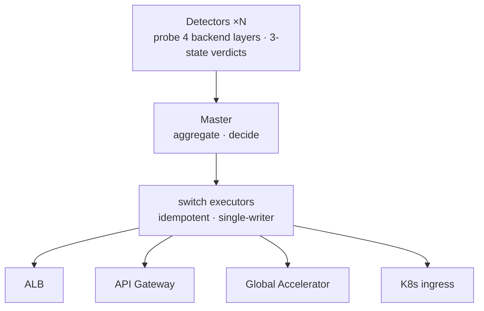
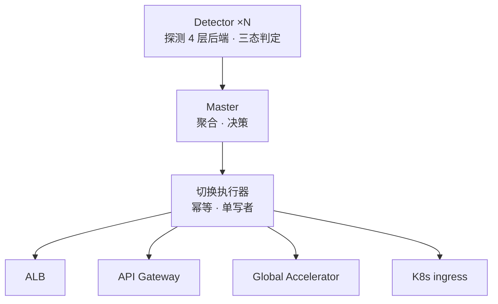

# META
id: w-p-tswitch
kicker_en: PROJECT
kicker_cn: 项目
title_en: Automated Traffic Switching Across Four Infrastructure Layers
title_cn: 跨四层基础设施的自动切流系统
sub_en: A Master-Detector control plane, designed from zero, that cut failover from 5-15 minutes of manual console work to seconds across 50 clusters
sub_cn: 从零设计的 Master-Detector 控制面：50 个集群的故障切流从 5-15 分钟人工操作压缩到秒级

# EN

## Why: manual failover is unacceptable for real-time fraud detection

The platform served real-time fraud detection across 50 Kubernetes clusters spread over four kinds of traffic infrastructure: AWS ALB, API Gateway, Global Accelerator, and K8s Ingress. Each layer had its own control plane, so when a cluster degraded, an on-call engineer logged into multiple consoles and hand-executed the switch: 5 to 15 minutes of MTTR, per incident, entirely human-paced. There was no automated loop between fault detection and traffic action; failure discovery relied on manual inspection or passive alerts, switch operations were scattered and unaudited, and rules could not be reused. At 50-cluster scale this does not extend, and for a real-time decisioning service every minute of misrouted traffic is direct customer impact.

## How: a two-layer Master-Detector control plane, built from zero

I designed and implemented the system from scratch as a single codebase deployed in two roles, selected by a `master=yes/no` environment variable. Detectors run in every workload cluster (50 of them) on dynamic cron schedules, probing target endpoints with three-layer validation: HTTP status code, response-body field extraction against expected values, and response latency against a threshold. The Master runs in the management cluster and does everything else: rule CRUD with MD5 dedup, an approval workflow (`review → ready → disabled`, any change forces a rule back to review), aggregation of detector reports, failure-rate evaluation against a threshold, and switch execution through four backend adapters: ALB target-group weights, API Gateway route integrations, Global Accelerator endpoint weights, and K8s Ingress canary-weight annotations. Switching escalates across three independent granularities, SERVICE, CLUSTER, and REGION, each driven by its own rule rather than automatic cascading.

## Hard parts

**1. False-positive governance: a wrong switch is worse than no switch.** A naive detector turns every network blip into a failover. The system treats distrust of its own signal as a design axiom. Probe results are three-state: PASS, FAIL, UNKNOWN, and timeouts count as UNKNOWN, excluded from the failure rate, because a timeout proves nothing about the target. Probe semantics are typed: a Prometheus-metrics probe failing yields UNKNOWN, not FAIL, because a dead monitoring stack does not mean a dead service. A single FAIL never triggers anything; only `neededDetectTimes` consecutive failures make a detector report at all, and the Master then aggregates reports grouped by target cluster and rule, acting only when the aggregate failure rate crosses the threshold (5% in the canonical configuration). Detector concurrency is isolated in a 50-thread pool with independent timeouts, so one slow target cannot distort verdicts about the others.

**2. Four switching primitives that do not agree with each other.** ALB moves traffic by target-group weight, Global Accelerator by endpoint weight, API Gateway by re-pointing route integrations, K8s Ingress by a canary annotation. Delta-style operations ("shift 20% away") are retry-unsafe across four different API semantics: a retried delta compounds. The adapter layer therefore converges on declarative state: before every switch the Master live-queries the infrastructure for current state via the provider APIs, compares it to the approved target state, and performs an upsert, or skips entirely if they already match. The local database stores only approved target states, never a shadow copy of live state, eliminating drift. Global Accelerator's slow control-plane API gets a 5-minute TTL read cache.

**3. Idempotency, single-writer, and the switch-back problem.** Every switch is idempotent by construction: read-compare-upsert, safe to re-run. Race conditions are removed structurally rather than locked away: Detectors have no switch permission at all, so there is nothing to split-brain, and Master uniqueness is double-guarded by the environment variable plus a DNS check comparing the service domain against the pod's node IP. The one constraint that cannot be engineered around: a switch is not safely auto-reversible, because the system cannot prove the failed cluster has truly recovered. Each switch carries a `durationInSeconds` (300 s in the canonical flow); on expiry the on-call is notified to confirm switch-back, or a pre-configured switch-back rule takes over.

**4. Compressing minutes to seconds without losing control.** Automation this powerful needs governance. Every rule passes the approval workflow before it can fire, and approval auto-fills service variables from K8s Ingress rather than trusting hand-typed endpoints. Rule dispatch to 50 clusters is best-effort HTTP POST; clusters that miss a dispatch re-sync on the next rule change. Rule changes create a brief detection blind window, an explicitly accepted trade: rule correctness over continuous coverage. Net effect: failure response went from 5-15 minutes of console work to seconds of automatic execution, with an audit trail.

## Takeaways

- In a failover system, the detection layer's first job is to distrust itself. False positives are governed structurally: typed probe semantics, three-state results, consecutive-failure thresholds, cross-detector aggregation, not tuned away with magic numbers.
- Heterogeneous backends converge on one abstraction: read live state, upsert declarative target state. Deltas do not survive retries; declarations do.
- Authority separation removes failure classes by construction. Detectors that cannot switch cannot split-brain; a single Master with double-guarded uniqueness makes the read-then-write sequence race-free without distributed locking.

# CN

## 为什么做：人工切流对实时反欺诈不可接受

平台的实时反欺诈服务运行在 50 个 Kubernetes 集群上，流量入口横跨四种基础设施：AWS ALB、API Gateway、Global Accelerator、K8s Ingress。每一层有独立控制面，集群故障时值班工程师需要逐一登录多套控制台手工切流，单次 MTTR 5-15 分钟，完全由人的速度决定。故障感知与切流执行之间没有自动化闭环：故障发现依赖人工巡检或被动告警，切流操作分散且无审计，规则无法复用。在 50 集群规模下这套模式无法扩展，而对实时决策服务来说，流量错误停留的每一分钟都是直接的业务损失。

## 怎么做：从零设计的 Master-Detector 两层控制面

系统从 0 到 1 设计实现，同一套代码通过 `master=yes/no` 环境变量区分两种角色。Detector 部署在全部 50 个 workload 集群，按动态 cron 调度探测目标 endpoint，做三层验证：HTTP 状态码、响应体字段提取与预期值比较、响应延迟阈值。Master 部署在管理集群，承担其余全部职责：规则 CRUD 与 MD5 去重、审批工作流（`review → ready → disabled`，任何变更强制回退到 review）、聚合 Detector 上报、按阈值评估故障率、通过四种后端 adapter 执行切流：ALB Target Group 权重、API Gateway 路由指向、Global Accelerator 端点权重、K8s Ingress canary-weight annotation。切流粒度分三级：SERVICE、CLUSTER、REGION，各自由独立规则驱动、并行触发，而非自动级联。

## 难点

**1. 检测假阳性治理：切错比不切更糟。** 朴素的探测器会把每次网络抖动放大成一次切流。本系统把「不信任自己的信号」作为设计公理。探测结果是三态的：PASS、FAIL、UNKNOWN，超时计为 UNKNOWN 且不计入失败率，因为超时无法证明目标真的故障。探测语义按类型区分：Prometheus 指标类探测失败产出 UNKNOWN 而非 FAIL，监控系统挂掉不等于业务挂掉。单次 FAIL 不触发任何动作，连续失败达到 `neededDetectTimes` 次 Detector 才上报；Master 再按目标集群与规则分组聚合所有 Detector 的上报，只有聚合失败率越过阈值（典型配置为 5%）才执行切流。Detector 并发用 50 线程池加独立超时隔离，单个慢目标不会污染对其他目标的判断。

**2. 四种切流原语互不一致。** ALB 用 Target Group 权重，Global Accelerator 用端点权重，API Gateway 靠改路由指向，K8s Ingress 靠 canary annotation。「挪走 20%」这类 delta 操作在四套 API 语义下重试不安全：重试一次 delta 就叠加一次错误。adapter 层因此统一收敛到声明式状态：每次切流前 Master 通过各家 API 实时读取基础设施当前状态，与审批通过的目标状态比较后 upsert，相同则直接跳过。本地数据库只存审批流程中的目标状态，从不存实际状态的副本，杜绝漂移。Global Accelerator 控制面 API 延迟高，加 5 分钟 TTL 的读缓存。

**3. 幂等、单写者与回切问题。** 每次切流天然幂等：读、比、upsert，可安全重放。竞态靠结构消除而非加锁：Detector 完全没有切流权限，从根上不存在脑裂；Master 唯一性由环境变量加 DNS 检测（服务域名与 pod 所在节点 IP 比对）双重保证。绕不过去的约束是：切流本身不可安全地自动回滚，系统无法证明故障集群真正恢复。每条切流带 `durationInSeconds`（典型流程为 300 秒），到期通知 on-call 人工确认回切，或由预先配置的回切规则接管。

**4. 把分钟压到秒，同时不失控。** 这种量级的自动化必须配套治理。所有规则必须过审批流才能生效，审批通过时从 K8s Ingress 自动填充 service 变量，不信任手工输入的 endpoint。规则向 50 个集群的下发是 best-effort HTTP POST，漏掉下发的集群在下次规则变更时重新同步。规则变更期间存在短暂检测盲区，这是显式接受的取舍：规则正确性优先于覆盖连续性。最终效果：故障响应从 5-15 分钟的控制台操作降到秒级自动执行，且全程留有审计记录。

## Takeaway

- 切流系统里，检测层的第一职责是不信任自己。假阳性靠结构治理：类型化探测语义、三态结果、连续失败阈值、跨 Detector 聚合，而不是靠调参数压下去。
- 异构后端收敛到一个抽象：读实际状态、upsert 声明式目标状态。delta 扛不住重试，声明式可以。
- 权限分离从构造上消灭故障类别：不能切流的 Detector 无脑裂可言；唯一 Master 加双重保证，让「先读后写」无需分布式锁也没有竞态。

# SOURCES
- work-contexts/career/interview/interview-2_traffic_switch.md
- work-contexts/career/interview/interview-2_traffic_switch_reference.md
