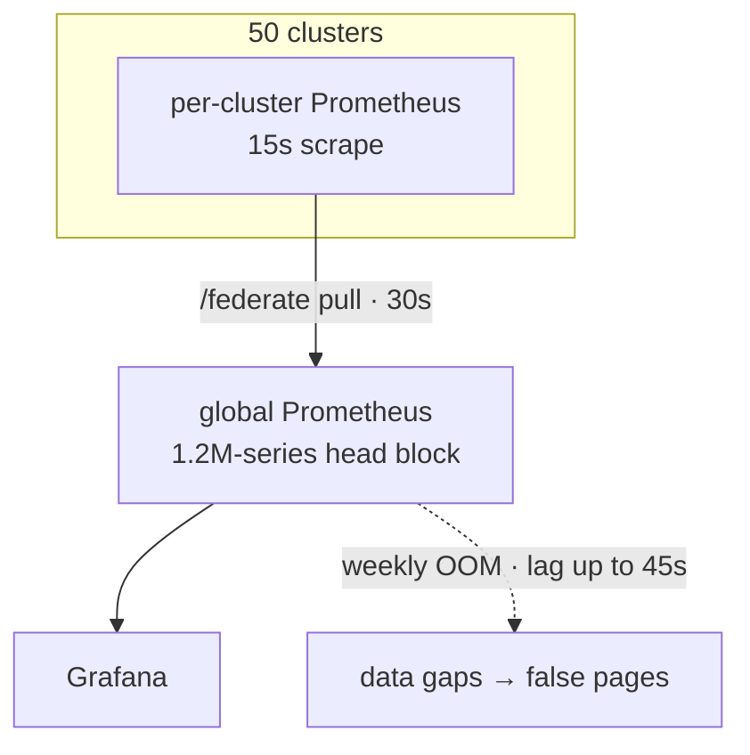
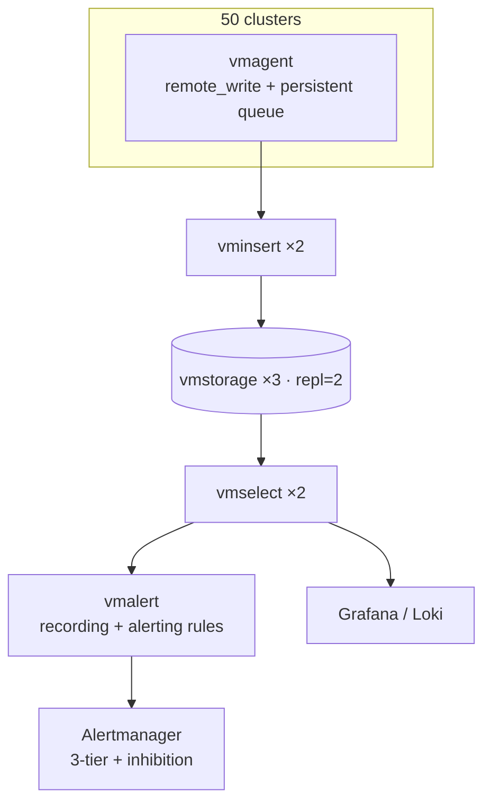
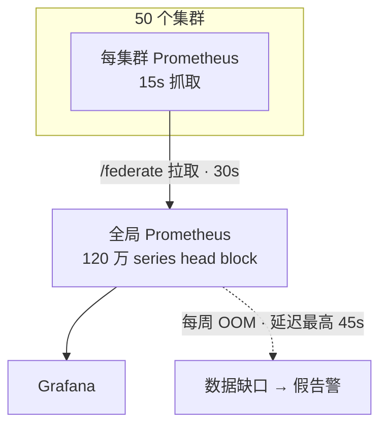
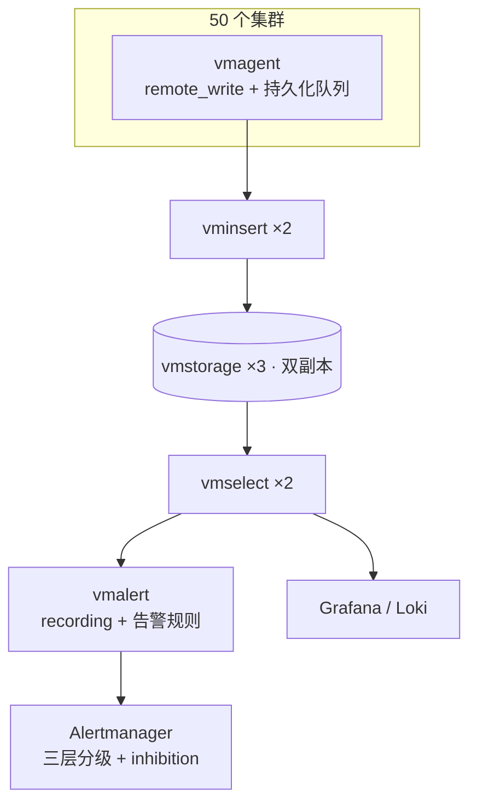

# META
id: w-p-vm
kicker_en: PROJECT
kicker_cn: 项目
title_en: Replacing Prometheus Federation: Rebuilding a Multi-Tenant Monitoring Platform
title_cn: 替换 Prometheus Federation：一个多租户监控平台的重建
sub_en: Moved 50 Kubernetes clusters off a weekly-OOMing federation topology onto a VictoriaMetrics platform — 1.2M active series, data lag 45s → <5s, zero alert gaps through the cutover.
sub_cn: 把 50 个 Kubernetes 集群从每周 OOM 的 Federation 拓扑迁到 VictoriaMetrics 平台：1.2M active series，数据延迟 45s 降到 5s 以内，切换全程告警不断流。
domains: [obs]

# EN

## Why

The global Prometheus at the top of our federation topology was OOMing two to three times a week. Its head block carried 1.2M series and cost 5–10 GB of memory to maintain; every crash-restart cycle left holes in the data, and those holes paged on-call for incidents that did not exist. That was the reliability half of the problem. The latency half was structural: federation stacks two scrape intervals — 15s at the cluster level plus 30s at the global tier — so the global view could trail reality by up to 45 seconds. During a P0, the person paged was looking at the past.

Scale made both problems terminal. At 50 clusters, the `/federate` endpoint was timing out under scrape load, producing gaps in Grafana. Every cluster maintained its own federation rules, and onboarding a new cluster meant hand-editing the global Prometheus scrape config. And the platform had no usable multi-tenant dimension: metrics aggregated across tenants, so a fault confined to one tenant disappeared into the average.

I owned the observability domain end-to-end within a 3–4 person SRE team — design, evaluation, rollout. For the engine choice I ran the VictoriaMetrics-vs-Thanos POC (write throughput, compression, operational complexity) and the team ratified the result.

## How

The replacement is a push-based hub: one vmagent per workload cluster scrapes locally, injects `cluster` and cluster-group labels at relabel time, and remote-writes into a central VictoriaMetrics cluster (vminsert ×2 behind LB, vmstorage ×3 with replication factor 2, vmselect ×2). vmalert evaluates recording and alert rules against the same store; Alertmanager (HA pair) routes notifications; Grafana and Loki form the read-and-verify plane.

Capacity was designed from measured inputs: 50 clusters × ~12 nodes ≈ 600 nodes at ~2,000 series per node gives ~1.2M active series and ~80,000 samples/s at a 15s scrape interval. Hot storage holds 3 months in ~250 GB on SSD at roughly 4× compression — the same window cost ~930 GB under federation. Cold storage is 5-minute downsampled data on S3: 180 days in ~25 GB.

Alerting is part of the platform, not an afterthought. Recording rules materialize an SLI family first — QPS, error ratio, P95/P99 latency, saturation, and per-tenant SLI — keyed by `{tenant, cluster group}`; dashboards and alert rules both consume the precomputed series instead of running heavy queries live. Severity is three-tiered: PAGER routes to PagerDuty and is reserved for confirmed user impact, HIGH goes to Slack, MEDIUM becomes a ticket. A PAGER requires a multi-window burn-rate breach — both the 5m and the 30m windows over threshold — which filters transient jitter without losing sustained degradation. Inhibition rules suppress derived noise along explicitly causal chains only (NodeNotReady inhibits PodUnableToStart on the same node); speculative cross-service inhibition was deliberately excluded, because a wrong inhibition hides a real failure.

Tenant identity rides two paths. Applications emit the `tenant` label on their own metrics, since only the application knows whose request it is serving; vmagent relabeling injects cluster and cluster-group context at scrape time. Before this project, relabel configs had drifted per cluster — inconsistent cluster naming, some teams labeling `client` instead of `tenant` — which silently broke alert routing, drill-down, and inhibition's label-equality matching. I wrote one relabel template and distributed it to all clusters, and drove the application-side convergence on `tenant`.

**Before: federation.**

**After: VictoriaMetrics platform.**

## Hard parts

**Cutting over without losing an alert.** VictoriaMetrics speaks MetricsQL, which has boundary differences from PromQL, so "the rules still fire" could not be assumed. We ran both stacks in parallel for two weeks in a dual-write configuration, evaluated every alert rule on both sides, diffed firing behavior, and fixed divergences before flipping notification routing. The platform also had to fail loudly: vmalert emits a continuous heartbeat, and a deadman's switch plus an out-of-band probe convert "monitoring went silent" into an explicit page within minutes, rather than a quiet blind spot.

**Data lag: 45s to under 5s.** The improvement is architectural, not tuned. Federation's lag is two stacked scrape periods by construction; remote_write pushes samples as they are scraped, so lag drops below 5 seconds. What actually needed engineering was loss, not speed: push means a network blip can drop data, so every vmagent runs a persistent queue on local disk, buffering through remote outages and draining on reconnect.

**Multi-tenant cardinality governance.** Adding a tenant dimension multiplies series, and series growth after the label rollout was fast. The controls: tenant-level recording rules exist only for core SLIs; infrastructure metrics carry no tenant label at all; retention is tiered (tenant SLA series 90 days, troubleshooting series 30 days, infrastructure 15 days); and periodic cardinality reviews catch accidentally high-cardinality labels. The honest retrospective note: a cardinality budget should have existed from day one, not after the growth curve forced the issue.

**Making severity mean something.** An audit of 30 days of alert history showed roughly 80% of pages were resource-centric — CPU or memory jitter that on-call would glance at and dismiss. The fix was admission control on the PAGER tier: a page must indicate observable user impact (SLO burn rate, SLA latency breach, or a QPS cliff on a critical flow), everything else is demoted to HIGH or MEDIUM. Static thresholds were replaced by multi-window burn-rate. Two feedback signals tuned the system after launch: action rate per PAGER, and user-reported incidents that produced no page.

## Production

The cutover gate was the two-week dual-write window: alert rules had to fire equivalently on both stacks and dashboard queries had to return equivalent results under MetricsQL before routing moved. The federation stack stayed live as the fallback until that gate passed. Inhibition rules were validated in staging by manually triggering upstream failures and checking which downstream alerts were suppressed, with firing history retained for postmortem review. After the switch, new-cluster onboarding collapsed from "write federation rules, edit the global scrape config" to "deploy vmagent, point it at the remote_write address." Ongoing verification runs on three signals: the deadman heartbeat, PAGER action rate, and missed-incident tracking.

## Takeaways

- Federation's 45s lag and weekly OOMs were properties of the architecture, not of the configuration; no tuning budget would have fixed them.
- Alert quality is an admission-control problem: define what earns a page, demote everything else, and measure action rate per page as the regression test.
- Label consistency is platform infrastructure. Routing, drill-down, and inhibition all depend on label equality, so it must be enforced once at the relabel layer, not negotiated per team.

# CN

## Why

Federation 拓扑顶端的 global Prometheus 每周 OOM 两到三次。它的 head block 维护着 1.2M series，占用 5 到 10 GB 内存；每次崩溃重启都会在数据上留下空洞，而这些空洞会以"不存在的故障"的形式把 oncall 从床上叫醒。这是可靠性的一半。另一半是延迟，而且是结构性的：Federation 叠加了两层 scrape 周期，集群本地 15s 加全局层 30s，全局视图最多滞后现实 45 秒。P0 发生时，被 page 的人看到的是过去。

规模让两个问题都无解。50 个集群的负载下 `/federate` 接口频繁 scrape timeout，Grafana 上出现数据断点；每个集群各自维护一套 federation rules，新集群接入要手工修改 global Prometheus 的 scrape 配置。同时平台没有可用的多租户维度：指标跨租户聚合，单个租户的局部故障被平均值掩盖。

我在一个 3 到 4 人的 SRE 团队里独立 own observability 这个领域：设计、选型、落地。引擎选型上我做了 VictoriaMetrics 与 Thanos 的 POC 对比（写入吞吐、压缩率、运维复杂度），结论由团队共识确认。

## How

替代方案是推送式的中心化架构：每个 workload 集群部署一个 vmagent 就地采集，在 relabel 阶段注入 `cluster` 和 cluster group 标签，然后 remote_write 到中心 VictoriaMetrics 集群（vminsert ×2 挂 LB，vmstorage ×3 副本因子 2，vmselect ×2）。vmalert 在同一存储上评估 recording rules 和 alert rules；Alertmanager 以 HA 双实例做通知路由；Grafana 加 Loki 构成读取与验证面。

容量按实测输入设计：50 集群 × 约 12 节点 ≈ 600 节点，每节点约 2,000 series，合计约 1.2M active series、约 80,000 samples/s（15s 采集间隔）。热存储 SSD 上 3 个月约 250 GB，压缩比约 4 倍：同样的窗口在 Federation 下要 930 GB。冷存储走 S3，5 分钟降采样，180 天约 25 GB。

告警是平台的组成部分，不是附属品。recording rules 先物化一族 SLI：QPS、error ratio、P95/P99 latency、saturation、分租户 SLI，全部按 `{tenant, cluster group}` 键控；dashboard 和告警规则都消费预计算结果，不在现场跑重查询。告警分三层：PAGER 走 PagerDuty，只留给确认的用户影响；HIGH 进 Slack；MEDIUM 归工单。PAGER 必须满足 multi-window burn-rate：5m 和 30m 两个窗口同时超阈值才触发，既滤掉瞬时抖动，又不放过持续恶化。inhibition 只沿因果明确的链条做抑制（NodeNotReady 抑制同节点的 PodUnableToStart）；跨服务的推测性抑制被刻意排除，因为配错方向的 inhibition 会掩盖真实故障。

租户身份有两条注入路径：应用在自己的 metrics 上打 `tenant` label，因为只有应用知道在处理谁的请求；vmagent 在 scrape 时通过 relabel 注入集群与 cluster group 上下文。项目之前各集群的 relabel 配置各自为政：cluster 命名不统一，部分团队用 `client` 而不是 `tenant`，这会悄无声息地破坏告警路由、drill-down 和 inhibition 的 label 相等匹配。我写了统一的 relabel 模板分发到所有集群，并推动应用侧收敛到 `tenant`。

**旧架构：federation。**

**新架构：VictoriaMetrics 平台。**

## Hard parts

**切换全程不丢一条告警。** VictoriaMetrics 用 MetricsQL，与 PromQL 存在边界差异，"规则照常触发"不能靠假设。我们以双写配置并行运行新旧两套栈两周，每条告警规则在两侧同时评估，diff 触发行为，修完所有分歧才切换通知路由。平台还必须"响亮地失败"：vmalert 持续输出心跳，deadman's switch 加 out-of-band 探针把"监控失联"在分钟级转化为一条明确的 page，而不是一个安静的盲区。

**数据延迟从 45s 到 5s 以内。** 改善来自架构而非调参。Federation 的滞后是两层 scrape 周期的结构性叠加；remote_write 在采集的同时推送样本，延迟直接降到 5 秒以内。真正需要工程投入的不是快，而是不丢：推送意味着网络抖动可能丢数据，所以每个 vmagent 都在本地磁盘上跑 persistent queue，remote 断连期间缓冲，恢复后回放。

**多租户 series 基数治理。** 加租户维度会成倍放大 series，label 铺开后增长很快。治理手段：tenant 级 recording rules 只覆盖核心 SLI；基础设施指标一律不带 tenant label；retention 分层（tenant SLA 序列 90 天，排障序列 30 天，基础设施 15 天）；定期 cardinality 审查清理意外的高基数 label。诚实的复盘结论：cardinality budget 应该在第一天就存在，而不是等增长曲线逼出来。

**让 severity 有语义。** 对 30 天告警历史做审计，约 80% 的 page 是 resource-centric 的：CPU 或内存抖动，值班人看一眼就关掉。解法是给 PAGER 层做准入控制：一条 page 必须指示可观测的用户影响（SLO burn rate、SLA latency 击穿、关键链路 QPS 断崖），其余全部降级到 HIGH 或 MEDIUM；静态阈值全部换成 multi-window burn-rate。上线后用两个反馈信号持续调参：每条 PAGER 的 action rate，以及用户报了问题但没有对应 page 的漏报。

## Production

切换的门禁是那两周的双写窗口：告警规则在两套栈上触发行为等价、dashboard 查询在 MetricsQL 下结果等价，路由才允许迁移；门禁通过之前 Federation 栈一直作为 fallback 在线。inhibition 规则在 staging 环境人工触发上游故障做验证，确认下游告警被正确抑制，并保留 firing 历史供 postmortem 回溯。切换后，新集群接入从"写 federation rules 加改全局 scrape 配置"收缩为"部署 vmagent，配一个 remote_write 地址"。日常验证靠三个信号：deadman 心跳、PAGER action rate、漏报追踪。

## Takeaways

- Federation 的 45s 延迟和每周 OOM 是架构属性而不是配置属性，任何调参预算都修不好。
- 告警质量是准入控制问题：定义什么配得上一条 page，其余全部降级，用每条 page 的 action rate 做回归测试。
- label 一致性本身就是平台基础设施：路由、drill-down、inhibition 全部依赖 label 相等匹配，必须在 relabel 层一次性强制，不能靠各团队各自约定。

# SOURCES

- Global Prometheus OOM 每周 2-3 次；head block 1.2M series 占 5-10 GB；重启数据空洞误报 oncall → interview-3-monitoring_reference.md:46
- Federation 两层 scrape（local 15s + global 30s），全局视图最多滞后 45s → interview-3-monitoring_reference.md:47
- /federate 接口 50 集群高负载 scrape timeout，Grafana 数据断点 → interview-3-monitoring_reference.md:48
- 50 集群各维护 federation rules，新集群手工配置 Global Prometheus scrape job → interview-3-monitoring_reference.md:49
- 迁移 Before/After 表：热存储 3 月 ~930 GB → ~250 GB（4x 压缩）；OOM 每周 2-3 次 → 0；数据延迟 45s → <5s；新集群接入 = 部署 vmagent + remote_write 地址 → interview-3-monitoring_reference.md:53-58
- MetricsQL/PromQL 边界差异；2 周双写验证告警规则兼容后切换 → interview-3-monitoring_reference.md:60
- deadman's switch + out-of-band 探针，分钟级告知 oncall 数据不可信 → interview-3-monitoring_reference.md:63
- 50 clusters × ~12 nodes = 600 nodes，~2,000 series/node → 1.2M active series，~80,000 samples/s（15s interval）→ interview-3-monitoring.md:52
- 热存储 ~250 GB（3 月），冷存储 S3 5min 降采样 180 天 ~25 GB → interview-3-monitoring.md:53
- 架构链路 vmagent → VM cluster → vmalert → Alertmanager → Grafana + Loki；PAGER→PagerDuty / HIGH→Slack / MEDIUM→ticket → interview-3-monitoring.md:41-48
- vminsert ×2 (LB) / vmstorage ×3 (repl=2) / vmselect ×2 → interview-3-monitoring_architecture.md:55-57
- recording rules SLI 族（QPS/error ratio/P95/P99/saturation/tenant SLI），按 {tenant, cluster_grp} 键控 → interview-3-monitoring.md:14, interview-3-monitoring_architecture.md:73-78
- multi-window burn-rate：5m + 30m 两窗口都异常才 PAGER → interview-3-monitoring.md:61
- inhibition 只做因果明确的抑制（NodeNotReady → 同节点 PodUnableToStart），不做推测性跨服务抑制 → interview-3-monitoring_reference.md:88, interview-3-monitoring_architecture.md:312-314
- tenant label 双路径注入（应用埋点 + vmagent relabel）；统一 relabel 模板分发；client → tenant 收敛 → interview-3-monitoring_architecture.md:244-282
- vmagent persistent queue 防网络抖动丢数据 → interview-3-monitoring.md:67, interview-3-monitoring_reference.md:37
- cardinality 治理四条（核心 SLI 才做 tenant-level rules / 基础设施不加 tenant / retention 分层 90d/30d/15d / 定期审查）→ interview-3-monitoring_reference.md:130
- "cardinality budget 一开始就该有，tenant label 加入后 series 增长快" → interview-3-monitoring_reference.md:150
- 30 天告警审计，约 80% page 不可操作（resource-centric，看一眼关掉）→ interview-3-monitoring_architecture.md:290-293, 236
- PAGER 准入标准（SLO burn rate / SLA latency / QPS 断崖）；静态阈值 → multi-window burn-rate → interview-3-monitoring_architecture.md:297-308
- 上线后反馈信号：PAGER action rate + 漏报 → interview-3-monitoring_architecture.md:318-322
- inhibition staging 人工触发验证，保留 firing 历史供 postmortem → interview-3-monitoring_reference.md:88
- 团队背景：3-4 人 SRE 团队，observability 领域从零到一由我 own；VM vs Thanos POC 我做评估、团队共识决策 → interview-3-monitoring_architecture.md:207-231

未采用/未写入的数字说明：
- 任务简报中的"30 集群/40 租户"在素材中不存在（素材口径为 50 clusters；"40 租户"无出处），正文统一使用 50 clusters，未写租户数量。
- victoriametrics_ops_review_20260402.md / playbook 描述的是 Single 模式、~793k series 的另一时点快照，与本页 cluster 模式叙事口径不同，其具体数字（4.7TB、76% 磁盘等）未混入本页。
- 素材未描述"逐集群灰度"的分批切换过程与正式回滚预案文档，Production 节仅写素材支持的双写窗口、等价性门禁、staging 验证与 fallback 事实。
