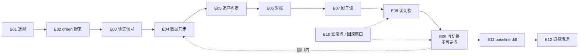
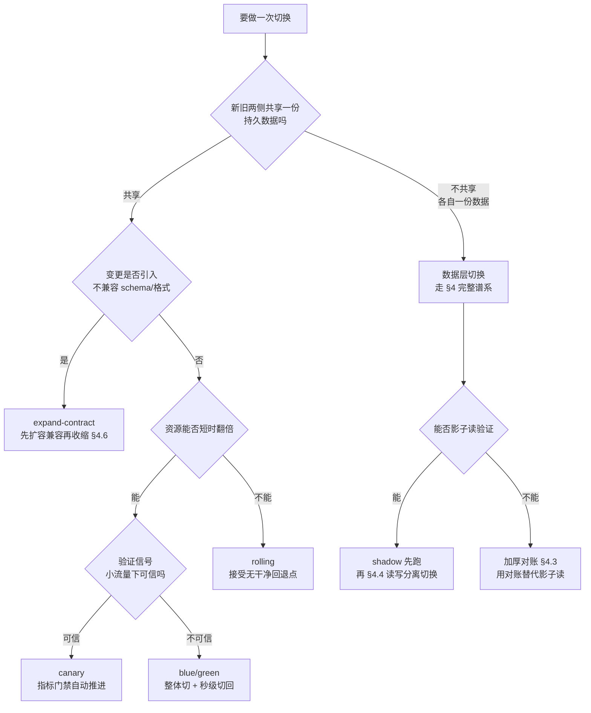
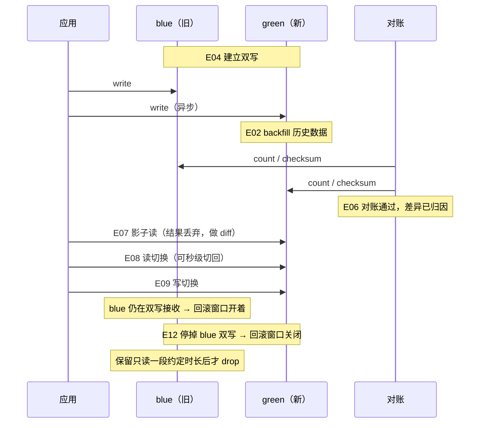

# 切换方法论骨架（Cutover Methodology）

> 本方向最重要的原创交付物。目的是让我在白板前能画出一套**通用切换设计框架**，然后把自己的真实故事挂上去，而不是反过来从故事里拼凑方法论。
>
> **标记约定**：`[一手]` = 我做过、有 evidence 路径；`[理论]` = 通用知识或业界实践，我没有生产证据。面试里这两类必须用不同的语气讲，`[理论]` 部分主动说明「这块我是读来的，我们没上」。

---

## 0. 十二环节骨架：白板上先画这个

任何一次切换（服务、集群、数据层）都可以拆成这十二个环节。面试里被问任何切换题，我先画这条主干，再说明这次要跳过哪几环、为什么。**跳过是设计决策，不是遗漏。**

| ID | 环节 | 核心问题 |
|---|---|---|
| E01 | 变更分级与模式选型 | 这次是 blue/green、canary、rolling 还是 shadow？依据是什么 |
| E02 | green 环境构建 | 新的一侧怎么起来，资源成本翻倍能不能接受 |
| E03 | 验证信号设计 | 凭什么证明 green 是对的（infra 层 + 业务层两层） |
| E04 | 数据同步建立 | 双写、复制还是 backfill，一致性风险在哪 |
| E05 | 追平收敛判定 | 怎么判断增量追上了，用什么阈值 |
| E06 | 对账与差异归因 | 口径是什么，可接受差异怎么定义和解释 |
| E07 | 影子读 / dark launch | 在不承担风险的前提下先跑真实流量 |
| E08 | 读切换 | 灰度维度（租户/表/region）与粒度 |
| E09 | 写切换 | 不可逆点在哪，什么时候跨过它 |
| E10 | 回滚点与回滚窗口声明 | 回滚到哪、还有多久能回、什么条件触发 |
| E11 | 切换后对比验证 | 和切换前 baseline 逐项 diff，不靠记忆 |
| E12 | 旧环境退役与清理 | 双写停掉、旧表 drop、expand-contract 的 contract 步 |

一句话记法：**先把新的一侧建出来并证明它对，再把读切过去，最后才切写；写切过去之前回滚窗口一直开着，切过去之后就开始关。**

---

## 1. 选型判据：四种模式的适用条件矩阵

### 1.1 四种模式在说的到底是什么 `[理论]`

先把定义钉死，面试里很多人把这四个词混着用。

- **blue/green**：两套完整环境同时存在，流量在两套之间整体切换。粒度粗、回退快（把流量切回去就行）、资源成本接近翻倍。
- **canary**：一套环境内，把一小部分流量导向新版本，靠指标门禁决定继续放量还是回退。粒度细、需要流量可分割、需要可靠的验证信号。
- **rolling**：实例逐批替换，新旧版本在替换期间共存。资源成本最低，但**没有干净的回退点**，回退本身也是一次 rolling。
- **shadow / dark launch**：真实流量复制一份给新环境，结果不返回给用户。零用户风险，但写路径的副作用必须隔离掉，且拿不到「用户真的满意」这个信号。

### 1.2 六维度判据矩阵

| 维度 | blue/green | canary | rolling | shadow / dark |
|---|---|---|---|---|
| **状态性**（是否有本地状态/数据） | 有状态时最优，因为可以把整套数据一起准备好 | 有状态时最难，两个版本同时写同一份数据 | 有状态时按实例逐个搬，最容易伤到 quorum | 与状态无关（只要写副作用被隔离） |
| **回退速度要求** | 秒级，把流量切回去 | 分钟级，需要把权重降回 0 | 慢，回退是反向 rolling | 无需回退，本来不承担流量 |
| **资源成本翻倍容忍度** | 必须容忍近 2× | 只多一小部分 | 几乎不多 | 多一套但可以按比例缩小 |
| **验证信号获取难度** | 低（整套跑起来跑合成流量即可） | 高（小流量下指标信噪比差，要多窗口 burn rate） | 中 | 中（结果不可比时要写 diff 逻辑） |
| **流量可分割性** | 不要求可分割 | 强要求（按权重/header/租户可分） | 天然按实例分 | 要求能镜像复制 |
| **数据不可逆性** | 切换前可反复演练，不可逆点集中在写切换 | 每次放量都在真实写数据，不可逆性分散 | 同上，且难界定 | 无（前提是写被隔离） |

### 1.3 决策树

**这棵树里我最想强调的一句**：canary 的前提是「小流量下的验证信号可信」。很多有状态系统不满足这个前提，比如一次重查询的资源画像只有在真实并发下才暴露，1% 流量什么都看不出来，这时候 canary 是安全感表演，blue/green 加完整验证反而更诚实。

### 1.4 我自己场景里的选型结论 `[一手]`

| 场景 | 选了什么 | 为什么 |
|---|---|---|
| 50 集群 K8s 1.24→1.29 | 集群级 blue/green（双集群流量前置转移），集群内 worker 走不可变 rolling | 集群成对存在，天然有 sibling 可切；control plane 原地升级无法 blue/green，靠 `serial: 1` 把 blast radius 封在单节点 (src: `adhoc_jobs/dynamic_resume_site/content/projects/p_k8s_upgrade.md`) |
| Prometheus Federation → VictoriaMetrics | 双写并行 + diff 门禁 + 通知路由整体切 | 告警规则的语义等价性无法靠小流量验证，必须两侧同时评估全量规则再 diff (src: `adhoc_jobs/dynamic_resume_site/content/projects/p_vm_platform.md`) |
| ClickHouse → Doris | 一次性批量迁移 + 逐月门禁 + 全量对账，非双写 | 源表是宽表历史数据，迁移瓶颈是内存而非算力；双写在 3,727 列宽表上的成本远高于对账 (src: `contexts/survey_sessions/ch_to_doris_migration_interview_arsenal_20260717.md`) |

---

## 2. 无状态服务切换：标准流程与陷阱

无状态是简单情况，但陷阱全在细节里。这一节的价值不是流程本身（人人会背），而是陷阱清单。

### 2.1 标准流程 `[理论]`

1. green 侧起足容量并 warm 起来（连接池、JIT、本地缓存、DNS 缓存）
2. 用合成流量或影子流量验证 green（不是只验证 `/healthz`）
3. 流量按设计比例导入，观察窗口至少覆盖一个完整业务周期
4. blue 侧先摘流量但**不销毁**，作为回滚点保留一个约定时长
5. 连接 draining 完成后再销毁 blue

### 2.2 陷阱清单

**连接 draining**：把权重调到 0 不等于连接断了。已建立的长连接会继续走老实例，直到应用主动关闭或超时。正确做法是 LB 层 deregistration delay 加应用层 graceful shutdown（收到 SIGTERM 后停止接受新请求、把 in-flight 跑完、主动关连接），两者时长要匹配。`[理论]`

**长连接与 keepalive**：这是我踩过的一手坑。一条连接在**空闲 431 秒**后被杀，而 MySQL 侧 `wait_timeout` 是 8 小时，所以凶手不可能是数据库，只能是中间网络层的 TCP idle timeout；用 heartbeat 加 keepalive 绕开 (src: `adhoc_jobs/dynamic_resume_site/content/integration/oncall_track_record.md` 案例 3)。`[一手]` 切换场景下的推论：**中间层的空闲超时是切换后连接分布变化时才暴露的隐藏约束**，切换前要把各跳的 idle timeout 列出来对比，最短的那一跳决定行为。

**DNS TTL 的物理下限** `[理论]`：TTL 是建议不是保证。客户端 JVM 默认可能永久缓存、操作系统有 stub resolver 缓存、中间递归解析器可能不遵守小 TTL，再加上连接池不会因为记录变了就主动断开重连。所以 DNS 层故障切换的现实下限通常是分钟级，做不到秒级。推论是：需要秒级生效的切换点应当放在 DNS 之后的转发层（LB target group 权重、网关路由、Ingress 权重），那一层的决策在连接建立之后仍然生效，不依赖客户端重新解析域名。

**健康检查的假阳性与假阴性**：两个方向都会翻车。
- 假阴性（探针说健康其实不健康）：`SELECT 1` 探针会被 Doris FE 常量折叠，从不下发到任何 backend，一个空的 compute group 也会被它报告为健康。真正的数据面探针必须是 `SHOW BACKENDS` 的 Alive 状态加一条真正触达存储的 canary 查询 (src: `adhoc_jobs/dynamic_resume_site/content/projects/p_elastic_compute.md`)。`[一手]`
- 假阳性（探针说不健康其实健康）：对 quorum 系统，liveness 必须保守、readiness 保持敏感。KRaft 模式的 Kafka broker 曾因 liveness 误杀轮流重启，每次误杀又强制一轮 controller 重选举，把不稳定层层放大 (src: `oncall_track_record.md` 案例 6)。`[一手]`
- 切换判定层面 `[理论]`：探测结果做**三态**而不是两态，超时算 UNKNOWN 且不计入失败率，因为超时无法证明目标真的故障；监控类探测失败也只产出 UNKNOWN，因为监控挂不等于业务挂。把 UNKNOWN 当成 FAIL 是这类判定最常见的设计错误。

**warm-up 与冷启动**：新实例接第一波流量时延迟必然更高。缓存冷、连接池空、JIT 未预热。有状态系统更严重：存算分离下新加的 compute 节点本地 file cache 为空，缓存部分命中约降 10%、完全 miss 约降 35%，需要 warmup 预热才达稳态 (src: `ch_to_doris_migration_interview_arsenal_20260717.md`)。`[一手]` 对应设计：LB 层用 slow start，或者干脆把冷启动成本算进切换预算（我的弹性池就是这么做的，节点约 66 秒起来、backend 约 2 分钟注册，这个延迟被显式接受并写进了 cooldown 参数）(src: `p_elastic_compute.md`)。

**session 亲和**：sticky session 会让权重失真，10% 的权重可能对应 30% 的活跃用户。有 session 的系统做 canary，要么把 session 外置（Redis 等），要么按用户维度而不是按连接维度分流。`[理论]`

---

## 3. 有状态服务切换：为什么难，以及存算分离怎么降低难度

### 3.1 有状态让 blue/green 变难的四个具体原因 `[理论]`

1. **数据不能翻倍复制得很便宜**。无状态的 green 侧只是一份代码，有状态的 green 侧是一份 TB 级数据，构建时间从分钟变成小时或天。
2. **两侧同时写会产生分叉**。一旦 green 也开始接写入，两侧数据就开始各自演化，回滚意味着丢掉 green 期间的写。这是回滚窗口存在的根本原因（见 §4.5）。
3. **quorum 与副本约束限制并行度**。3 成员的 quorum 系统一次只能动一个，`serial: 1` 不是保守，是数学约束。我的 K8s 升级里 3 台 master 恰好容忍 1 台不可用，`serial: 1` 把最坏情况封在单节点 (src: `p_k8s_upgrade.md`)。`[一手]`
4. **驱逐顺序不是随机的**。drain 承载数据库 pod 的节点是升级最容易伤到租户的地方，必须提前测绘数据库节点分布、在每个波次排最前、逐节点推进、每个服务验证通过才走下一个 (src: `p_k8s_upgrade.md`)。`[一手]`

### 3.2 存算分离怎么把有状态切换降级成近似无状态切换 `[一手]`

**这是我这个方向最想讲透的技术论点。**

存算分离（Doris shared-data 模式）下，tablet 数据在 S3 storage vault，元数据在 MetaService 加 FoundationDB，backend 是无状态计算，本地 EBS 只作为 file cache。由此得到三个可验证的操作性质：

1. **节点替换是安全的**。BE 没有本地权威数据，杀一个节点不需要 `DECOMMISSION` 流程，不需要等数据搬迁完成 (src: `contexts/resume_highlights_doris_dcluster.md` §1)。这直接使得**在 spot 实例上跑重查询池成为可行方案**：FE 心跳约 2 秒检测到 backend 失联，锁约 7 秒释放，失败查询重试一次，全部落在 spot 2 分钟回收窗口之内 (src: `p_elastic_compute.md`)。
2. **扩容零数据搬迁**。线上把 serving 池从 2 台扩到 4 台 backend，**移动了零字节数据**，tablet 归属只是元数据操作 rebalance 成 131/128/128/125 (src: `p_elastic_compute.md`)。存算一体下同样的动作是一次数据再平衡。
3. **compaction 只处理单副本**。存算一体每个 BE 独立跑 compaction、要处理 3 副本各自的数据；存算分离下 compaction 只需处理共享存储上的单副本、结果写回 S3、由 MetaService 协调 (src: `ch_to_doris_migration_interview_arsenal_20260717.md`)。副本健康的重要性大幅下降，`tablet_status_count{type="unhealthy"}` 这类指标的权重跟着下降。

**必须同时讲的诚实边界**，不然这段听起来像卖架构：

- 存算分离**不消除状态，它把状态浓缩到一层**。MetaService、FoundationDB、S3 recycler 这三个新的有状态失效域替换了「每台机器都挂盘」，而这一层恰恰是不能再偷工减料的地方 (src: `adhoc_jobs/dynamic_resume_site/content/case_study_ch_to_doris.md`)。切换设计的复杂度是被搬家了，不是消失了。
- **缩到 0 的 compute group 可能在元数据服务里留下 orphan lease，在过期之前阻塞其他 group 的 compaction** (src: `p_elastic_compute.md`)。这是「无状态计算」这个说法的实际裂缝：注册/租约本身就是状态。
- 弹性是**分钟级不是秒级**，冷 cache 有性能税（见 §2.2 warm-up）。
- 存算分离下 MoW 表更新 delete-bitmap 要抢分布式锁 `delete_bitmap_update_lock`，导入、compaction、schema change 竞争同一把锁 (src: `ch_to_doris_migration_interview_arsenal_20260717.md`)。切换期间如果三者叠加，这把锁就是瓶颈。

### 3.3 有状态切换的通用降级手法 `[理论]`

按「让状态离开被切换的单元」这一条主线组织：

| 手法 | 例子 | 代价 |
|---|---|---|
| 状态外置到共享存储 | 存算分离、S3/EFS、外置 session store | 引入共享存储的延迟与新的失效域 |
| 状态外置到独立集群 | 数据库不随应用集群一起切 | 跨集群网络与权限复杂度 |
| 用复制换切换窗口 | 主备复制 + failover | 复制延迟决定 RPO，主备切换有裂脑风险 |
| 用不可变替换换原地升级 | worker 换 AMI 而不是原地 apt upgrade | 需要节点可随时替换（即状态已外置） |

我的 K8s 升级正好是最后一行的实例：**control plane 原地升级（有状态，etcd 在本地），worker 不可变替换（无状态，换新 AMI、更新 Launch Template、ASG Instance Refresh 按 20% batch）** (src: `p_k8s_upgrade.md`)。同一次变更里两种策略并存，依据就是这一层有没有本地权威状态。`[一手]`

---

## 4. 数据层切换完整谱系

这一节最厚，因为它是面试高频且我有真实故事。

### 4.1 双写模式的三种形态与各自的一致性风险 `[理论]`

| 模式 | 机制 | 一致性风险 | 适用 |
|---|---|---|---|
| **同步双写**（应用层同时写 A 和 B） | 业务代码在一个请求里写两个存储 | 没有跨存储事务。写 A 成功写 B 失败时，要么牺牲可用性（回滚并报错）要么牺牲一致性（记日志继续）。并发写的顺序在两侧可能不同，产生**永久分叉** | 延迟预算宽、写量小、能容忍写放大 |
| **异步双写**（写 A，投递队列，消费者写 B） | 队列解耦 | 队列消费失败/重复/乱序。需要幂等写和顺序保证（同 key 走同分区）。B 侧永远落后 A 一个可观测的 lag | 大多数生产场景的默认选择 |
| **CDC / binlog 复制**（读 A 的变更日志写 B） | Debezium、MySQL binlog、Doris/Iceberg 的变更流 | 业务代码零改动，但**schema 变更会直接打断它**；snapshot 与增量的交接处最容易出问题 | 不想改业务代码、A 侧日志可靠 |

**CDC 的风险我有一手证据**：一次 release 把 MySQL 某表从 4 列改成 2 列，CDC connector 缓存的旧 schema 与 binlog 不再匹配导致崩溃，重启后触发全量 snapshot，而 snapshot 的读类型事件没有映射 `_sign` 列，被 ClickHouse 的 NOT NULL 约束拒绝写入 (src: `oncall_track_record.md` 案例 3)。`[一手]`

这个案例的价值在于它演示了**一条故障链跨三跳**：上游 schema 变更 → CDC 崩溃重启 → 重启副作用（全量 snapshot）撞上下游约束。所以双写/复制链路的设计原则是：**上游 schema 变更必须被当成一次跨系统变更来评审**（见 §4.6 expand-contract），而不是一次本地 DDL。

**跨集群复制的容量约束我也有一手证据**：跨集群 mirror 复制积压持续高位，而复制服务本身健康（无报错、无重启、资源正常），重启不解决任何问题。真正的约束是容量，某大租户 QPS 增长超过了 topic 仅有 3 个分区所能承载的复制吞吐，**每分区吞吐是 mirror 并行度的硬天花板**。峰值过后 lag 自然收敛；长期修复是分区扩容评审，并**标注为不可逆操作，需先评估 key 分布** (src: `oncall_track_record.md` 案例 4)。`[一手]`

对切换的推论：**如果切换依赖复制追平（E05），那么复制的并行度上限就是切换窗口的硬约束**。加机器不解决分区数不够。切换前必须先算：待追平的数据量除以每分区吞吐乘以分区数，是否落在窗口内。

### 4.2 backfill 历史数据 + 增量追平的收敛设计 `[理论]` + `[一手]`

标准形状是两条腿：**存量走 backfill 批任务，增量走复制/双写**，两条腿在某个时间点交汇。

**收敛怎么判定（面试爱追这个）**，四个层次，从弱到强：

1. **lag 指标低于阈值且稳定**。最弱但必要。Kafka 看 consumer lag，Doris 看 `routine_load_lag`，通用做法是端到端时间戳差。注意 lag 抖动到 0 一次不算收敛，要看持续时间。
2. **watermark 越过切换点**。在源侧打一个哨兵写入（sentinel record），观察它在目标侧出现，得到真实的端到端延迟而不是队列自报的 lag。
3. **行数/校验和对账通过**（见 §4.3）。
4. **业务语义验证通过**：抽真实查询在两侧跑，结果一致。

我的实践是把收敛判定做成**门禁而不是观察**：每个月的迁移做无损校验门禁，各切片行数之和必须等于重新计算的当月 ClickHouse 总数，对不上就响亮告警、这个月不标记完成（实测 30M 行的月份切 5 片，差值为 0）(src: `ch_to_doris_migration_interview_arsenal_20260717.md`)。`[一手]`

K8s 升级里的对应设计：升级 dark 集群后**恢复跨集群复制并等待 lag 降回阈值以下**，才按 checklist 验证、再把流量切回 (src: `p_k8s_upgrade.md`)。`[一手]` 这是 E05 在集群级 blue/green 里的落地形态。

**backfill 本身的工程要求**（我这次踩全了）：
- **切片边界要能一遍扫出来，不能用 OFFSET**。源表 `ORDER BY (user_id, ...)` 且 user_id 分布倾斜，所以不能按值等分，要按均匀行偏移切：一遍扫描取每 N 行的边界值，构造无缝、不相交、半开区间的完整覆盖。用 OFFSET 是 O(K²)，越到后面越慢；这个方法 415M 行的月份 11 秒扫出边界 (src: `ch_to_doris_migration_interview_arsenal_20260717.md`)。`[一手]`
- **可随时 kill、按对象 checkpoint**。整个迁移跑在集群内的 K8s Job 里，断线安全、checkpoint 落 PVC、自动降并发自愈；被内存 watchdog 杀掉的导入提交为空、不留半条数据 (src: 同上)。`[一手]`
- **资源占用会随已迁入量增长，不是随批次大小**。约 1.7B 行时 MoW delete-bitmap 加宽表 compaction 让每个 load 在约 40 GiB baseline 上再加约 25 GiB，2 并发反复冲破 90 GiB 硬顶并 livelock，钳到 1 并发解决，吞吐本来就是 export-paced 的 (src: 同上)。`[一手]` 这条的通用教训：**backfill 的容量规划不能用前 10% 的实测外推**。

### 4.3 对账设计（本节是面试必考）

#### 4.3.1 全量 vs 采样 `[理论]`

| | 全量对账 | 采样对账 |
|---|---|---|
| 保证强度 | 能证明「没有一行差异」 | 只能给出置信区间 |
| 成本 | 与数据量线性，且可能压垮生产 | 可控 |
| 适用 | 一次性迁移的终态门禁 | 持续双写期间的常态巡检 |
| 陷阱 | 对账本身是一次重查询，会影响被对账的系统 | 采样偏斜。按主键 hash 取模才均匀，按时间/自增 ID 取头尾会漏掉分布中段的问题 |

**「对账本身会打挂系统」不是理论，我踩过**：验证方法本身必须为安全性做工程设计，因为一次朴素的 `COUNT(*)` 审计打挂了全部 8 个 backend (src: `case_study_ch_to_doris.md`)。根因是几十亿行的宽 Merge-on-Write 表上 `COUNT(*)` 要合并 delete-bitmap；正确做法是**按月分区分别计数并调高 `query_timeout`，而不是一把梭全表 count** (src: `ch_to_doris_migration_interview_arsenal_20260717.md`)。`[一手]`

这是我对账部分最好的一个 senior 信号：**对账是一次生产变更，要按生产变更来设计，而不是「跑个 SQL 看看」。**

#### 4.3.2 对账口径的三个层次 `[理论]`

从便宜到贵、从弱到强：

1. **行数（count）**。最便宜，能抓「整片丢失」，抓不到「值错了」。分区/分片维度分别 count 比全表一个数有用得多，因为差异定位一步到位。
2. **校验和（checksum / 聚合指纹）**。对关键列做 `sum` / `min` / `max` / `count(distinct)`，或者对整行做稳定 hash 再聚合。能抓到值错误，但要小心：浮点数聚合顺序不同结果就不同，`NULL` 语义在两个引擎间可能不同，时区和精度截断都会造成假差异。**做 checksum 前必须先对齐类型语义**。
3. **业务语义对账**。拿真实业务查询在两侧跑，比结果。最贵但最有说服力，因为它对齐的是「用户会不会发现」而不是「字节是否相同」。

推荐组合：**行数做门禁（必须 100% 一致或差异可解释），checksum 做抽样，业务语义对账做上线前的最后一道人工确认。**

#### 4.3.3 可接受差异的定义：99.945% 的 0.055% 是什么 `[一手]`

**这是本目录被追问概率最高的一个点，答法必须一次到位。**

事实基线：迁移完整性认证为 **99.945%，即 5,173,508,562 行中的 5,170,688,484 行**，差额（2,820,078 行）**逐行归因到去重语义（deduplication semantics）** (src: `case_study_ch_to_doris.md`)。

标准答法分四步，按这个顺序说：

**第一步，先给绝对数不给百分比。** 差的是约 282 万行，源侧 51.7 亿行。先给绝对值，因为「0.055%」听起来像误差，「282 万行」听起来像事故，我要主动给出更难听的那个说法，然后解释它。这一步的作用是建立可信度：我知道这个数字不好看，我没打算糊过去。

**第二步，说清差异的构成机制。** 目标表是 Unique Key 加 Merge-on-Write，按主键去重；源侧 ClickHouse 的 `MergeTree` 不做主键唯一约束，同一主键的多行可以共存。所以源侧的 N 行同键数据在目标侧收敛成 1 行。**这个差异是设计意图，不是数据丢失**：差额是「源侧存在的重复」，而不是「目标侧缺失的信息」。

**第三步，说清怎么证明它是这个原因而不是别的原因。** 光有解释不够，必须能证伪其他假设。可证明的路径是：在源侧按主键分组统计 `count(*) > 1` 的行数总和，看它是否等于差额。差额能被这个数字解释掉，才叫「逐行归因」；解释不掉的余量必须单独调查。**我要把这个区分讲出来，因为它是「归因」和「找了个理由」的分界线。**

**第四步，说清为什么不做到 100%，以及 100% 在这里意味着什么。**
- 做到 100% 行数相等只有两条路：目标侧不去重（那就把源侧的数据质量问题一起搬过来，且后续点查会返回多行，业务语义错了），或者源侧先清洗去重再迁（那是一次独立的、有业务影响的数据治理项目，不该塞进迁移的关键路径）。
- 所以正确的目标不是「行数相等」，而是「**差异可完整归因，且归因结果符合设计意图**」。我交付的是后者。
- 反过来说，如果差异归因不完整，剩一个解释不掉的余量，那就必须停下来。**可接受差异的定义是「机制已知且已量化」，不是「比例足够小」。** 这句话是我这个故事的方法论内核。

**第五步（追问才说）**，去重语义之外，跨引擎迁移里还有哪些「合法差异源」需要预先声明，否则会被误当成丢数据：
- 迁移窗口内源侧仍在写入，导致「移动中的靶子」，所以对账必须按封闭分区（已完结的月份）做，不对开放分区做
- 类型精度截断（浮点、decimal 标度、时间戳精度）
- `NULL` 与空字符串/零值在两个引擎里的默认行为差异
- 稀疏宽表里不存在的列在目标侧被填了默认值

预先把这些列成一张「合法差异清单」，对账时逐项排除，剩下的才是真问题。**先声明再对账，而不是对完账再找理由**，这两者在面试官眼里是完全不同的成熟度。

#### 4.3.4 对账的可运营化 `[理论]`

一次性对账是项目，持续对账是能力。要能持续跑，需要：
- 对账任务本身有资源上限和超时，不能压垮生产（见 §4.3.1）
- 差异输出可定位到分片/分区/主键区间，而不只是一个总数
- 差异有分级：已知合法差异静默，未知差异告警
- 对账结果落盘留档，因为它是切换决策的证据

### 4.4 切换点选择 `[理论]` + `[一手]`

**核心原则：读切换和写切换必须分开，而且读先切。**

理由是不对称的风险：读切错了，用户看到旧数据或报错，回退是把读切回去，秒级且无残留；写切错了，新数据落在了新库，回退需要把这段写反向搬回旧库，而这段时间的写可能已经不可重放。所以**读切换是可逆的，写切换是不可逆点**。

推荐的切换阶梯：

| 阶段 | 动作 | 风险 | 可逆性 |
|---|---|---|---|
| P0 | 影子读：真实读请求复制一份打到 green，结果丢弃，只做 diff | 零用户影响 | 完全可逆 |
| P1 | 灰度读：按维度切一部分读流量到 green | 用户可见旧/新数据不一致 | 秒级可逆 |
| P2 | 全量读切换，写仍在 blue | 同上，范围扩大 | 秒级可逆 |
| P3 | 写切换到 green，blue 侧仍在双写接收 | 出现分叉可能 | 可逆但需补偿 |
| P4 | 停掉 blue 侧双写 | **回滚窗口关闭** | 不可逆 |
| P5 | 旧表/旧集群退役 | 彻底不可逆 | 不可逆 |

**影子读的价值和它的限制**：价值是拿真实流量的真实形状去验证，合成 benchmark 永远做不到这一点。我这个项目最贵的一课就是这件事的另一个版本：原本的 serving 表方案建立在一份 50 条查询的精选 benchmark 上，在提交不可逆的表布局之前我去挖了 14 天的生产 `system.query_log`（7,470 万条日志行），结论直接反转，**超过 90% 的流量是点查**，第二张 serving 表从「也许要」变成「必须要」。按 benchmark 设计会优化错误的负载 (src: `case_study_ch_to_doris.md`)。`[一手]` 这段虽然是「挖日志」而不是「影子读」，但要讲的是同一个论点：**真实流量分布是设计输入，不是验证阶段的确认项**。

影子读的限制（面试要主动说）：写路径的副作用必须隔离（否则影子写会真的改数据、发邮件、扣钱），有些请求本身不可重放（带一次性 token），且拿不到「用户主观满意」这个信号。

**灰度维度的选择**：按租户切最实用（多租户 SaaS 的天然隔离边界，且爆炸半径等于一个客户），按表切次之（不同表的风险独立），按流量百分比最省事但爆炸半径分布在所有客户身上。多级粒度（服务级 / 集群级 / 区域级）之间**不要做自动级联** `[理论]`：级联意味着一次误判会自动放大成更大范围的动作，独立触发意味着每一级都要各自越过自己的阈值、各自监控自己那一级的健康指标。

**不可逆点的识别清单** `[理论]`：分布键/分区键（很多引擎不能 ALTER），压缩/编码格式，主键语义（是否去重），停掉双写，drop 旧表，分区数扩容（Kafka 分区数只能加不能减，且改变 key 到分区的映射，我这里明确把它标为不可逆操作、需先评估 key 分布，见 §4.1）。

我在自己项目里对不可逆点的处理方式是**先做 A/B 再提交**：因为分布键是唯一一个后续不能 ALTER 的决策，所以做了两表 A/B，同样的数据、镜像的键、四次测量，然后才提交 (src: `case_study_ch_to_doris.md`)。`[一手]` 这是「不可逆点要额外买保险」的教科书形态。

### 4.5 回滚设计

**回滚设计的三个必答项：回滚到哪（回滚点）、还有多久能回（回滚窗口）、什么条件触发（触发器）。**

#### 4.5.1 回滚窗口：双写停止就是窗口关闭 `[理论]`

这是数据层切换最容易被忽略的概念，也是面试区分度最高的点之一。

要点：
- **写切换到 green 之后，只要 blue 还在接收双写，回滚就是「把写切回 blue」，代价接近零。**
- **一旦停掉 blue 侧双写，blue 的数据就开始过期，回滚从「切回去」变成「先把 green 这段时间的增量反向搬回 blue，再切回去」**，代价从秒级变成小时级，且这个反向搬迁本身可能不可行（green 侧的新 schema 数据未必能表达成 blue 的旧 schema）。
- 所以「什么时候停双写」是一个**独立的、需要显式决策的变更**，不是切换的自然尾巴。判据是：green 侧已经稳定运行超过一个完整业务周期（含月末结算这类低频路径），且期间的对账全部通过。
- 停双写之后，**blue 侧转为只读保留**一段约定时长再 drop。只读保留期不能回滚写，但仍能做事后取证和历史数据补查。

#### 4.5.2 回滚点按层设计，触发条件事前声明 `[一手]`

我的 K8s 升级就是这个模式的完整实例 (src: `p_k8s_upgrade.md`)：

| 层 | 回滚路径 | 关键认识 |
|---|---|---|
| control plane | etcd snapshot 恢复 + 二进制降级 | **etcd snapshot 恢复的是数据不是二进制**，所以必须两个动作都做 |
| worker | 停止 ASG Instance Refresh + 回退 Launch Template | 不可变替换的红利：回滚就是回退一个 LT 版本 |
| addon | `kubectl rollout undo` | 依赖顺序反向 |

触发条件在执行前写死：master 升级失败、超过 50% pod 非 Running、关键服务不可达、告警洪水 (src: 同上)。**事前声明触发条件的价值是把「要不要回滚」从事故当中的判断题变成查表题**，因为事故当中的人会倾向于再试一次。

同一模式在 oncall 里也沉淀成了规则：容量受损时**先回滚到已知良好的 launch template 或 AMI 恢复容量，然后再追根因** (src: `oncall_track_record.md` 案例 8)。`[一手]` 这句是「止血优先于归因」的具体形态。

#### 4.5.3 不能自动回滚的情况要明说 `[理论]` + `[一手]`

有一类切换可以自动执行，但它的反向动作不能自动执行，这个不对称必须主动讲清楚而不是藏起来。`[理论]` 典型形态是故障场景下的整体切换：把流量切离故障侧可以自动化，切回去不行，因为探测只能证明「现在探得通」，证明不了「刚才的根因已经消除」。自动切走的代价是「流量落在健康侧」，自动切回的代价是「流量落在可能仍然故障的侧」。两个方向的错误代价不对称，所以自动化的方向也不对称。工程落地形态是给切换动作带一个到期时间，到期不做自动回滚，而是把决策强制交回给人。

**fail-safe 不是一个方向，而是对该操作避免代价高错误动作的那个方向**，这个原则在我的弹性控制面里也是同一套写法：队列读/readiness 读出错返回 0（绝不误报 ready、绝不因不确定而扩容），idle 判定出错返回 false（绝不因不确定而回收）(src: `resume_highlights_doris_dcluster.md` §2.2)。`[一手]`

### 4.6 schema 变更与数据迁移的兼容性：expand-contract `[理论]`

**扩展-收缩模式（expand-contract，又称 parallel change）是所有不停机 schema 变更的底层骨架**，三步：

1. **expand**：加新结构，保留旧结构。加列不删列，加表不改表，双写两边。此时新旧代码都能工作。
2. **migrate**：把读切到新结构，backfill 历史数据到新结构，双写维持。
3. **contract**：确认没有任何读者依赖旧结构（用指标或日志证明，不是靠翻代码），才删除旧结构。

每一步之间要有一次完整的部署周期，因为**部署本身不是原子的**，滚动期间新旧代码共存。

常见翻车点：
- 直接 rename 列：一次部署里必然有一侧代码找不到列。正确做法是 add new + 双写 + 切读 + drop old，四次变更。
- 加 NOT NULL 无默认值的列：旧代码的 insert 会失败。
- 加唯一索引：已有重复数据会让变更失败，且在大表上是长事务/锁表。
- **忘了下游**。我的一手案例正是这个：上游把表从 4 列改成 2 列，三跳之外的数据落地断了 (src: `oncall_track_record.md` 案例 3)。expand-contract 的 contract 步之所以要求「证明没有读者」，就是为了防这个，而 CDC connector 是一类容易被漏掉的隐形读者。

`[外环 / 待补课]` 具体工具生态我没有生产经验：gh-ost、pt-online-schema-change（MySQL 影子表 + 触发器/binlog 追平 + 原子 rename）、pg_repack、Vitess 的在线 DDL。我在 Doris 侧知道的机制是 schema change 与导入、compaction 竞争同一把 `delete_bitmap_update_lock`，以及宽表 `ALTER ADD COLUMN` 在 ClickHouse 上的脆弱性 (src: `ch_to_doris_migration_interview_arsenal_20260717.md`、`case_study_ch_to_doris.md`)，但没有用过专门的 OSC 工具。这个边界面试要主动说。

---

## 5. 切换的可观测性

### 5.1 两层验证：infra 健康 + 业务正确性 `[一手]`

**任何切换的验证都必须覆盖两层，只验一层是最常见的失败模式。**

- **infra 层**：节点 Ready、pod Running、版本号正确、副本数够、连接数正常、错误率无变化。这一层容易做，也容易给出虚假的安全感。
- **业务层**：真实业务路径的结果是对的。我的 K8s 升级明确要求验证范围覆盖业务层正确性、不止 infra 健康 (src: `p_k8s_upgrade.md`)；VM 平台切换的门禁是**每条告警规则在两侧同时评估、diff 触发行为，且 dashboard 查询在 MetricsQL 下返回等价结果**，才允许移动通知路由 (src: `p_vm_platform.md`)。后者是业务层验证的教科书形态：对一个监控平台来说，「业务正确」就是「该响的告警响、不该响的不响」。

### 5.2 切换前后必须对比的信号清单 `[理论]` + `[一手]`

「对比」是关键词。**验证不是看绝对值达标，是看和 baseline 的差**。我的做法是 post-verify 重跑完整 check 并与升级前落盘的 baseline 做 diff，对比的是落盘 baseline 而不是工程师的记忆 (src: `p_k8s_upgrade.md`)。`[一手]`

| 类别 | 信号 | 为什么切换会动它 |
|---|---|---|
| 流量 | QPS、按 endpoint/租户分解的请求量 | 切换不完整时会出现「流量少了一块」，总量看不出来 |
| 延迟 | P50/P99/P999 分冷热、分查询类型 | 新侧冷 cache 必然更慢，要预期而不是惊讶 |
| 错误 | 错误率、错误码分布、超时占比 | 错误码分布的变化比错误率更早暴露问题 |
| 饱和度 | CPU/内存/连接池/队列深度 | 新侧容量配比可能和旧侧不同 |
| 数据 | 复制 lag、写入成功率、行数增长曲线 | 切换后写入应该在新侧增长、旧侧停滞，两条曲线都要看 |
| 正确性 | 业务关键查询的结果 diff、对账差异 | 唯一能抓住「跑得很快但答案是错的」 |
| 元层 | 监控自身活着（deadman、心跳） | 切换期间最坏的情况是监控也一起切坏了 |

**元层单独强调**：VM 平台里 vmalert 持续输出心跳，deadman's switch 加 out-of-band 探针把「监控失联」在分钟级转化为一条明确的 page，而不是一个安静的盲区 (src: `p_vm_platform.md`)。`[一手]` 切换监控系统时，「没有告警」既可能是一切正常也可能是全都坏了，必须有 out-of-band 的方式区分这两者。

### 5.3 baseline 本身可能是错的 `[一手]`

一个容易被忽略的失效模式：如果 baseline 采集本身有 bug，diff 通过毫无意义。我的处理是**把 check 结果与外部监控交叉验证，专门防御「baseline 本身就是错的」这一失效模式** (src: `p_k8s_upgrade.md`)。

同一思路的另一个实例：一条 P99 告警声称越限，但同窗口的应用日志与 APM 显示没有慢请求。调查第一步是**先证伪真实用户影响**，再解释指标（多实例采集时间错位叠加 histogram 分桶聚合偏差把 P99 虚高）(src: `oncall_track_record.md` 案例 7)。`[一手]` 切换验证时同理：先确认信号本身可信，再用它做决策。

### 5.4 切换动作本身要可审计 `[理论]` + `[一手]`

切换是高权限操作，自动化程度越高越需要审计。`[理论]` 通用要求有三条：高权限动作要有显式的审批态（草稿 → 已批准 → 生效），任何变更都强制回到未批准状态重走一遍；目标地址这类关键参数从系统里自动填充而不是接受手工输入，因为人因错误是这类自动化最常见的失效源；每次执行留完整审计记录。我的一手实例在 K8s 升级侧，每一步落 evidence：结构化 JSON 健康快照、plan diff、完整执行日志、记录每步 completed/in-progress/pending 的状态文件，中断可从状态恢复、幂等步骤直接重跑 (src: `p_k8s_upgrade.md`)。

**「自动化切换的治理」的完整答案是三段：事前有审批，事中有幂等与状态，事后有证据。**

---

## 6. 失败模式清单

切换类操作最常见的翻车方式，每条配一句止血思路。这张表是白板讲完骨架之后我的第二张牌。

| # | 失败模式 | 表现 | 止血思路 |
|---|---|---|---|
| F01 | 误切（假阳性触发） | 网络抖动被放大成一次故障切换 | 三态判定 + 超时算 UNKNOWN 不计失败率 + 连续 N 次才上报 + 跨探测点聚合过阈值 `[理论]` |
| F02 | 切换不幂等，重试放大错误 | 「挪走 20%」重试一次就挪走 40% | 一切收敛到声明式：读实际状态、比目标状态、upsert，相同则跳过 `[理论]` |
| F03 | 脑裂（两个 writer 同时切） | 两侧互相把流量切给对方 | 权限分离（探测者无切换权限，从构造上不存在脑裂）+ 单写者唯一性保证 `[理论]` |
| F04 | 本地 DB 存了一份「当前状态」的影子副本并漂移 | 系统以为已经切了，其实没切 | 本地只存审批过的目标状态，当前状态每次实时 live query `[理论]` |
| F05 | green 侧看起来健康其实空的 | 探针被常量折叠/只查了 pod 数 | 探针必须走数据面（`SHOW BACKENDS` Alive + 触达存储的 canary），且要数到 N 不是数到 1 `[一手]` |
| F06 | 回滚窗口已经关了才发现问题 | 双写早停，无法切回 | 停双写作为独立变更决策，要求 green 稳定跑满一个完整业务周期（含月末等低频路径）才停 |
| F07 | 对账把生产打挂 | 一条 `COUNT(*)` 打挂全部 backend | 对账按分区拆、限并发、设超时，把对账当生产变更设计 `[一手]` |
| F08 | 对账「通过」但口径是错的 | 两侧行数相等，值不同 | 分层口径：行数 + checksum + 业务语义；checksum 前先对齐类型/NULL/时区语义 |
| F09 | 差异用比例糊过去 | 「99.9% 就够了」 | 可接受差异的定义是机制已知且已量化，不是比例小；解释不掉的余量必须停 `[一手]` |
| F10 | 复制追不上，切换窗口超时 | lag 居高不下、重启无效 | 先判是故障还是容量：每分区吞吐是复制并行度硬天花板，加机器无效，要扩分区且分区扩容是不可逆操作 `[一手]` |
| F11 | 上游 schema 变更打断复制链路 | CDC 崩溃、重启触发全量 snapshot 撞下游约束 | expand-contract；schema 变更按跨系统变更评审；显式盘点隐形读者（CDC connector） `[一手]` |
| F12 | 长连接不跟着切 | 权重已改，旧连接还在打老侧 | draining 时长与应用 graceful shutdown 匹配；盘点各跳 idle timeout，最短的一跳决定行为 `[一手]` |
| F13 | 冷启动被误判为故障 | 切过去 P99 暴涨触发回滚 | 把冷 cache 代价写进预期（部分命中约降 10%、完全 miss 约降 35%），用 slow start 或分冷热双 SLO `[一手]` |
| F14 | 有状态节点被 drain 伤到租户 | 数据库 pod 被驱逐、quorum 丢 | 提前测绘数据库节点分布、排在波次最前、逐节点验证；PDB 不满足就等或显式调低 minAvailable，绝不强制 `[一手]` |
| F15 | 切换期间监控盲区 | 改配置的那一刻探测或采集停了 | 新配置先并行生效再撤旧配置，或显式接受并声明盲区窗口；元层用 out-of-band 探针 + deadman 兜底 `[理论]` |
| F16 | baseline 本身错了 | diff 全绿但系统是坏的 | baseline 与外部监控交叉验证；先证伪用户影响再解释指标 `[一手]` |
| F17 | 不可逆决策做早了 | 分布键/分区键选错，不能 ALTER | 识别不可逆点清单，对不可逆点额外买保险（两表 A/B、多次测量）后才提交 `[一手]` |
| F18 | 缩到 0 的资源留下残留状态 | orphan lease 阻塞其他组的 compaction | 「无状态」不等于「无注册状态」，idle 状态要有专门的运维审视 `[一手]` |
| F19 | 集群漂移导致同一套流程在某个集群失败 | 50 个集群里有几个特例 | 按 cluster_type 分类 + per-cluster feature flag 表达残余例外；flag 数量增长本身当作分类失准的信号 `[一手]` |
| F20 | 自动化切了但没人知道 | 事后无法复盘 | 事前审批流、事中状态文件与幂等、事后 evidence 落盘 `[一手]` |

---

## 7. 白板一页速记

面试白板上按这个顺序画，五分钟讲完框架：

1. 画十二环节主干（E01→E12），标出 **E09 写切换是不可逆点**、**E10 回滚窗口在 E12 关闭**
2. 画四模式判据（六个维度里挑「状态性 / 回退速度 / 验证信号可信度」三个先说）
3. 说一句选型结论：**有状态且小流量下验证信号不可信 → blue/green + 完整对账，而不是 canary**
4. 数据层展开三件事：**双写形态、追平判定、对账口径与可接受差异的定义**
5. 收尾两句：**验证要覆盖 infra 与业务两层且对比 baseline；回滚点按层设计、触发条件事前声明**

然后等对方选一个点往下钻，切到 `story_bank.md` 里对应的故事。
