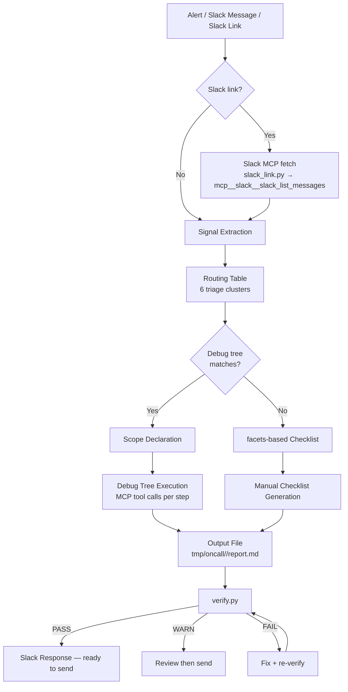

# SRE Oncall Triage Agent

Autonomous investigation agent for production alerts. Takes a raw alert or Slack message, queries metrics/logs via MCP tools, and produces a structured output with a Slack-ready response.

**Safety boundary**: read-only investigation only. Never mutates production systems.

---

## Setup

```bash
cd sre_oncall_triage_agent
cp .env.example .env          # fill in VM_BASE_URL, GRAFANA_URL, LOKI_URL, etc.
bash tools/agent_ops/setup.sh # symlinks hooks → ~/.claude/hooks/ and merges settings.json
```

Re-run `setup.sh` whenever hooks or skills change.

## Usage

```
/sre_oncall_triage                          # raw alert text (paste after)
/sre_oncall_triage https://datavisor.slack.com/archives/CJT8ZPRJL/p1775790979547669
```

**Static mode**: kubectl/helm commands are generated and explained, not executed.

---

## Architecture

### Investigation Pipeline



### Safety Layers

```mermaid
flowchart LR
    subgraph L1["Layer 1: Claude Code Permissions (settings.json)"]
        P1[allow: kubectl get/describe/logs]
        P2[deny: delete/drain/cordon/IAM mutations]
    end
    subgraph L2["Layer 2: Hook Chain (PreToolUse / PostToolUse)"]
        H1[k8s-gate.sh — tier enforcement PROD=read-only]
        H2[audit-pre.sh — INTENT capture]
        H3[audit-log.sh — kubectl JSONL audit]
        H4[mcp-audit.sh — MCP JSONL audit]
    end
    subgraph L3["Layer 3: Agent Spec (CLAUDE.md + Skills)"]
        S1[Hard constraints: read-only only]
        S2[Query Safety Rules: label filter / step floor / time ceiling]
        S3[Scope Declaration: out_of_scope required]
    end
    L1 --> L2 --> L3
```



### Environment Tier Enforcement (k8s-gate.sh)

| Tier | Mutating ops |
|------|-------------|
| PROD / PCI / MGT / DEMO | Blocked — prints command for human to run |
| PREPROD | Dry-run only (--dry-run required); delete blocked |
| DEV | Allowed with `# INTENT:` comment |
| Unclassified | Blocked |

### Audit & Observability

```bash
# View audit logs
python3 tools/agent_ops/audit-view.py tools/agent_ops/logs/YYYY-MM-DD.jsonl
python3 tools/agent_ops/audit-view.py tools/agent_ops/logs/mcp-YYYY-MM-DD.jsonl

# Quality trends across investigations
python3 tools/agent_ops/slo.py [--since YYYY-MM-DD] [--json]

# Verify a report
python3 tools/agent_ops/verify.py tmp/oncall/<ts>/report.md
```

---

## Directory Layout

```
sre_oncall_triage_agent/
├── CLAUDE.md             # Agent entry point (frontmatter + acceptance criteria + hard constraints)
├── README.md             # This file
├── skills/               # Claude Code skills (setup.sh symlinks → ~/.claude/skills/)
│   ├── sre-oncall-acceptance-criteria/   # auto-inject: 8 acceptance criteria
│   ├── sre-oncall-query-safety/          # auto-inject: query safety rules
│   ├── sre-oncall-init/                  # Layer 0: mkdir + skeleton + routing
│   ├── sre-oncall-output-format/         # on-demand: output format
│   ├── sre-oncall-data-tools/            # on-demand: MCP data source reference
│   ├── sre-oncall-compound-learning/     # on-demand: post-investigation learning
│   ├── sre-oncall-quick-check/           # on-demand: ~60s fan-out check
│   ├── sre-vm-query/                     # on-demand: VM MCP + vm_lookup wrapper
│   └── workflow-oncall-spike/            # Layer 1: P99/P95 latency spike workflow
├── facets/               # Structured knowledge facets (signal extraction, alert intake, etc.)
├── knowledge/            # Oncall knowledge base
│   ├── README.md               # Master index (130+ files by kind/tag/summary)
│   ├── agent-routing-table.md  # Signal → triage cluster routing
│   ├── cases/                  # ~34 incident postmortems
│   ├── runbooks/               # ~21 procedures with #MANUAL gates
│   ├── cards/                  # ~15 fast-triage reference cards
│   ├── debug-trees/            # Structured decision trees with MCP calls
│   ├── patterns/               # Root cause models
│   ├── checklists/             # Layered troubleshooting sequences
│   └── references/             # Command refs, dashboards, cluster/client lookups
└── tools/
    ├── vm_lookup.py            # Pod/namespace discovery via VM MCP
    ├── slack_link.py           # Slack URL parser
    ├── loki_fetch/             # Loki CLI (LogQL queries direct to Loki HTTP API)
    └── agent_ops/              # Safety hooks + audit + registration
        ├── setup.sh            # One-shot: register agent + skills + hooks → ~/.claude/
        ├── hooks/              # k8s-gate.sh, audit-pre.sh, audit-log.sh, mcp-audit.sh
        ├── verify.py           # Output verifier (exit 0=PASS, 1=WARN, 2=FAIL)
        └── slo.py              # Quality trend metrics
```

## Knowledge Base

| Directory | Kind | Contents |
|-----------|------|----------|
| `cases/` | case | ~34 incident records with evidence, timeline, decision trace |
| `runbooks/` | runbook | ~21 step-by-step procedures with `#MANUAL` gates |
| `cards/` | card | ~15 fast-triage reference cards (first 2 minutes) |
| `debug-trees/` | debug-tree | Structured decision trees with MCP tool calls |
| `patterns/` | pattern | 4 root cause models |
| `checklists/` | checklist | Layered troubleshooting sequences |
| `references/` | reference | Command refs, architecture docs, dashboards, cluster/client lookups |

## Data Sources

| Source | Tool | Use for |
|--------|------|---------|
| VictoriaMetrics | `mcp__victoriametrics__*` | PromQL/MetricsQL queries |
| Loki | `/dv_loki_fetch` skill | LogQL queries — direct to Loki HTTP API |
| Slack | `mcp__slack__slack_list_messages` etc. | Fetch alert messages from Slack links |
| Grafana dashboards | Manual URL construction | Dashboard links for user to click |

**Query safety rules**: label filter required on every PromQL; `query_range` step ≥ 30s, window ≤ 24h; LogQL stream selector required; max 2 retries.

## Output

Each investigation writes to `tmp/oncall/<YYYYMMDD_HHMM>_<label>/report.md`:

- **Plan** — what to query, what the user needs to run (written before any MCP query)
- **Scope** — cluster, services, tools, time window, out_of_scope
- **Slack Response** — conservative, ready-to-send reply
- **Internal Notes** — verdict, hypothesis tree, evidence checklist
- **Extracted Signals** — direct from alert, no inference
- **Links** — Grafana, VMUI, VMAlert URLs
- **Investigation Log** — step table: Tool / Query / Result / Interpretation / Decision
- **操作命令方案** — diagnostic + fix commands with Chinese explanations

Verdict vocabulary: `IGNORE_DEV` | `KNOWN_ISSUE` | `NON_ACTIONABLE_NOISE` | `NEEDS_ATTENTION` | `ESCALATE` | `MANUAL`
