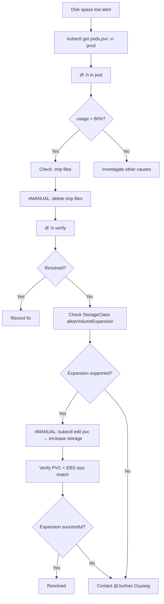

---
metadata:
  kind: runbook
  status: final
  summary: "Oncall runbook for ClickHouse disk space exhaustion: covers Pod/PVC/EBS diagnosis, disk and data directory checks, temporary file cleanup, and resize options to quickly restore writes and service stability."
  tags: ["clickhouse", "storage", "disk", "pvc", "ebs"]
  first_action: "Check pod/PVC status and `df -h` in pod"
---

# ClickHouse Disk Space Exhaustion Troubleshooting Guide

## TL;DR (Do This First)
1. Check ClickHouse Pod/PVC health: `kubectl get pods,pvc -n prod | grep -i clickhouse`
2. Confirm disk usage in Pod: `kubectl exec -it <pod> -n prod -- df -h`
3. Identify top consumers: `kubectl exec -it <pod> -n prod -- du -sh /var/lib/clickhouse/* | sort -h | tail -n 20`
4. If write actions are needed (delete data/resize/rollout restart), stop and hand off as `#MANUAL`

## Safety Boundaries
- Read-only: status/log/usage checks
- `#MANUAL`: deleting data, resizing volumes, restarting stateful components

## Emergency Contact
- **Primary**: @Junhan Ouyang — ClickHouse storage and disk space

## Symptoms
- ClickHouse service unhealthy; data ingestion/import fails
- Disk usage > 80%; pod becomes unhealthy or restarts

## Investigation

### 1. Pod and PVC status
```bash
kubectl get pods,pvc -n prod | grep clickhouse
kubectl describe pvc <clickhouse-pvc-name> -n prod
```

### 2. Disk usage inside pod
```bash
kubectl exec -it <clickhouse-pod-name> -n prod -- df -h
kubectl exec -it <clickhouse-pod-name> -n prod -- du -sh /var/lib/clickhouse/*
kubectl exec -it <clickhouse-pod-name> -n prod -- find /var/lib/clickhouse -name "*.tmp" -type f
```

### 3. EBS backing volume
- `kubectl describe pvc <clickhouse-pvc-name> -n prod` → note `volumeName`
- AWS Console → EC2 → Volumes → find the EBS volume → check state and size

## Remediation

### Option 1: Clean temporary files (fast mitigation — `#MANUAL`)
```bash
kubectl exec -it <clickhouse-pod-name> -n prod -- bash
find /var/lib/clickhouse -name "*.tmp" -type f -delete
find /var/lib/clickhouse -name "*.tmp" -type d -exec rm -rf {} +
rm -rf /var/lib/clickhouse/tmp/*
rm -rf /var/lib/clickhouse/store/tmp/*
find /var/lib/clickhouse -name "*.log" -mtime +7 -delete
```

### Option 2: Expand PVC (`#MANUAL`)

DV uses EBS-backed StorageClasses with `allowVolumeExpansion: true`. Expanding only requires editing the PVC; no StatefulSet restart needed for online-resize clusters.

```bash
# Back up current manifest
kubectl get pvc <clickhouse-pvc-name> -n prod -o yaml > clickhouse-pvc-backup.yaml

# Edit resources.requests.storage (e.g. 100Gi → 200Gi)
kubectl edit pvc <clickhouse-pvc-name> -n prod

# Verify
kubectl get pvc <clickhouse-pvc-name> -n prod
kubectl exec -it <clickhouse-pod-name> -n prod -- df -h
```

Then confirm in AWS Console that the EBS volume size matches and state is "in-use".

## Incident Flow



## Notes
1. Try tmp file cleanup first — fastest mitigation with no data risk.
2. PVC expansion is online for EBS gp2/gp3 StorageClasses used in prod.
3. If the problem persists after expansion, contact @Junhan Ouyang.
