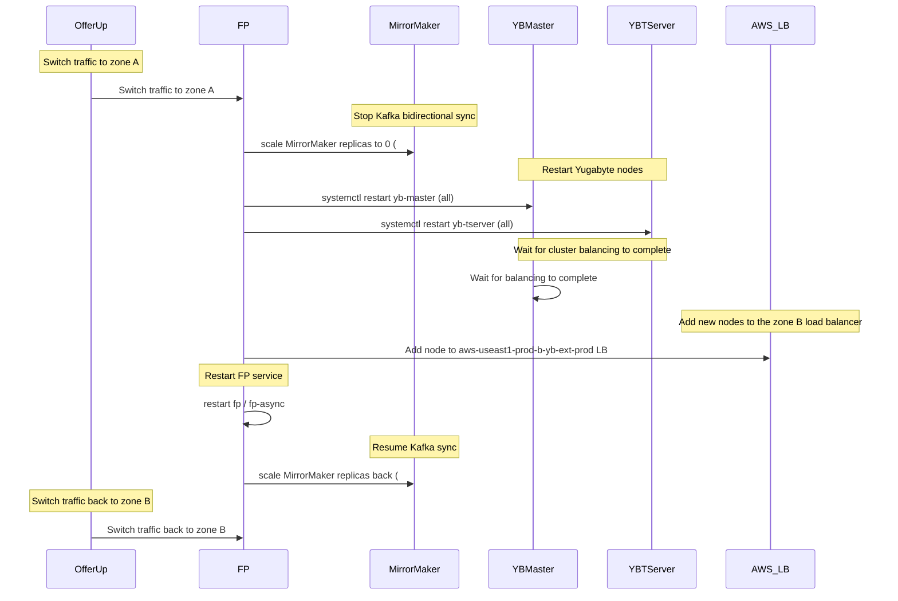
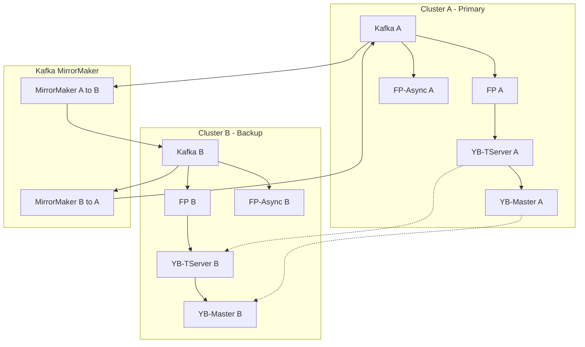

---
metadata:
  kind: runbook
  status: stable
  summary: "YugabyteDB oncall: diagnosis + common ports + production incident recovery"
  tags: ["yugabyte", "ysql", "bootstrapping", "connectivity", "debugging", "ports", "tserver", "incident", "recovery", "mirrormaker"]
  first_action: "Focus on tserver pressure/raft catchup, not UI balance"
---

# YugabyteDB Oncall Runbook

Connection failures and bootstrapping errors in Yugabyte almost always stem from tserver resource/IO pressure, not topology imbalance. Follow diagnosis first, then escalate to incident recovery only if the cluster needs a controlled restart.

---

## Diagnosis

### TL;DR (Do This First)
1. Confirm if it is a real outage: can any client connect? is it localized?
2. Ignore UI "not balanced" until you prove rebalance is happening; first suspect node IO/CPU/memory pressure
3. Focus on tserver overload / raft catchup signals; correlate with resource metrics and recent changes

### Verification
- Connections recover and remain stable after pressure is relieved
- Tablet/raft catchup stabilizes; errors stop increasing

> This is a typical Yugabyte incident where surface signals mislead and the real bottleneck is resources/state.
> Next time you cannot connect to Yugabyte, follow this framework directly.

---

### 1. The real nature of this case

**It is not:**

> cluster not balanced

**It is:**

> **tserver enters self-protection under resource/IO pressure -> the driver sees bootstrapping -> connections fail**

In other words:

> It is not a topology problem.
> It is node pressure plus raft/catchup.

---

### 2. The correct causal chain (production-grade)

```text
Cannot connect to Yugabyte
        ↓
Driver reports Overloaded / bootstrapping
        ↓
Suspect the node is unhealthy
        ↓
Check UI -> see not balanced (surface signal)
        ↓
But tablet distribution is actually balanced (rule out rebalance)
        ↓
Find the real cause:
tserver transient resource/IO/raft pressure
        ↓
tablet catchup / bootstrap
        ↓
Refuse requests (protect consistency)
        ↓
Connection failure
```

---

### 3. Decision tree: what to do when you cannot connect to Yugabyte

#### Step 1 - Determine whether it is truly down

```text
yb-master UI
→ Tablet servers
```

| Signal | Meaning |
| ---------------------- | ----------- |
| node DEAD | Truly down |
| node BOOTSTRAPPING | Scaling/recovery in progress |
| node ALIVE but errors/refusals | Resource/IO issue |

This case: **ALIVE but refusing requests**.

---

#### Step 2 - Determine whether it is rebalancing

```text
Are tablet counts heavily skewed?
```

| Case | Conclusion |
| ---------- | ---------------- |
| Severely imbalanced | Rebalancing |
| Fully balanced | X not rebalancing |
| New node added | Rebalancing |
| Node just restarted | Rebalancing |

This case:

> Fully balanced -> rule out rebalance.
> UI not balanced is usually historical residue / mild leader skew, not the primary cause.

---

#### Step 3 - Determine the real root cause

| Root cause | Share |
| -------------------- | ----- |
| Slow IO / disk jitter | 40% |
| Memory/CPU pressure | 30% |
| Bulk writes/import | 30% |

> Likely: one-off bulk import plus small preprod resources.
> (Consistent with issues caused by undersized resource limits: it is almost always resources/state.)

---

### 4. First principles (memorize this)

Yugabyte will **refuse connections** under these conditions:

```text
raft catchup
tablet bootstrap
flush/compaction pressure
memtable flush
```

At this point:

> The node is alive.
> But it is not serving logically.

The driver sees:

```text
OverloadedException
bootstrapping
```

---

### 5. Why a restart can fix it

```text
raft queue stuck
memtable backlog
flush backlog
```

Restart can:

```text
Clear queues
Rebuild tablet state
Re-elect leaders
```

Common preprod mitigation:

```bash
#MANUAL
kubectl rollout restart sts yb-tserver -n preprod
```

---

### 6. Oncall case template (abstracted from this incident)

**Incident**: YB connection failure / driver reports bootstrapping

**Surface signals**:
- Cannot connect to CQL
- Driver reports overloaded / bootstrapping
- UI shows not balanced (**misleading**)

**Investigation chain**:

1. **Are any nodes dead** -> all alive
2. **Is it rebalancing** -> tablet counts balanced -> no new nodes -> rule out
3. **Is it resource/IO pressure** -> small preprod resources -> bulk write/import -> raft catchup -> tablet bootstrap

**Root cause**:

> Under high IO/resource pressure, tserver hits tablet catchup/bootstrap and temporarily refuses requests.

**Mitigation**:

```bash
#MANUAL
kubectl rollout restart sts yb-tserver -n preprod
```

**Prevention**:
- Avoid bulk imports
- Increase tserver resources
- Write in batches
- Increase disk IOPS

---

### 7. First reaction when you see these errors

If you see:

```text
OverloadedException
bootstrapping
```

Immediately jump to:

> It is not a connectivity issue.
> It is tserver protecting itself.

Check first: resources / IO / write pressure

Do not start with: network / service / dns

---

### 8. Production-grade rule of thumb

```text
Cannot connect
  -> first check node alive
  -> then check rebalance
  -> then check IO/resources
  -> restart last
```

This is right in ~90% of cases.

---

### 9. Root cause confirmation: questions to ask oncall

- Was there a **bulk import** at that time?
- Was there a **Spark job**?
- Was there a **backfill**?
- Was there a **restore**?
- Was there **bulk write** activity?

If any one of these is true, the root cause is almost certainly determined.

---

## Common Ports & Debug Endpoints

### TL;DR (Do This First)
1. On the node, confirm yb-tserver is listening: `ss -lntp | grep yb-tserver`
2. Identify the Web UI port (9000) and test locally: `curl -sS http://127.0.0.1:9000/ | head`
3. If testing from another host, validate network path and security rules before blaming Yugabyte

### Port Reference

| Port | Purpose |
|------|---------|
| 9000 | tserver Web UI (e.g. `http://<node-ip>:9000/utilz`) |
| 9100 | RPC |
| 12000 | YCQL |
| 5433 | YSQL |

### Stop / Escalate When
- You suspect data loss / corruption, or the cluster is flapping
- You need to restart Yugabyte processes or change resource limits/config (`#MANUAL`)
- Connectivity issues point to network policy / security group / firewall changes (`#MANUAL`)

### Exit Criteria
- You can reach tserver Web UI (9000) and/or required client ports (YCQL/YSQL)
- You have a clear classification: Yugabyte process down vs network blocked vs overload

---

## Incident Recovery

### TL;DR (Do This First)
1. Confirm impact + decide whether to switch traffic (`#MANUAL`)
2. Stop cross-cluster sync to reduce blast radius (MirrorMaker) (`#MANUAL`)
3. Recover Yugabyte control plane then data plane (yb-master -> yb-tserver) (`#MANUAL`)
4. Wait for rebalance/balance to complete before restoring dependent services
5. Restore FP/fp-async and then re-enable MirrorMaker (`#MANUAL`)

### Safety Boundaries
- This runbook contains production write actions; execute only with human approval.
- Marked as `#MANUAL`: traffic switching, scaling deployments, systemctl restarts, LB target changes.

### Stop / Escalate When
- You cannot clearly scope impact (single tenant vs global) before switching traffic
- You do not have a verified rollback plan for any `#MANUAL` action (MirrorMaker/yb-master/yb-tserver/LB)
- Any step requires touching production data or changing replication topology beyond this runbook

### Exit Criteria
- Traffic is stable on the chosen cluster (error rate/latency back to baseline)
- Yugabyte masters + tservers are healthy and rebalanced
- MirrorMaker is running and lag is recovering/stable (if re-enabled)
- FP/fp-async are healthy; no sustained backlog/regression

### Verification
- Yugabyte dashboards show stable leader elections and no sustained overload/bootstrapping errors
- Dependent services error rate decreases and stays low for >= 15-30 minutes

### Recovery Steps (OfferUp / prod)

1. Switch OfferUp traffic to cluster A
2. Stop Kafka MirrorMaker (A and B)
```bash
#MANUAL
kubectl scale --replicas 0 deployment -n prod mirrormaker2
```
3. Restart Yugabyte yb-master on all nodes
```bash
#MANUAL
systemctl restart yb-master
```
4. Restart Yugabyte yb-tserver on all nodes
```bash
#MANUAL
systemctl restart yb-tserver
```
5. Wait for Yugabyte balance to complete
6. Add the new node to the `aws-useast1-prod-b-yb-ext-prod` LB:
   `arn:aws:elasticloadbalancing:us-east-1:480609039449:targetgroup/aws-useast1-prod-b-yb-ext-prod/acf8b6179eda946b`
   (Console: https://us-east-1.console.aws.amazon.com/ec2/home?region=us-east-1#TargetGroup:targetGroupArn=arn:aws:elasticloadbalancing:us-east-1:480609039449:targetgroup/aws-useast1-prod-b-yb-ext-prod/acf8b6179eda946b)
7. Restart fp/fp-async
8. Start Kafka MirrorMaker (`#MANUAL`)
9. Switch OfferUp traffic back to cluster B

### Recovery Sequence Diagram



### Cluster Architecture



---

## Cross-References
- `card-yugabyte-metrics-fast-checks.md` — quick metric checks
- `card-yugabyte-incident-first-hour.md` — blast radius doctrine
- `reference-yugabyte-monitoring-commands-reference.md` — 命令参考
