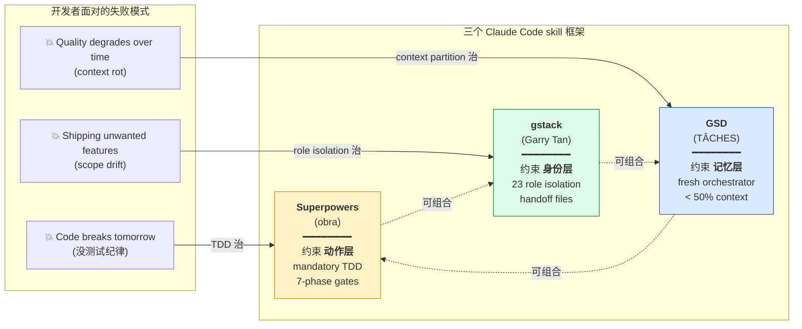
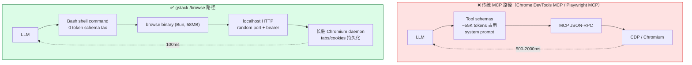

# gstack / Anthropic / Karpathy 三层关系图

## 图 1：三层思想 → 机制 → 应用的传递链

```mermaid
flowchart TB
    subgraph L1["🧠 哲学层：Karpathy（提出问题）"]
        K1["Software 3.0<br/>prompts = programs<br/>English = new language"]
        K2["Context Engineering<br/>> Prompt Engineering<br/>context = 稀缺资源"]
        K3["3 大失败模式 (2026-01-26)<br/>① Wrong Assumptions<br/>② Overcomplexity<br/>③ Orthogonal Edits"]
        K4["Autonomy Slider<br/>boilerplate→agent<br/>novel→human"]
        K5["⚠️ 第 4 条<br/>Imperative→Declarative<br/>(社区衍生, 非原帖)"]
        K3 -.衍生.-> K5
    end

    subgraph L2["🏗️ 机制层：Anthropic（提供平台）"]
        A1["Skill 系统 (2025-10-16)<br/>SKILL.md + YAML frontmatter"]
        A2["Progressive Disclosure 3 级<br/>metadata → body → ref files"]
        A3["Agent Tool Loop<br/>gather→act→verify→repeat"]
        A4["Harness over Model<br/>per-release tuning"]
        A5["Sub-agent Architecture<br/>isolated context + summary"]
        A6["Code Execution > MCP<br/>55K token tax → 2K"]
        A7["Context Resets<br/>> Compaction<br/>claude-progress.txt"]
    end

    subgraph L3["⚙️ 应用层：gstack（落地 workflow）"]
        G1["23 个 Role Skill<br/>CEO/Eng/Designer/QA/<br/>Security/Release/Doc/Retro"]
        G2["preamble-tier 分级<br/>tier 1 自动 / tier 4 显式"]
        G3["/office-hours<br/>Six Forcing Questions<br/>反讨好"]
        G4["/review<br/>Specialist Dispatch<br/>+ quote-the-line gate"]
        G5["/investigate<br/>Iron Law + Scope Lock<br/>+ 3-strike rule"]
        G6["/browse daemon<br/>localhost HTTP + Bun<br/>绕过 MCP"]
        G7["分支级 handoff YAML<br/>{branch}-ship-state.yaml"]
        G8["/learn<br/>跨 session 持久记忆"]
    end

    K1 ==> A1
    K2 ==> A2
    K2 ==> A6
    K2 ==> A7
    K3 ==> A3
    K4 ==> A4
    K3 ==> A5

    A1 ==> G1
    A1 ==> G2
    A2 ==> G2
    A5 ==> G4
    A6 ==> G6
    A7 ==> G7
    A7 ==> G8
    A3 ==> G5

    K3 -.治 wrong assumption.-> G3
    K3 -.治 overcomplexity.-> G4
    K3 -.治 orthogonal edits.-> G5
    K5 -.spec/loop.-> G7

    style L1 fill:#fff4e6,stroke:#d97706
    style L2 fill:#e6f4ff,stroke:#0369a1
    style L3 fill:#e6ffe6,stroke:#15803d
    style K5 fill:#fee2e2,stroke:#dc2626,stroke-dasharray: 5 5
```

---

## 图 2：三框架"约束什么层"对比（Pulumi framing）

---

## 图 3：gstack 的 skill 流水线（sprint 抽象）

```mermaid
flowchart LR
    A["💭<br/>/office-hours<br/>Six Forcing Q"] --> B["📋<br/>/plan-ceo-review<br/>think bigger"]
    B --> C["🏗️<br/>/plan-eng-review<br/>lock architecture"]
    C --> D["🎨<br/>/plan-design-review<br/>visual critique"]
    D --> E["⌨️<br/>(implementation)<br/>主 agent 写代码"]
    E --> F["🔍<br/>/review<br/>Specialist Dispatch"]
    F --> G["✅<br/>/qa<br/>11-phase test loop"]
    G --> H["📦<br/>/ship<br/>state.yaml 写入"]
    H --> I["🚀<br/>/land-and-deploy<br/>读 state.yaml"]
    I --> J["👀<br/>/canary<br/>post-deploy 监控"]
    J --> K["📝<br/>/retro + /learn<br/>知识沉淀"]
    K -.feeds back.-> A

    style A fill:#fff4e6
    style B fill:#fff4e6
    style E fill:#dcfce7
    style F fill:#fef3c7
    style G fill:#fef3c7
    style H fill:#dbeafe
    style I fill:#dbeafe
    style J fill:#dbeafe
    style K fill:#f3e8ff
```

---

## 图 4：`/browse` 如何绕过 MCP context tax

---

## 关键 takeaway

1. **L1 提问 → L2 给机制 → L3 落 workflow**：三层各自解决不同层面的问题，互不替代
2. **gstack 的"创新点"几乎都在 L3**：唯一的 L2 级创新是 `/browse` daemon（绕过 MCP）
3. **三框架可组合**：Superpowers（动作）+ gstack（身份）+ GSD（记忆）三轴正交
4. **⚠️ 红色虚线**：Karpathy 第 4 条失败模式是社区衍生，不在他 2026-01-26 原帖里
